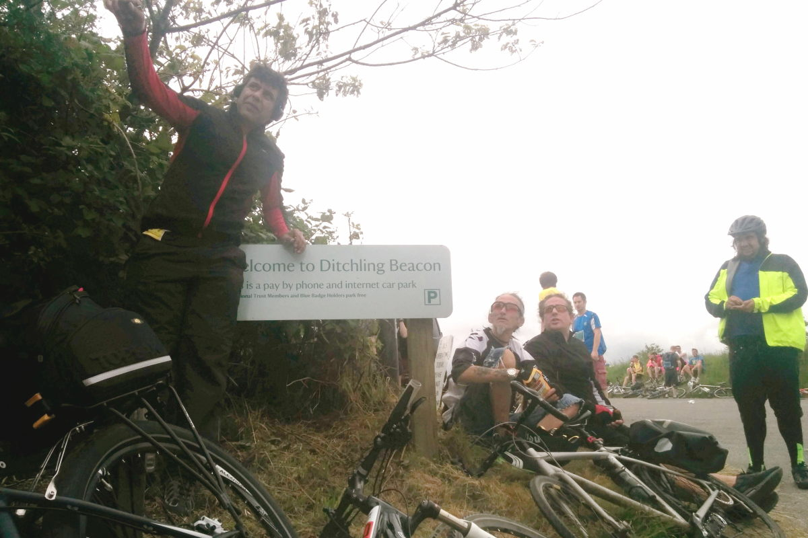

+++
title = "London - Brighton - London: recovery ride"
description = ""
date = 2014-06-23T19:51:13+01:00
draft = false
images = ["toxic_crew.jpg"]
tags = []
+++

I was not unfamiliar with the term. The recovery ride was something other people said. I just rode. Sometimes faster sometimes slower. Why get all fancy with special ways of saying things. As if doing so validates our motivations and ability. Somehow lifts us above the hoi polloi and puts us among the rarefied air of serious amateurs.

I did a recovery ride. London to Brighton on the 15th June. Together with four friends I rode down from Seven Sisters to the start of British Heart Foundation's L2B charity ride. With tens of thousands of others we left Clapham Common and ambled our way to the coast. We never actually left with tens of thousands of others. We gate crashed the ride. Filtered in a few miles from the official start. Judge us harshly. We surely deserve it.

This was the first ride over four miles I had tried since taking time off cycling with Achilles Tendinopathy. First ride in about seven weeks. It went very well. The pace was very slow. 10 mph or so. Lots and lots of stops. It was the perfect ride for easing back into the saddle.

We spent the night down in Brighton. On Monday we took another slow ride back to London. As far as recovery rides go I thoroughly recommend the occasion. No incentive to ride fast. Long enough to feel like the bases are covered but nothing epic about the distance. I got back feeling fine. No pain from the Achilles at all.
