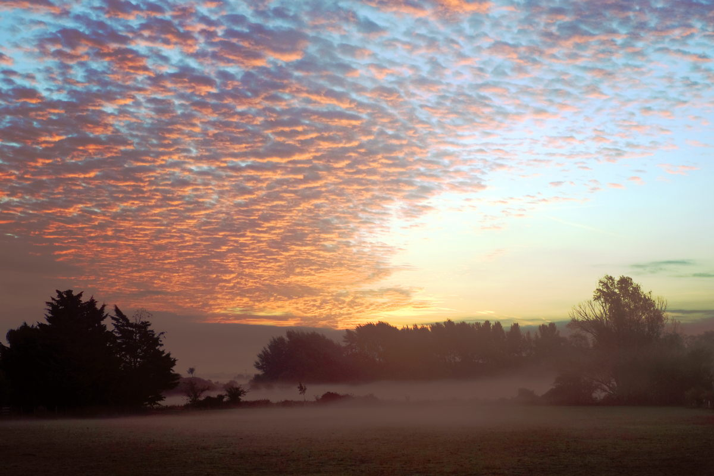
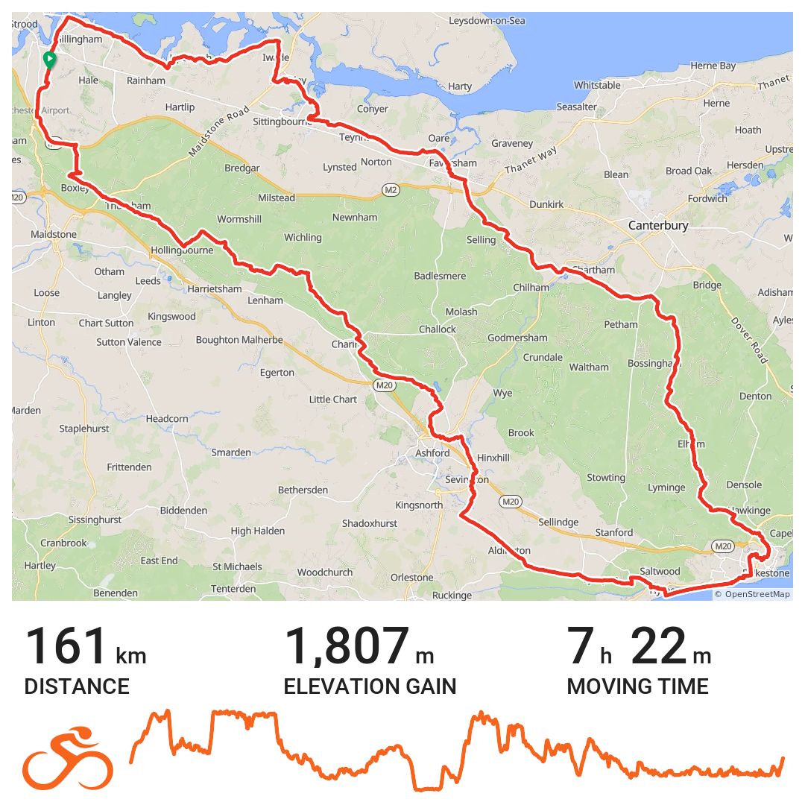
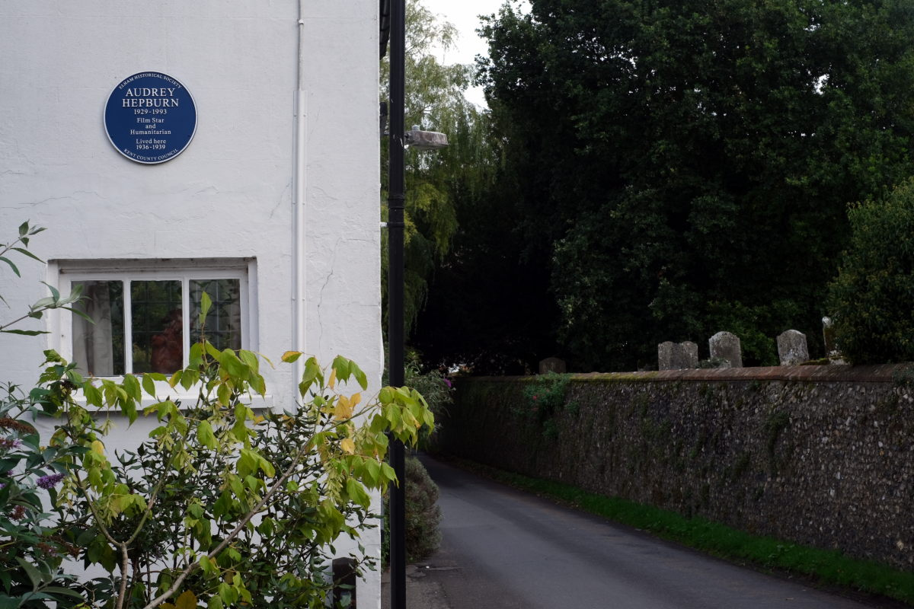

+++
title = "Week Notes: 38|2025"
description = ""
date = 2025-09-21T21:55:13+01:00
draft = false
images = [
""
]
tags = []
+++



**Family**:\
Opportunity knocks for s2. A good friend of mine is planning to launch a music & mental health app he's been leading the development of for the last 4- 5 years. s2 and s3 contributed to some early promo content a while ago. S2 has since completed a music and business degree. He's now undertaking some self led study in data analytics. Turns out he's got exactly the right skill set for a post my friend is looking to fill. Hope it works out well for them both. 

**Work**:\
Very productive on Monday. Made a great start on reviewing practice guidance on DNACPR (‘Do not attempt cardiopulmonary resuscitation (CPR)).\
Tuesday was all about speaker notes for training I'm preparing on positive risk taking and risk enablement.\
Wednesday was an in person team meeting. My monthly office visit and face to face with colleagues. Good to spend time with them. We went for lunch. That got a bit [odd](https://www.bongotwisty.blog/oddfellow/).\
Busy on Thursday dealing with practitioner queries. Always interesting. Always something to learn from these.\
Friday revisited the DNACPR and actioned a few comments. Couple of hours in the afternoon tracking down a bug in a PowerAutomate flow. Pretty new to that. A less than or equal to should have been an equal to. Very pleased I managed to fix it. Helped out business support colleagues.  Another string to my bow. 


 
**Cycling**:\
Missed a couple of days during the week. Made up for it on Saturday with a ride down to Folkstone and back via the North Downs. Lovely day out. Really enjoyed it. 



On the way back I passed by a house in Elham where Audrey Hepburn used to live. Just a few miles lated I stopped off for a beer at The Duck Inn in Pett Bottom near Canterbury. It's where Ian Flemming lived in 1964 and wrote "You Only Live Twice".




Finished the week with 365km done. Keeping pace with reaching 18,000 km by year end. 

```bash
=== ANNUAL GOAL PROGRESS (2025) ===
Goal: 18,000 km
Current: 13,120.1 km (72.9% complete)
Year Progress: 72.3% elapsed
Days passed: 264 | Days remaining: 101
Status: ✅ On track

=== PACING TARGETS ===
To reach your goal, you need:
• Daily: 48.3 km/day
• Weekly: 338.2 km/week
• Monthly: 1470.7 km/month
```

**Photography**:\
A few snaps. A couple of [Postbox Toppers](https://www.bongotwisty.blog/gallery/postbox_toppers/) I saw in Folkstone and the pictures included in this post.  

**Listening**:
Went down a rabbit hole of LastFM stats displays. Played around with a few. Thinking I shall try a different one each week for a while. I created the table below with data [bijou.fm](https://www.bijou.fm) processed. FWIW not all the tunes I've listened to have been scrobbled but the list gives a good idea of the soundtrack to my week. King Tubby for the win.  

| Rank | Artist                                             | Playcount |
|------|----------------------------------------------------|-----------|
| 1    | King Tubby                                         | 133       |
| 2    | Keeno                                              | 22        |
| 3    | Glen Brown & King Tubby                            | 16        |
| 4    | Marcus Visionary                                   | 15        |
| 5    | The Breadwinners                                   | 15        |
| 6    | The African Brothers & King Tubby                  | 12        |
| 7    | The Congos                                         | 10        |
| 8    | Fikir Amlak                                        | 9         |
| 9    | Skin, Flesh & Bones                                | 9         |
| 10   | Brizion                                            | 8         |
| 11   | Kid Cudi                                           | 8         |
| 12   | King Tubby, Prince Jammy, the Scientist            | 8         |
| 13   | Lee "Scratch" Perry                                | 8         |
| 14   | Danny Red                                          | 5         |
| 15   | Logistics                                          | 5         |
| 16   | Joseph Lalibela meets Vibronics and Maa and Fluxy  | 4         |
| 17   | Bob Dylan                                          | 3         |
| 18   | Carole King                                        | 3         |
| 19   | David Bowie                                        | 3         |
| 20   | Dubkasm Meets Aba Shanti-I                         | 3         |
| 21   | Earl Sixteen                                       | 3         |
| 22   | OutKast                                            | 3         |
| 23   | Restless Mashaits / Boom Horns                     | 3         |
| 24   | The Streets                                        | 3         |
| 25   | The Sunshot Band                                   | 3         |
| 26   | Alanis Morissette                                  | 2         |
| 27   | Augustus Pablo                                     | 2         |
| 28   | Calibre                                            | 2         |
| 29   | Christina Aguilera                                 | 2         |
| 30   | Dubkasm                                            | 2         |
| 31   | India.Arie                                         | 2         |
| 32   | Jah Shaka                                          | 2         |
| 33   | Joey Negro, Sunburst Band                          | 2         |
| 34   | John Hiatt                                         | 2         |
| 35   | Joshua Idehen                                      | 2         |
| 36   | Kate Bush                                          | 2         |
| 37   | London Elektricity                                 | 2         |
| 38   | Masterstepz                                        | 2         |
| 39   | Nu:Tone                                            | 2         |
| 40   | Prince Fatty meets Mad Professor                   | 2         |
| 41   | Scientist                                          | 2         |
| 42   | Tina Moore                                         | 2         |
| 43   | UB40                                               | 2         |
| 44   | Winston Francis & Change The Mood                  | 2         |
| 45   | Xavier Rudd                                        | 2         |
| 46   | “Don't Touch The Girl Again”                       | 1         |
| 47   | Alex Sci-Fi                                        | 1         |
| 48   | Alpha & Omega                                      | 1         |
| 49   | An Dannsa Dub                                      | 1         |
| 50   | An Dannsa Dub, Paolo Baldini DubFiles              | 1         |
| 51   | Faversham Anti                                     | 1         |
| 52   | Finley Quaye                                       | 1         |
| 53   | Gorillaz                                           | 1         |
| 54   | Gorillaz, Jehnny Beth, Claptone                    | 1         |
| 55   | Groove Chronicles                                  | 1         |
| 56   | Hot Chocolate                                      | 1         |
| 57   | I Wanna Be Adored                                  | 1         |
| 58   | Iration Steppas                                    | 1         |
| 59   | Kid Cudi feat. Chip Tha Ripper & A$AP Rocky        | 1         |
| 60   | Kid Cudi feat. Father John Misty                   | 1         |
| 61   | Kid Cudi feat. HAIM                                | 1         |
| 62   | Kid Cudi feat. Kendrick Lamar                      | 1         |
| 63   | Kid Cudi feat. RZA                                 | 1         |
| 64   | KiD CuDi Feat. Too $hort                           | 1         |
| 65   | King Alpha                                         | 1         |
| 66   | Liquid                                             | 1         |
| 67   | Lucinda Williams                                   | 1         |
| 68   | Mad Professor                                      | 1         |
| 69   | Mad Professor & Jah Shaka                          | 1         |
| 70   | Mad Wax                                            | 1         |
| 71   | MJ Cole                                            | 1         |
| 72   | MJ Cole, Nova Caspar, jaydee                       | 1         |
| 73   | MuRpHy1680                                         | 1         |
| 74   | Nuyorican Soul                                     | 1         |
| 75   | ormurk                                             | 1         |
| 76   | PFM                                                | 1         |
| 77   | Prince Fatty                                       | 1         |
| 78   | Prince Fatty feat. Shniece McMenamin               | 1         |
| 79   | Prince Fatty meets Mad Professor feat. Earl Sixteen| 1         |
| 80   | Protoje                                            | 1         |
| 81   | Ras Michael                                        | 1         |
| 82   | Rhythm & Sound                                     | 1         |
| 83   | Rhythm & Sound, Paul St. Hilaire                   | 1         |
| 84   | Smokin Beats                                       | 1         |
| 85   | Smokin Beats, Lyn Eden                             | 1         |
| 86   | Sunship                                            | 1         |
| 87   | Swamp Dogg                                         | 1         |
| 88   | The Chemical Brothers                              | 1         |
| 89   | The Ragga Twins                                    | 1         |
| 90   | The Singing Loins                                  | 1         |
| 91   | The Streets, Ashley Beedle                         | 1         |
| 92   | Turin Brakes                                       | 1         |
| 93   | Vibronics                                          | 1         |
| 94   | Villagers                                          | 1         |
| 95   | Whatnauts Band                                     | 1         |
| 96   | Winston Francis                                    | 1         |
| 97   | Wookie                                             | 1         |
| 98   | Wookie, Lain                                       | 1         |
| 99   | Yael Deckelbaum                                    | 1         |
| 100  | Yael Deckelbaum, Joss Stone                        | 1         |
| 101  | Anile                                              | 1         |
| 102  | B15 Project                                        | 1         |
| 103  | B15 Project, Crissy D, Lady G                      | 1         |
| 104  | Bicep                                              | 1         |
| 105  | Burning Spear                                      | 1         |
| 106  | Cimarons                                           | 1         |
| 107  | Conduct                                            | 1         |
| 108  | Conduct, Rick                                      | 1         |
| 109  | Culture                                            | 1         |
| 110  | Dubcreator                                         | 1         |
| 111  | Dubcreator, Danny Red                              | 1         |
| 112  | Earl 16 / Manasseh                                 | 1         |
| 113  | Ed Rush & Nico                                     | 1         |
| 114  | Eeyun Purkins                                      | 1         |
| 115  | Elbow                                              | 1         |
| 116  | Errol Dunkley                                      | 1         |
| 117  | Eva Keyes, Vibronics                               | 1         |
| 118  | Faversham Anti                                     | 1         |
| 119  | Finley Quaye                                       | 1         |
| 120  | Gorillaz                                           | 1         |
| 121  | Gorillaz, Jehnny Beth, Claptone                    | 1         |
| 122  | Groove Chronicles                                  | 1         |
| 123  | Hot Chocolate                                      | 1         |
| 124  | I Wanna Be Adored                                  | 1         |
| 125  | Iration Steppas                                    | 1         |
| 126  | Kid Cudi feat. Chip Tha Ripper & A$AP Rocky        | 1         |
| 127  | Kid Cudi feat. Father John Misty                   | 1         |
| 128  | Kid Cudi feat. HAIM                                | 1         |
| 129  | Kid Cudi feat. Kendrick Lamar                      | 1         |
| 130  | Kid Cudi feat. RZA                                 | 1         |
| 131  | KiD CuDi Feat. Too $hort                           | 1         |
| 132  | King Alpha                                         | 1         |
| 133  | Liquid                                             | 1         |
| 134  | Lucinda Williams                                   | 1         |
| 135  | Mad Professor                                      | 1         |
| 136  | Mad Professor & Jah Shaka                          | 1         |
| 137  | Mad Wax                                            | 1         |
| 138  | MJ Cole                                            | 1         |
| 139  | MJ Cole, Nova Caspar, jaydee                       | 1         |
| 140  | MuRpHy1680                                         | 1         |
| 141  | Nuyorican Soul                                     | 1         |
| 142  | ormurk                                             | 1         |
| 143  | PFM                                                | 1         |
| 144  | Prince Fatty                                       | 1         |
| 145  | Prince Fatty feat. Shniece McMenamin               | 1         |
| 146  | Prince Fatty meets Mad Professor feat. Earl Sixteen| 1         |
| 147  | Protoje                                            | 1         |
| 148  | Ras Michael                                        | 1         |
| 149  | Rhythm & Sound                                     | 1         |
| 150  | Rhythm & Sound, Paul St. Hilaire                   | 1         |

**Screen time**:\
Just three new posts to the blog including this one. Another half dozen or so pulled from the archives and published.\
Few posts from others caught my eye. I have been terrible at saving or otherwise noting them. Something to work on next week. Hardly any time on Mastodon.\
Watched a couple of films and enjoyed them both. [Superman](https://www.imdb.com/title/tt5950044/) and [The Salt Path](https://www.imdb.com/title/tt27766440/?ref_=nv_sr_srsg_0_tt_8_nm_0_in_0_q_the%2520slat%2520path).  

**Other business**:\
The 16:8 intermittent fasting continues. Think it's more than a month now. Feels like it's doing me good. 

