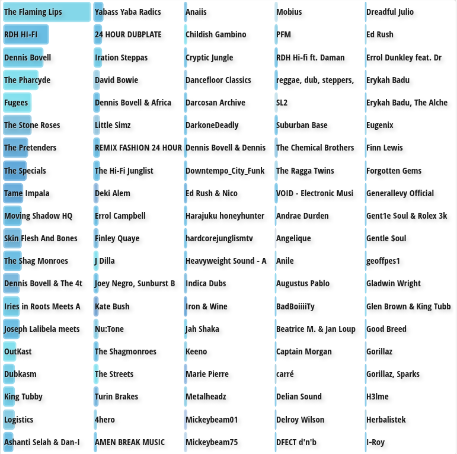

+++
title = "Week Notes: 39|2025"
description = ""
date = 2025-09-29T19:51:13+01:00
draft = false
images = []
tags = []
+++

**Family**:\
My dad has been given oxygen cylinders to help manage his worsening breathlessness due to exasperation of COPD. Him and mum have not been out at all for three weeks as a result. This week was different. My younger sister drove them to Canterbury. Dad had volunteered to attend a council meeting to share his views on something or other. Not sure what. Mum spent time with my sister by the riverside. Mum's sister has been diagnosed with terminal cancer. Her other sister died last year. Cancer as well. Not a happy time. 

**Work**:\
No dramas. Oh other than the Corporate Director bidding his farewells on Thursday. He said he was not one for long goodbyes but was sticking around until the end of the month to ensure a smooth handover. That would be less than a week then. Did he jump or was he pushed? Either way I don't think he had much choice.  

 
**Cycling**:\
Just two rides. Both on the same day. One in the morning and one at night. My hands were freezing on the morning ride. Clear skies at night. The night time ride was okay. Cloud cover during the day kept the temperature up.  117km total. I have often not managed the transition from warm to cold weather very well. When it's one thing or another I can dress for that. It's automatic. Warm one minute and cold the next takes a bit more thinking. I've ordered some new cold weather riding clothes. 

**Photography**:\
Took a few snaps while down in [Folkestone at the weekend](https://www.bongotwisty.blog/harbour_arm/). Another of a friend sat next to the artesian well at Harty Ferry. I should remember to ask about sharing. Without permission it does not feel right to do so. 
 
**Listening**:

From [LastChart](http://www.lastchart.com.s3-website-us-east-1.amazonaws.com)

**Screen time**:\
Another half dozen or so archived posts republished. A couple of new ones written. 

[Steve](https://www.imdb.com/title/tt32985279/?ref_=ext_shr_lnk): I fell asleep through parts of it. I get what the film was conveying. I have worked with similar young people. The story just didn't hold together too well for me.\
[The Naked Gun](https://www.imdb.com/title/tt3402138/?ref_=ext_shr_lnk): Very funny. Laughed out loud. Remained true to the original film(s). Liam Neeson is very good in a comedy role.\
[Pride and Predjudice and Zombies](https://www.imdb.com/title/tt1374989/?ref_=ext_shr_lnk): Enjoyed this much more than I thought I would. Crisp production. Great sets. Well choreographed action scenes. Good humour. Classic story plus Zombies. What's not to like.\
[When Eight Bells Toll](https://www.imdb.com/title/tt0067976/?ref_=ext_shr_lnk): Another classic. Certainly not timeless though. Would it be sacrilegious to say Anthony Hopkins puts in a great show of hammy overacting?\ 

A few blogs deleted from my NewsBurner feeds. A couple of new ones added. I remembered to save a blog post that chimed with me...

[Breaking the Loop: Replacing Reddit with Quiet and Focus](https://jishu.bearblog.dev/breaking-the-loop-replacing-reddit-with-quiet-and-focus/) *"Do I really need to read another book on habits, minimalism, or fitness routines—or do I just need to take out the trash, sell some things online, and go to the gym and do the workout I enjoy?"*\
I think we all know the answer to that. Having an awareness of, understanding what's behind, and overcoming the reasons why we do not act on what we know makes the difference. Inner work. 

**Other business**:\
The 16:8 eating habit continues. I rarely cook so when I do it's an occasion. This week I made a very tasty vegetable... not sure what you'd call it. If it had meat in it I think it would be a stew. Butternut Squash from a friends allotment, potatoes, carrots, onion and red lentils. Gravy granules, vegetable stock cubes and powder. A good dash of turmeric, all seasoning and paprika. Those at home seldom eat what I cook. We have different tastes and takes on food. I'm a veggie and none of them are. I eat everything I'm given and grateful for it. The others are a lot more picky and think nothing of turning their nose up on what's been prepared. Not sure I shall ever understand why that's considered okay. 

