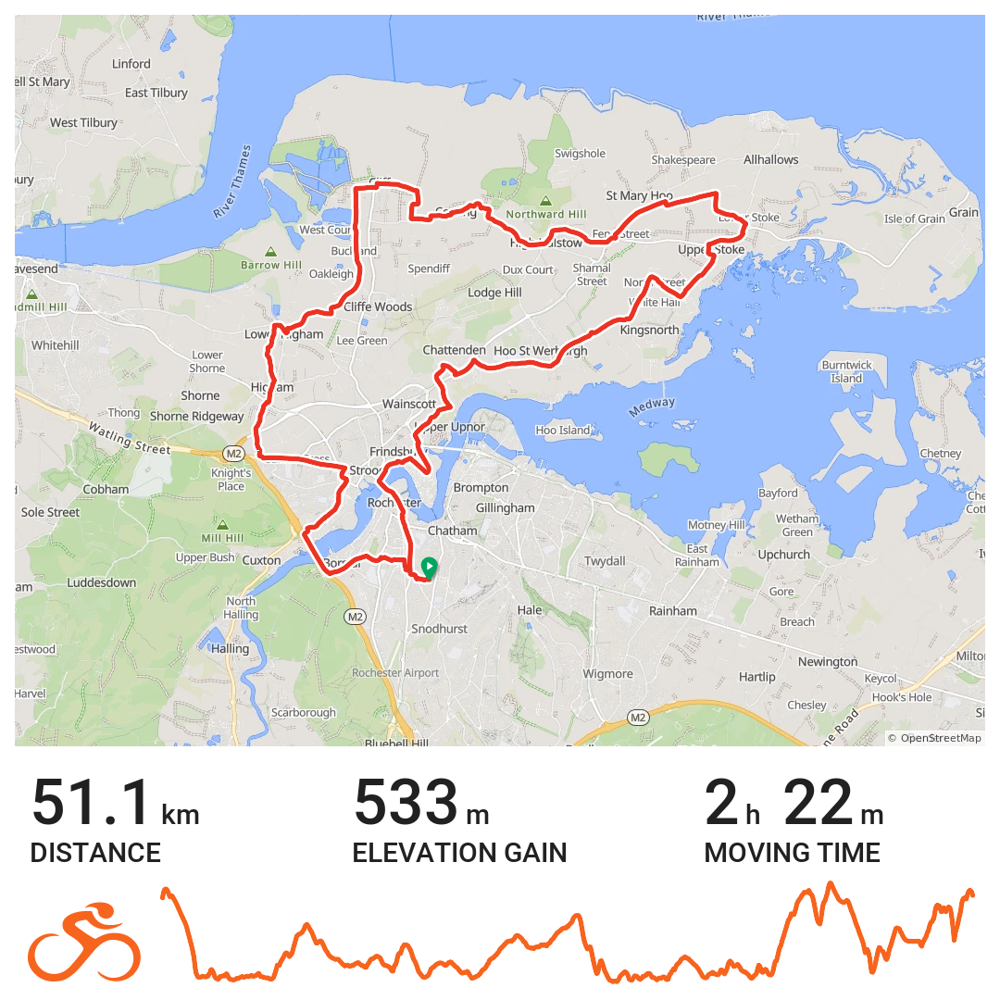
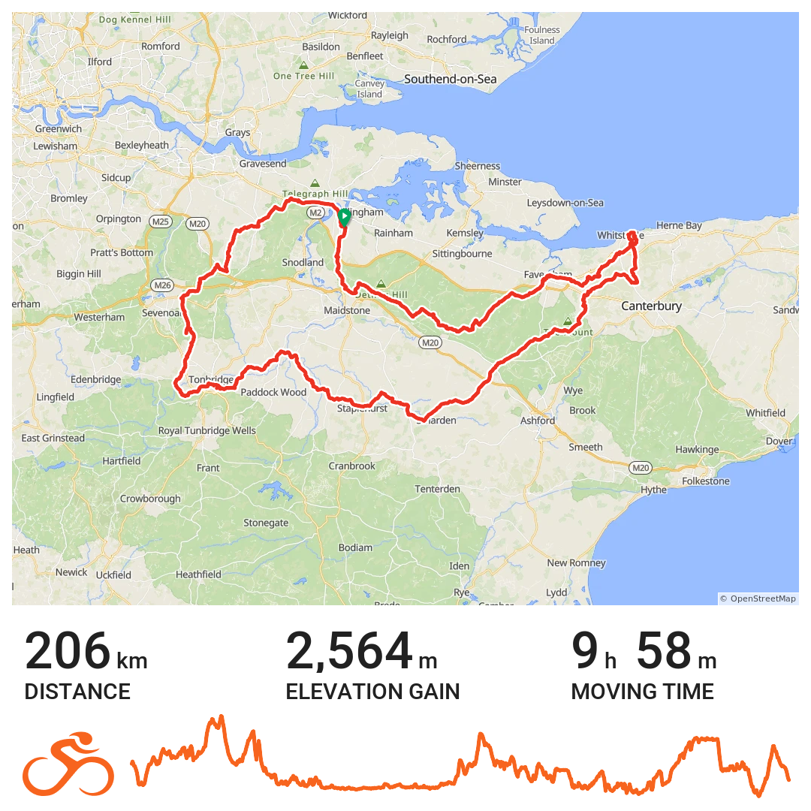
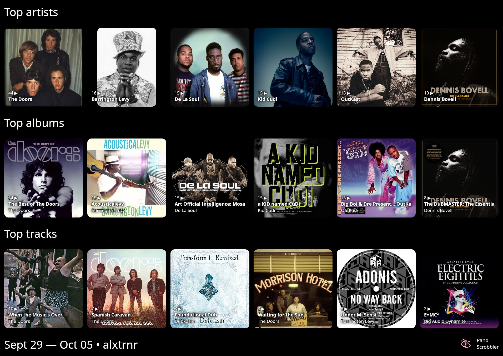

+++
title = "Week Notes: 40|2025"
description = ""
date = 2025-10-05T10:15:13+01:00
draft = false
images = []
tags = []
+++

**Family**:\
My mum is the oldest in her sibling group. Three girls and two boys. Her surviving sister died last week on Wednesday. She was in a hospice. Cancer of the larynx and oesophagus. My mum said that being the oldest she'd not thought that she would be the one sobbing sadly at her siblings funerals.\
I knew what I thought but not what to say. Comforting words that seemed anything more than trite did not spring to mind. A rational observation about the arbitary nature of life and death did not seem fitting. Something about lifestyle choices and general disposition, harsh. If nothing else you saved them from the sadness of going before them. Very big sisterly. 

Visted the parents at the weekend. Mum was just back from an appointment to remove a patch on her nose diagnosed as basal cell carcinoma. She's been told to avoid doing too much for the next three weeks. Dad is still getting breathless. Neither of them will be getting out much.  

Spouse had a consultation with her GP. Nothing definitive. Maybe migraines. General advice received about eating healthily etc... 

S3 back from uni during week. He's captain of a local football team. His team won. He said it looked like they were going to win the league. I thought it wwas a bit previous to bank on that. He said they were so far ahead others would not catch up with them now. I know nothing about football but thought the season had just started. What do I know. 

S2 and S3 are both now involved in the alpha/beta testing phase of the music app a friend of mine has been developing. S2 might be involved in data analytics with the app at some point. He's completed a music and business degree and is now completing a data analytics course so is well placed for it. Hope it works out. He'd welcome something more on his CV than warehouse work. 

**Work**:\
Got a few things done. Few boxes ticked. Poked and prodded a bottleneck to help move things along a bit. That may have backfired. What was endorsed in August may no longer be in favour. Time to step back and pause.\
On Friday I spent a bit of time developing a tool to scrape the CQC website of data relating to the outcome of local authority assessments. See this [post](https://www.bongotwisty.blog/cqc/) if that's of any interest to you.

 
**Cycling**:\
Out for a ride every day last week. Up and out the door around 5.00 am Monday to Friday. Same route each day

It's become a goto ride over the last year or so. Having a regular route like this works really well for getting the miles in. Not having to think about where to go, how long it will take, what the conditions will be like etc.\
I'm properly sorted on the clothing front to deal with whatever the weather is between now and spring. Feeling cautiously confident I'm going to reach my annual distance goal. 

Completed a 200k DiY audax on Saturday. It was very blowy out with the tail end of Storm Amy continuing to clear the air. I took this into account with the route planning. Had the wind behind me for the much of the first half. Protected from the wind by hills and hedgerows on the second. 

Stopped for breakfast in the cafe at Headcorn Areodrome at 10.45 am. It was a bit early to stay true to the intermittant fasting schedule I've been following. Sometimes it makes sense to do something different. With just over four and half hours / 90km of riding done I felt alright with making an exception. 

Finished the week with just over 514k done. Happy to have completed the 200 so early in the month. It's the first ride of the third consecutive RRtY. Toying with the idea of two years in one. That means at least two 200 + rides each month for the next year.  

**Photos**:\
 One more postbox topper on Saturdays DiY ride. Couple of other snaps but nothing worth sharing. 

 
**Listening**:

This weeks graphic created using the [Pano Scrobbler](https://kawaiidango.github.io/pano-scrobbler/) appimage for Linux.

**Blog posts**:\
Once again I have not saved or shared any blog posts I have read which struck a chord with me. It's not that none have it's just me not remembering to note those that do. Those that do not seem to stick in my memory for longer. 

**Screen Time**:\
I watched episode one of the current Slow Horses series. Not sure why but I was not as taken with it than with previous seasons. Wondering if the line between character and caricature has become blurred. Not watched episode two yet. I'll give it a go. 

Ellis (Inspector Ellis) on Channel 5 is pretty good. My dad suggested it to me at the weekend. Watched the first epsiode last night. It was a bit long but I guess she did solve the case from a cold start. 

We got a new TV. Special to me but pretty standard really. 43" inch smart TV. Not had one of those before. A bit of a revelations. So many free channels. Also prompted me to get the boys old Xbox down from their wardrobe and hook it up in the living room. Revived an old account I still had the details for. I've been racing around Mexico in Forza Horizon Five.

**Other business**:\
Nothing much come to mind. 