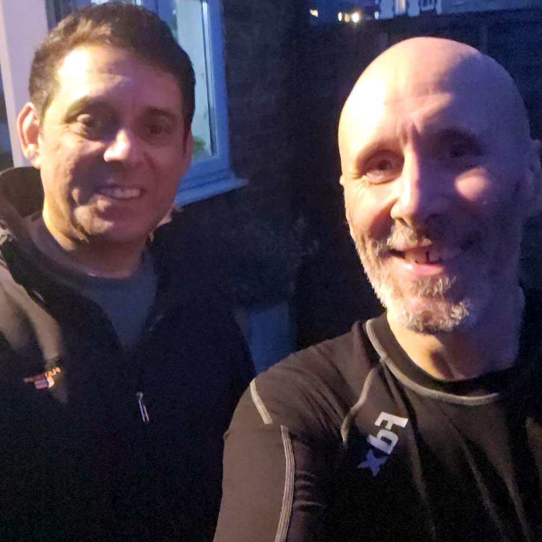

+++
title = "audax: All the Home Counties 300k DiY"
description = ""
date = 2025-12-07
tags = ["cycling"]
+++

Continuing on my mission to ride 18k km this year. I was out all day yesterday on a 300 DiY. A circumnavigation of the London Orbital AKA the M25. Obviously not on the motorway. Following lanes and roads close to it. In the course of doing so I entered each of the six traditional home counties. 

1. Kent - southeastern section
2. Essex - northeastern section via the Dartford Crossing
3. Hertfordshire - northern section
4. Buckinghamshire - northwestern section
5. Berkshire - western section
6. Surrey - southwestern section

This is the maybe the 3rd or 4th time I have done the ride. Each time I tweak the route a bit. Lessons learned and all that. Pretty happy with the latest version. Closest I have come to actually closing the circle. The M25 is not a full circle in any case. The beginning and end is the A282 on both sides of the Dartford Crossing. Given that it's fair to say this route in indeed a loop of the M25. 

My favourite part is through the Essex countryside up to Epping. It's very rural. Not flat but not especially hilly. The roads are quiet. After that the stretch from St Albans round to Chalfont St Giles. Farmland, quite lanes, small towns and villages. I typically get to the co-op food store in Chalfont at around 1.00 pm and get a bit of lunch there. The standard meal deal hits the spot with me. 

Each time I have done the ride it's been around this time of year. Short days. I always go counter clockwise to avoid getting to the Dartford Crossing at shift change over time (9.00 pm - 10.30 pm). The shuttle service does not run at those times and I'd end up waiting for 90 minutes at the roadside. This inevitably means I'm riding in the dark by the time I reach Surrey. I am familiar with the area so it's not as if I missing scenery I've not seen before but it would be nice to do it in the daylight sometime. 

Predictably I got a puncture on the way. It was a slow leak. Rather than stopping to mend it I continued to ride and stopped a couple of times after 40 - 60 km to pump some air into it. This was a mistake. Only because it was on mind the whole time and kind of marred my enjoyment of the miles. 

About 20k outside of Woking I noticed my front mudguard had become partially detached. A while ago the rivets holding it to the supporting frame had failed. I bodged a mend with a couple of zip ties. The lower one of these had snapped off. Another thing to occupy my thoughts. I found myself imagining the other tie snapping on the way down a hill, the mudguard fouling on the wheel and me going flying over the handlebars. What with the recent spate of misfortunes and mechanical failures on the bike I thought it best to do what I could to mitigate the risk. 

Lucky for me a good friend of mine lives in Woking. I checked how far his address was from the route. It was literally a couple of minutes at most from where I stopped to look. He was home and happy for me to visit.  Great! Nipped round  and stayed for an hour. Time enough for a chat, a couple mugs of tea and to make good the mudguard. Very happy. Should have fixed the slow puncture too. 

About 30k after setting off again I needed to pump the tyre once more.  I'd pushed my luck too far. It lost air much quicker this time. Needed to stop after a few kms to patch the tube and put the spare one on. With this done I was making a good pace again towards the last planned stop at Edinbridge just over the county boarder into Kent. The last 60k was happily uneventful. Got home at 11.30 pm. Job done. 
