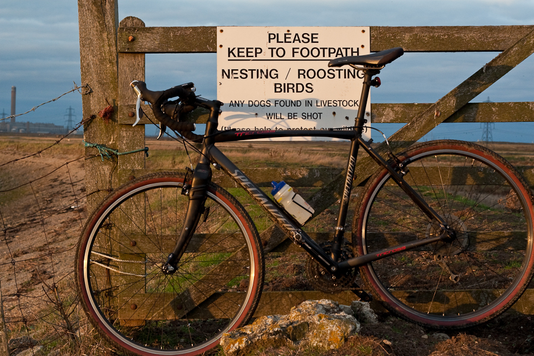

+++
title = "Cycle Ride #1"
description = "Chatham to Sheppey loop"
date = 2009-10-27T21:55:13+01:00
draft = false
images = ["route.jpg", "tricross"]
tags = []
+++

Riding a bicycle is one of my favourite things to do. Ever since I was a young boy there has not been many occasions when I've not owned a bike. Just recently I've bought a new second hand bike.

It's fantastic. The best bike I've ever had. I've been out on it as much as I can get away with. Seemed worthwhile to post about some of the rides so here's the first in the series to come. From home in Chatham to the Sheppey Crossing following the Saxon Shore Way on the outward leg as far as it is possible to do so.

In all about 34 miles. For most of the way it's possible to stay close to the Medway Estuary and the River Swale. I set off quite late in the afternoon and by the time I was closing in on Sheppey dusk was setting in. The light was beautiful. As I made my way across farmland to the Swale rabbits were running about all over stretching their legs after a days slumber. The water was mirror calm which was in stark contrast to when I paddled up and down it in a canoe during in the summer.

Here's a few pictures I got along the way.

  
  
  
  
  

              