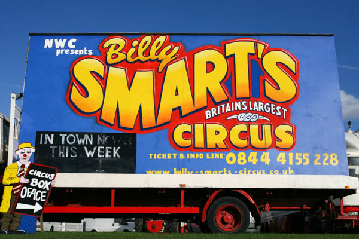

+++
title = "The Circus Has Come to Town"
description = "Rochester and Strood By-Election"
date = 2014-10-19T19:51:13+01:00
draft = false
images = []
tags = []
+++

A local by-election has been prompted by tory MP Mark Reckless defecting to UKIP. In the last week or so the Conservatives and UKIP have been doing what they do to win over the local electorate. Leafleting and telephone canvassing. Drop in appearances by the leaders of each party. Pop up shops at either end of Rochester High Street. 

This is all expected. They have to work hard at this. Cameron and his chums know we know they pulled up the ladder on the 99% a long time ago. Only time they feign any interest in what we think is when they want our vote.

Farage is a smiling mercenary. His penchant for supping pints with the locals should fool no one. Anyone who thinks UKIP has their interests at heart are gravely mistaken. Farage et al are all from the same mould as Cameron and his crew. Just as self-serving and deceitful.

[We need a sea change in politics.](https://greenparty.org.uk/about/our-core-values/)

That will only come about by people having the guts to break away from the tired old politics of Tory and Labour. I think UKIP will simply rehash the policies of each adding their own special flavour of prejudice and elitism. Sadly when it comes to the crunch though, as seen in the recent referendum in Scotland, the majority of the electorate lack the nerve and the conviction to oust tradition and try something new. Every nation gets the government it deserves.

> Toute nation a le gouvernement qu'elle mérite. *Joseph de Maistre*

I've not heard or read anything from the candidates for Labour, The Green Party, Liberal Democrats or Britain First. There's still a month to go till the by-elections. Along with Billy Smart up on Jackson's Recreation field the circus has very much come to town.

