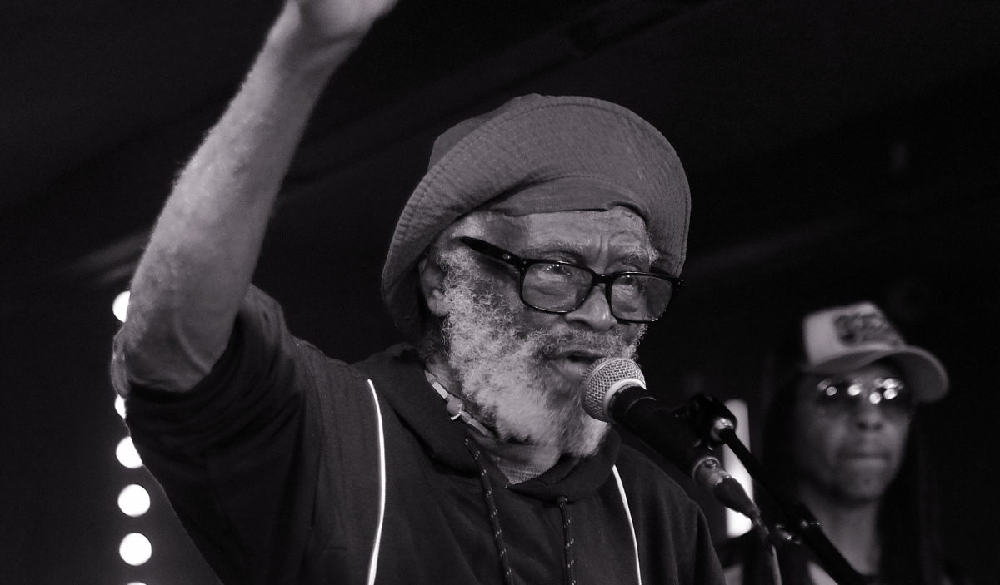
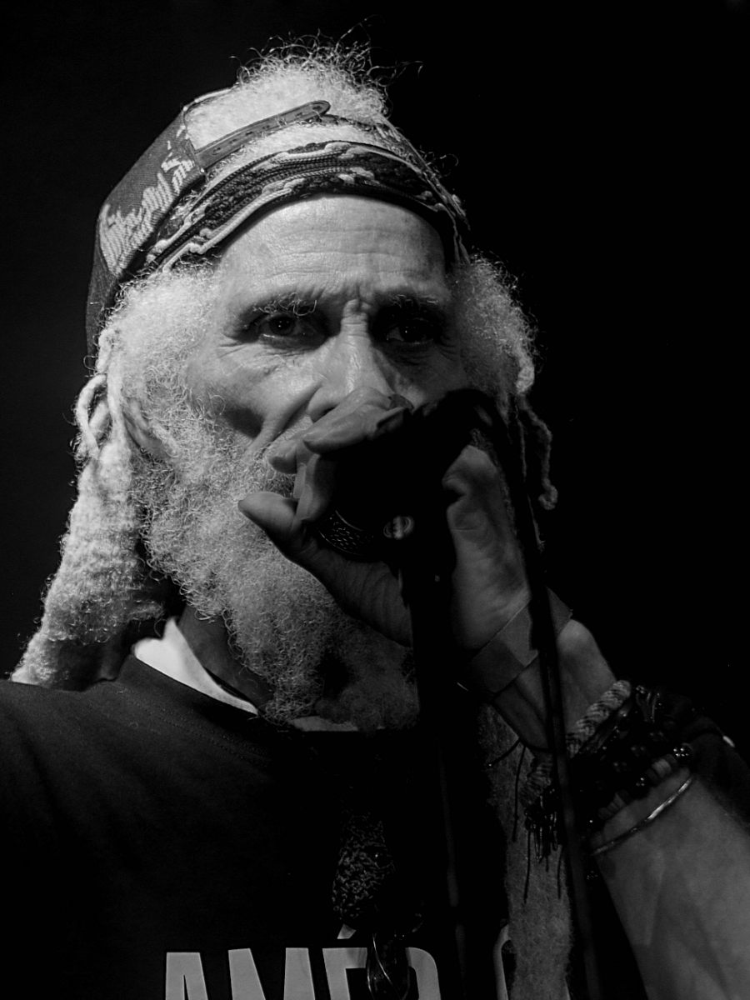
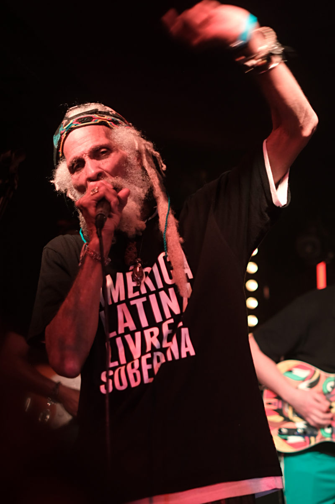

+++
title = "The Congos"
description = "At the Fox & Firkin, Lewisham"
date = 2025-10-28
tags = ["music"]
+++

Back in the early eighties I was bang into the two tone ska and rudeboy bands of the time. My favorities were The Beat. They were the first band I ever saw playing live. I still have a drumstick Everet Norton threw into the crowd at the end of playing Mirror in the Bathroom. I lamented the passing of this particular era as the New Romantics began to dominate radio playlists. 

I hung on though and with a good friend followed the natural path from ska to reggae. The Beat helped with this through their Go Feet record label. They reissued The Congos, Heart of the Congos in 1980. "Fisherman" was one of the tunes that sparked the blaze of what became a lifelong love of roots reggae. Back then The Congos were a world away from my teenage years living in Canterbury. The thought of seeing them play live unimaginable.  

Spouse and I went to see the Congos play at the Fox and Firkin in Lewisham last week. So happy to have had the opportunity. None of us are getting any younger. The set list included so many classic tunes. Starting with "Open up the Gate", through a gratifying collection of old favourites, some new songs true to their style, and closing with "Fisherman". They sung with love and energy. The players of instruments served them well. It was a great night out.   

")

