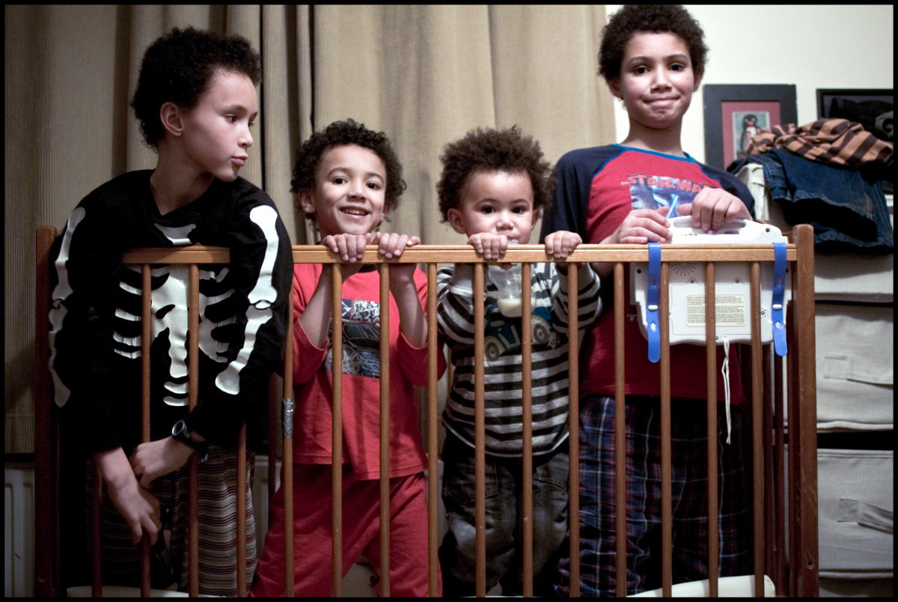

+++
title = "Turning a Page"
description = ""
date = 2011-04-03T19:51:13+01:00
draft = false
images = ["20110403_cot.jpg"]
tags = []
+++

All four of them have had their turn in this cot. Coming to an end of a chapter now. No more babies planned. Nappies, bottles, wipes and so on are all now coming to an end. Ten years of it and I'm ready to see all that baby stuff go. Rolling up my sleeves for the next episode. About a year or so to go and the first onset(slaught) of puberty...