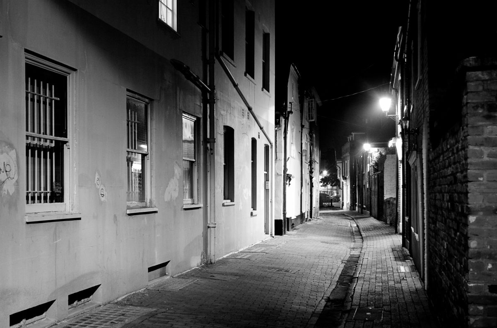
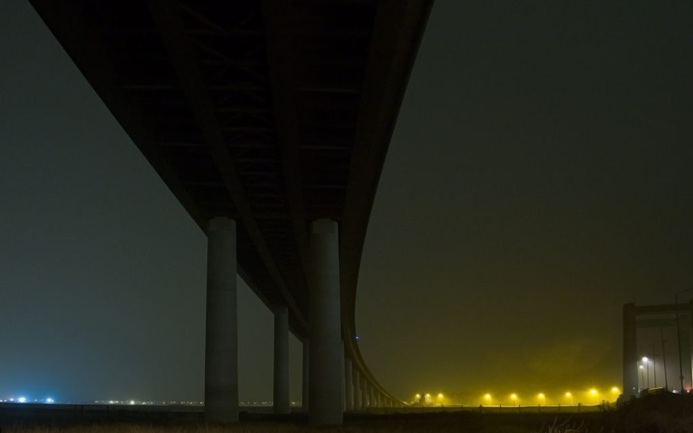

+++
title = "Drop one pick up three."
description = ""
date = 2007-10-01
+++

So I missed a day. On the 17th September I wrote a post, which was the first one I'd written, with some thought, for quite a while. It was an introspective ramble which if you want to read you will have to find yourself cos I ain't gonna make it easy and link back. Anyway in it I said I'd be posting daily. Yesterday I did not.

There was a good reason for that. I went on an errand. It never took long though my journey home was meandering. From Whitstable back to Chatham via Seasalter, Faversham, Sittingbourne, Sheppey Bridge and the back roads home along the path of the River Medway. I stopped a few times to take some pictures. Night time photography. The weather was lousy and got progressively wetter the nearer home I got. All the same I came back with a few pictures that I thought were worthy of an upload.

I got home about 11.30pm and did the decent thing, I spent some time with spouse rather than on the computer.

So though I missed a day, the first after 15 days straight. It was worth it I reckon to serve a higher cause. I'd be surprised if anyone noticed and confused if anyone cared. I just needed to acknowledge my omission.

As you can see I'm back now on rambling form.

Update on the Highways front. I have a date. I shall be out taking pictures of the [M25 / A2 roadworks](/pdfs/Exec_summary.pdf) next week. The forecast for the day before is sunny skies. Fingers crossed it will remain dry and there will be some fluffy clouds on the actual day. I'm really looking forward to this. A couple of visitors to this blog have been interested enough to give their tips about catching good light. Thanks [Gary](https://pigstyave.blogspot.com/ "Pig Sty Avenue") and [Brendadada](https://www.flickr.com/photos/brendadada/). I shall be there as early as I can convince my escort to accommodate but he's in charge of how much time I get and when so I'll be making the most of whatever conditions prevail on the day.

Back to the post of the 17th. In it I wrote about doing things differently. This little planned excursion is some proof to me of the benefit of that intention. The only thing I did different was to express an intention and put some action into making it happen. Nothing like a success to encourage repetition. With that in mind I'm starting to think of other stuff I'd like to do and never got round to, and set myself another objective.

If you read this far thanks. Here's the [link](https://www.bongotwisty.blog/its_all_about_me/) back to the post of the 17th if you missed it and want to have a look. Like the advert says "...because you deserve it" ;0)
