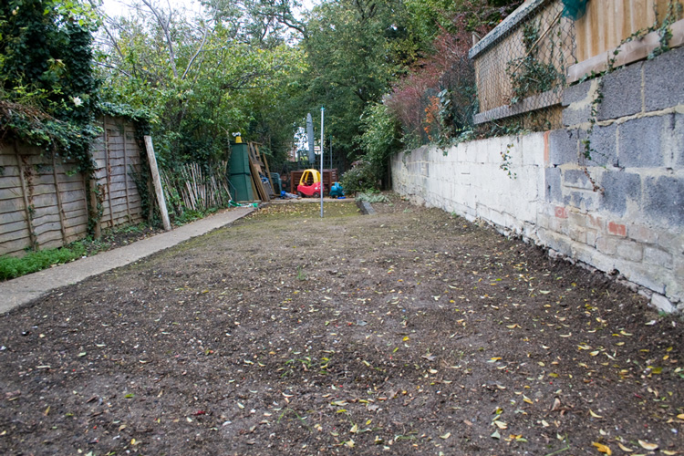

+++
title = "Growing My Own Grass"
description = ""
date = 2007-09-30T21:55:13+01:00
draft = false
images = ["grass_day_7.jpg"]
tags = []
+++

I'm a long time fan of grass. Thought it time I should grow my own. The picture below I hope illustrates the promise of things to come. A lush green lawn with any luck. As far as gardening goes I'm lacking in experience so all my fingers and toes are crossed that things go according to plan and grass starts sprouting in the next two weeks or so.

It's taken a few weekends to get to this point. When we moved in the garden looked very different. Since then I've moved paving slabs, taken up decking, shovelled up play bark, dug and moved a load of soil, picked up thousands of stones, levelled raked and levelled again. I put down the grass seed on Saturday.

I'll be taking a picture now every Sunday to record any growth that happens. I'll post the pictures. Wish me luck and check back in a week if not before.

  	
  	
  

