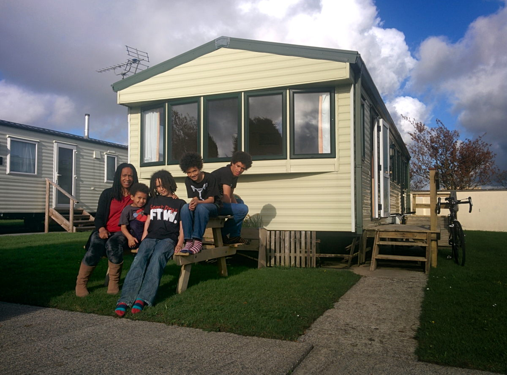
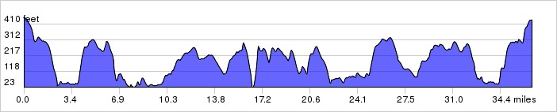
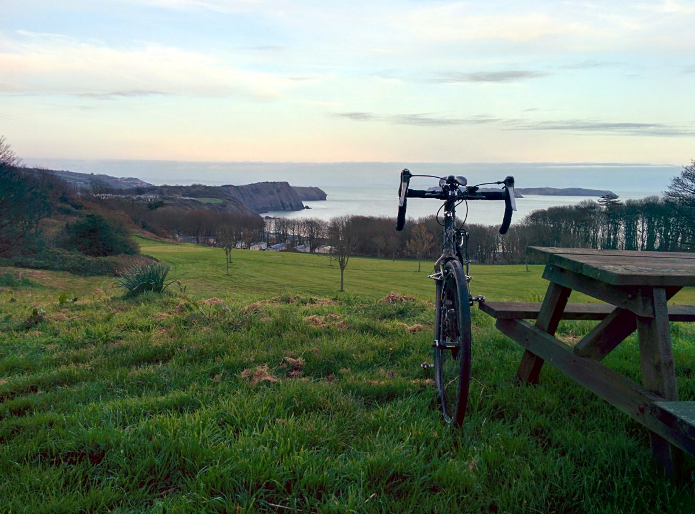
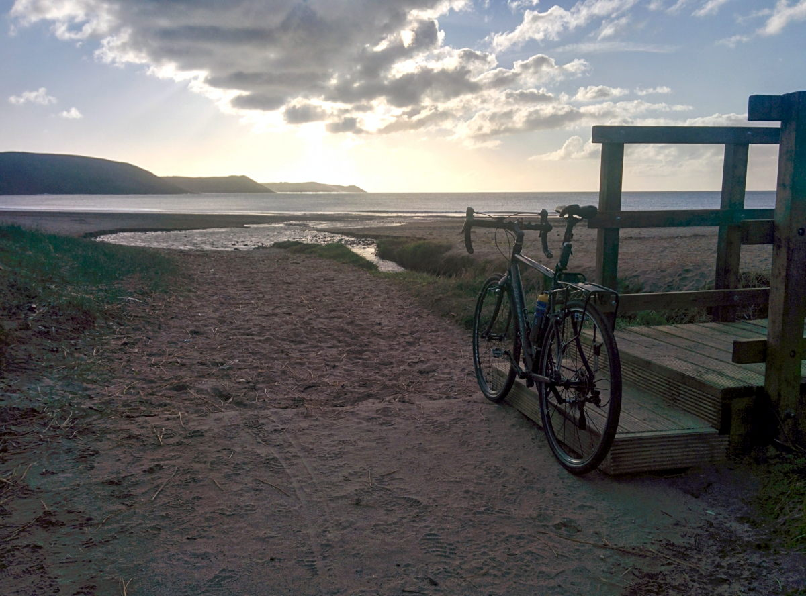
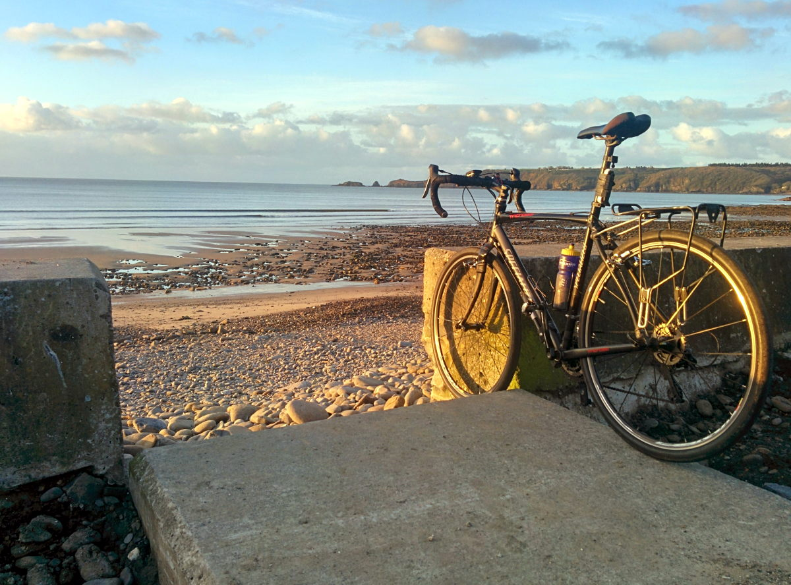
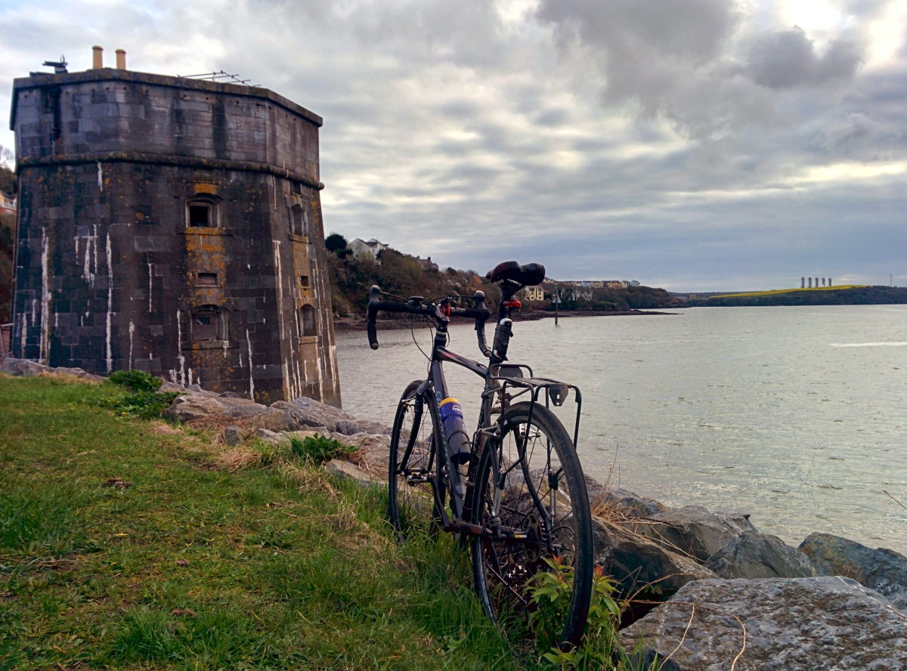
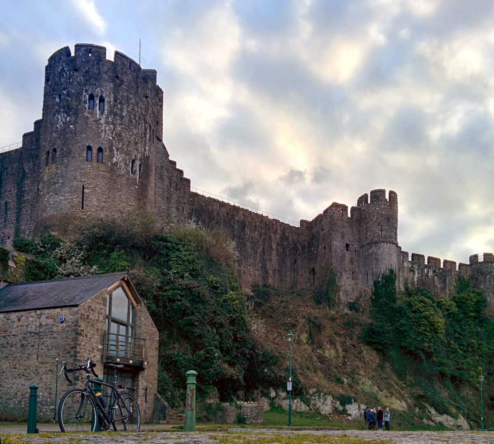

+++
title = "Hills and Valleys"
description = "A  Holiday in South Pembrokeshire"
date = 2014-04-11T19:51:13+01:00
draft = false
images = []
tags = []
+++

Just spent a few days with the family in South Pembrokeshire in South Wales. We stayed at [Little Kings Holiday Park](http://littlekings.co.uk) from where I started out on a few rides around the area.

A few observations from a cyclist perspective. There was a lot of us about. Each time I ventured out I saw at least a dozen or more other cyclists enjoying the roads and fine weather. Friendly people as well. Those that did not say hello or otherwise acknowledge me were in the minority. It was lovely. Even pedestrians were giving me a nod, a wave or a friendly greeting of one type another. I tacked on the wheel of one guy and rode a few miles with him taking it in turns to tow at the front. Really made it feel like a good place to spend some time.

The roads were on the whole very good quality in terms of the surface. Many of those that I rode on had been resurfaced either very recently or in the last year or two. Never experienced anything like it. There were a few that were badly rutted and potholed but to be fair these were proper back country roads used probably more by farm traffic than much else.

Hills and valleys were very much in preponderance. Every ride was characterised by the undulating contours of the environment.

None of the hills was so long as to make them tortuous and all were balanced out by sweeping downhill sections to pay back the effort put into the climbs. I loved it.

The scenery was great. Much of Pembrokeshire is a designated natural park. The coast line is stunning with some of the best beaches I've ever seen in the UK. Easily matches up to anything I've encountered in Devon or Cornwall.

I mostly stuck to the countryside but passed through some towns and villages along the way. Saundersfoot and Tenby were both lovely.

I have a bit of a penchant for urban decay and what with coming from Chatham with its naval dockyard history I felt compelled to visit Pembroke Dock. Like its counterpart in Chatham the Royal Navy ceased any substantive operations from there long ago. Although active warships were not based in Pembroke Dock after the 1940s, and formal dockyard work ceased in 1926, the base remained an official Naval Dockyard, and retained a Queen's Harbour Master, until 2008. You'd never guess it though looking at the perimeter wall which was impressive in its stature and showed little sign of deterioration other than natural ageing.

There's a couple of [Martello Towers](https://en.wikipedia.org/wiki/Martello_tower) there to which I had to have a look at to compare with those which can be found closer to my home in Medway. They were fine specimens and had stood up to the passage of time better than those I was more familiar with.

On my way out of Pembroke I passed by the [Pembroke Castle](https://en.wikipedia.org/wiki/Pembroke_Castle) which was an impressive looking edifice.

I really enjoyed cycling around the area. I have a feeling this will not be the last time I pedal about this part of the world.
