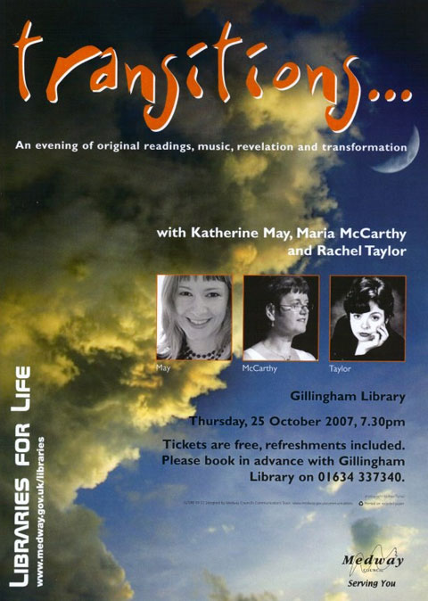

+++
title = "Twenty one days post seeding"
description = "Home Grown"
date = 2007-10-21
+++

Home grown in Medway. Our lawn and two local artists. Our lawn first.

It's now 21 days since the seed went down. Growth has slowed a bit from the amazing pace seen between being [seeded]( https://www.bongotwisty.blog/growing_grass/), to [seven days](https://www.bongotwisty.blog/seven_days_post_seeding/), then [fourteen](https://www.bongotwisty.blog/fourteen_days_post_seeding/).

The bald patches are slowly getting covered and the rest is generally getting a bit thicker. I wish my hair would grow like that!

Here's how it's looking on day twenty one...

 

To the untrained eye i.e. anyone who is not out there everyday like me checking on progress it probably looks no different from last week. I realise any more pictures now are perhaps superfluous to requirements. What the hell. I'll stop next week at 28 days post seeding. I'm not planning on mowing the lawn until spring so perhaps one more then just before I do will be in order.

Next up is support for Phil Dillon who is putting some of his photographs on show at the [Brook Theatre](https://en.wikipedia.org/wiki/Chatham_Town_Hall) in Chatham. The show runs throughout November from the 2nd to the 30th.

As likely as the second coming being on Wednesday week at noon and you happen to be reading this and in or around Chatham during November take some time out to pay the Brook Theatre a visit. 

Finally on the home grown front is another local artist. This time of the literary kind. Maria McCarthy who is a Medway based poet. She and two others (who I do not know of) have a show on next Thursday in Gillingham (another of the Medway Towns for those that are not local).

Though I do not know Maria personally I have seen her reading her work and enjoyed it. The connection I have is that she is using a picture I took of her performing at the Brook Theatre during the Medway Fringe Festival in 2006, on the publicity poster for the event next week.

 

Maria emailed me asking for permission to use the picture ages ago. I was made up that she wanted to use it and agreed of course. I asked that she attribute the picture to me and true enough the attribution is there on the poster. Tiny little letters that you can't see on this reproduction but there my name is all the same. It doesn't take much to make me happy.
