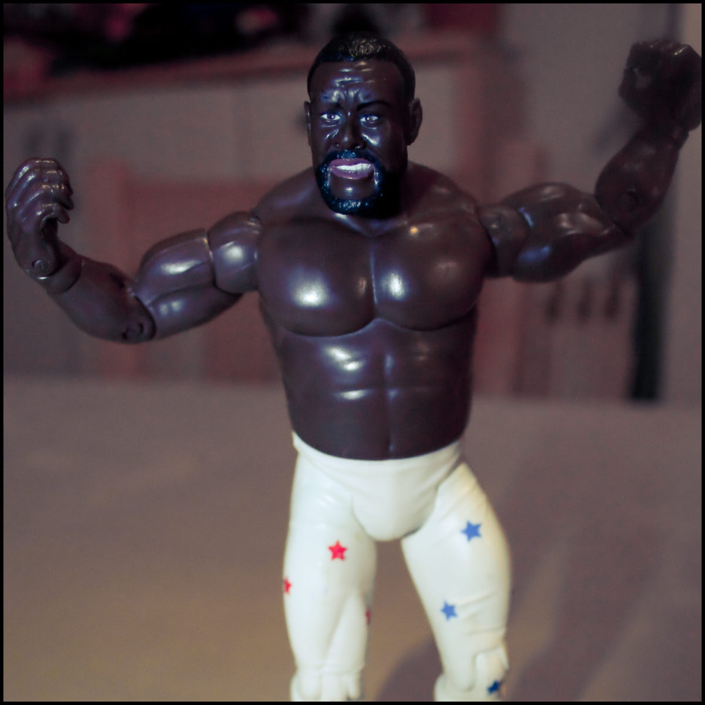

+++
title = "Grrrhh! 365/2011 Day 01"
description = "Junkyard Dog"
date = 2011-01-01
tags = ["Family"]
+++

C'mon 2011 lets have it!  
  
Day 1 of my first 365 project. 2010 had far too many days of being too busy with work to fit in the stuff I prefer to do with my time. Never got everything done at work anyhow!  
  
I'm a terrible planner in that I tend not to. Crap at organising myself in that I've not really ever bothered. Useless at setting goals that require a bit of effort. I coast along at the whimsy of passing tides and changing weather. Consequently there are a number of things I lament not having done.  
  
Could 2011 be any different? Well I have the intention it will be so that's a good start.  
  
The 365 project will become an indicator of my progress...