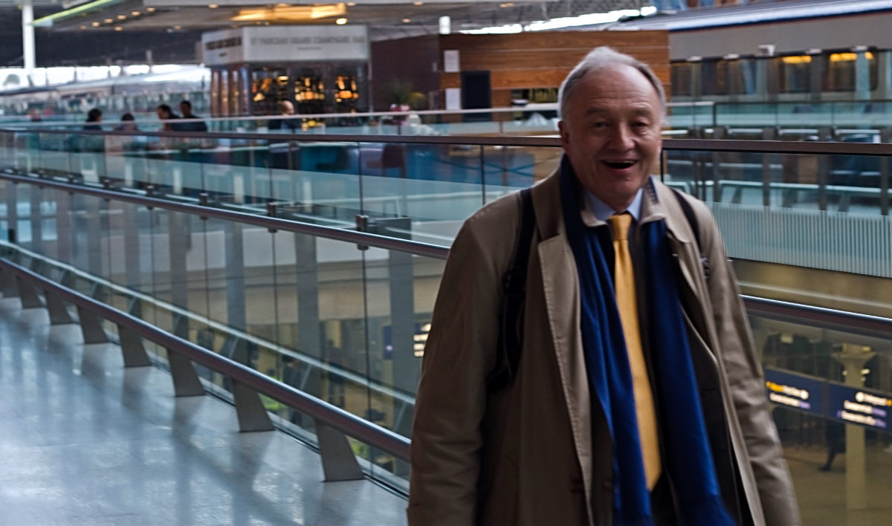

+++
title = "Ken Livingstone, Photography and Anti Terrorism Laws"
description = ""
date = 2009-01-20T19:51:13+01:00
draft = false
images = ["Ken Livingstone"]
tags = []
+++

To follow on from my [last blog post](https://www.bongotwisty.blog/photo_law/), today about 10 minutes after I took the shot above I was stopped by the police, searched, and questioned under section 44 of the Terrorism Act 2000. The police asked me to show them the pictures on my camera as part of their search stating the risk there was of hostile reconnaissance taking place in the area. The first picture that came up was this one. Not surprisingly the officer remarked it was Ken though then added, "...never mind. He's not the mayor anymore". The questioning continued without further event.

I didn't really mind being stopped in this way. The police explained themselves to me and were polite. What I do object to is being prevented from taking pictures where there are no legal grounds for doing so and being treated rudely and unfairly. That's what happened to me at Kingsnorth. On this occasion it was simply the way the officer nonchalantly dismissed Ken as he was not the mayor anymore that amused me. Ken never minded me taking his picture at all.

What's also interesting I suppose is the extent to which the officers inquiries albeit politely stretched the reasonable application of the guidance recently issued by the National Police Improvements Agency (NPIA) which states:

> The Terrorism Act 2000 does not prohibit people from taking photographs or digital images in an area where an authority under section 44 is in place. Officers should not prevent people taking photographs unless they are in an area where photography is prevented by other legislation.
> 
> If officers **reasonably suspect that photographs are being taken as part of hostile terrorist reconnaissance**, a search under section 43 of the Terrorism Act 2000 or an arrest should be considered. Film and memory cards may be seized as part of the search, but officers do not have a legal power to delete images or destroy film. Although images may be viewed as part of a search, to preserve evidence when cameras or other devices are seized, officers should not normally attempt to examine them.
> 
> Cameras and other devices should be left in the state they were found and forwarded to appropriately trained staff for forensic examination. The person being searched should never be asked or allowed to turn the device on or off because of the danger of evidence being lost or damaged.

I was simply walking down Midland Road outside St Pancras Station at the time with my camera in my hand. I was not in my view behaving in a way that would cause anyone to reasonably suspect I was taking photographs as part of hostile reconnaissance. Perhaps the police were acting on some intelligence that led them to believe I was. I don't know though. There were at least a dozen other officers. Other than me van drivers were pulled over and questioned and an assortment of other pedestrians. It did seem pretty random. Maybe we all fitted some kind of profile they were on the look out for. Maybe they were on high alert reasons for which the public are for obvious reasons not informed of. I know there is a balance to achieve between countering terrorism and maintaining normal everyday life. What made the encounter palatable on this occasion was simple good manners and a clear explaination on the part of the officer involved.
