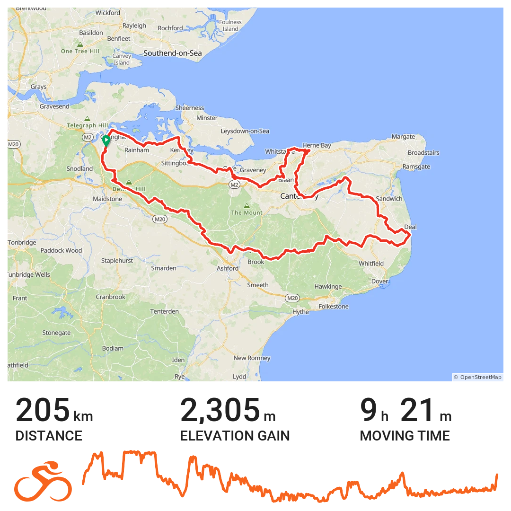
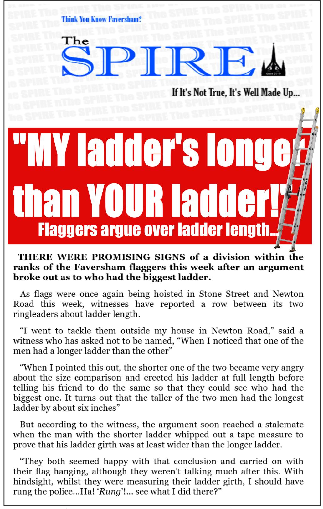

+++
title = "audax: Kent 200 DiY"
description = "Completed"
date = 2025-09-14T20:36:35+01:00
draft = false
author = "Alexander"
tags = ["cycling"]
images = [
"20250914_kent_200.png",
"ladders.jpg"
]
+++

Set out this morning at 5.00 am on a 200k DiY audax. The final one to complete for my 2nd consecutive [RRtY](https://www.audax.uk/awards-pages/randonneur-round-the-year/) award. At least one ride of 200km or more each calendar month for the whole year. You can start in any month, but miss a month and you have to start all over again.

Family visits in Deal and Tankerton on the way round for tea and sandwiches. Poor weather was forecast from around 2.00pm on. Sure enough that's when it started to rain. Just I was leaving Tankerton. Nothing more than a light drizzle for the last 50 k or so.\
Riding in Kent at this time of year is great. Blackberries everywhere there's a bush by the road. Fields of ripe sweet corn and orchards heavy with apples and pears ready for picking.\
Scrumping is the word given to picking fruit and veg from farmers land. I thought this was a commonly known word in Kent. Mentioned it to a couple of work colleagues and neither of them knew what I was talking about. One of them said it sounded like a sexual term. I guess if that's where your thoughts are at. I can go with that.

St George Cross flags were on nearly  all the the lampposts along Whistable Rd, Newton Rd, and Stone Street in Faversham. Unlike those in Medway these which are attached around half way up the lamposts, the flags in Faversham were fastened right at the top. Maybe they have longer ladders in Faversham. Looked to me though like a hydraulic cherry picker may have been used given the height. Seems like quite an expense to go to. Had me wondering if there was funding from outside interests with an agenda to promote. There was a bit of a commotion a week or so ago to do with unaccompanied asylum seeking children being accommodated in the town. Good to see the [local news reporting](https://www.kentonline.co.uk/faversham/news/police-called-in-as-hundreds-of-protestors-and-counter-demon-329532/) on the noisy and visible far right being outnumbered by counter protesters. I am convinced it's a small minority of people putting these flags ups all over to create the impression their views are a lot more popular than they actually are.  

