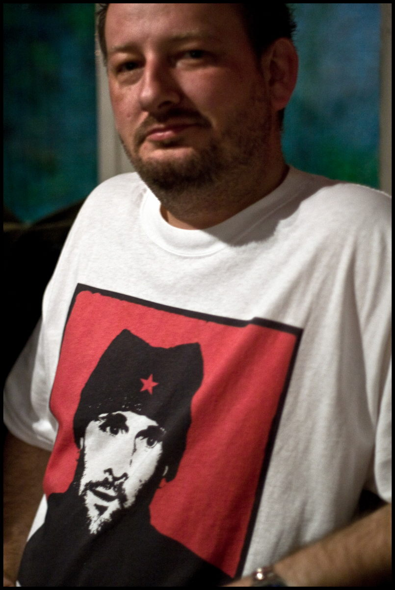
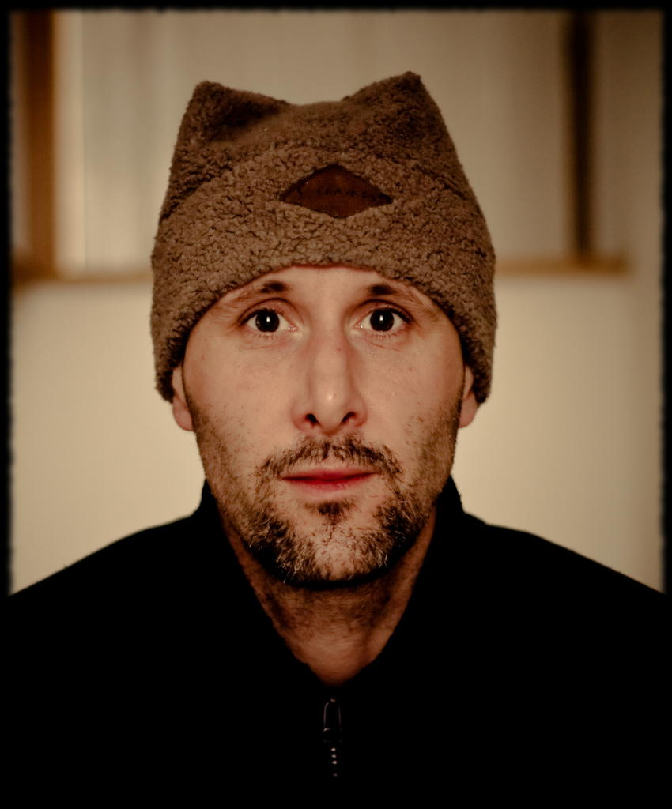

+++
title = "Monascow"
description = ""
date = 2008-03-20T21:55:13+01:00
draft = false
images = ["monascow.jpg", 
"me-and-a-hat.jpg"]
tags = []
+++

This made me laugh. I met up with Phil in the Command House. I never clocked what he was wearing until he pointed it out. The first and most likely the last time I see my face printed on a t-shirt. 

 The picture was was created by [Antony Martin](http://www.flickr.com/photos/antonymartin/ "Antony Martin") and posted to Flickr. It was a good surprise when I found it. This was the description that went with it -

> A tribute to the very successful [medwaytowns](http://www.flickr.com/groups/medwaytowns) group creator. Maybe we should start having tee-shirts made with this printed on them. It might just catch on. This is a derivative work of a self portrait by...

