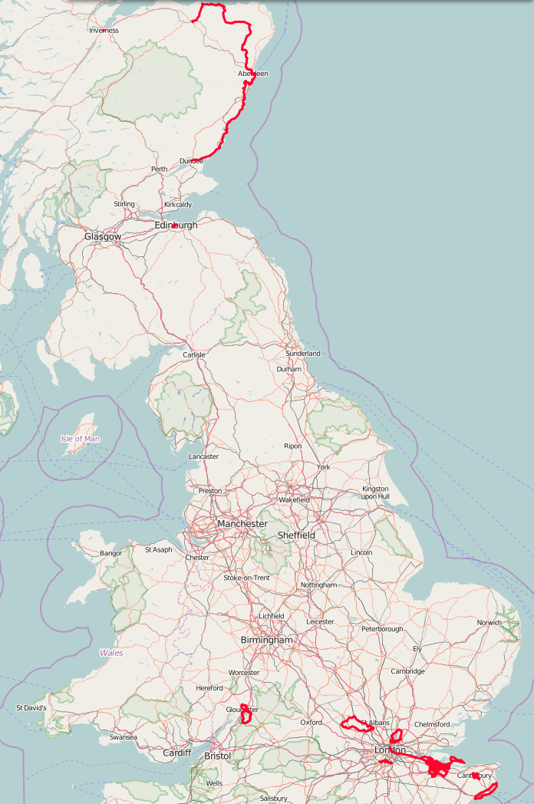
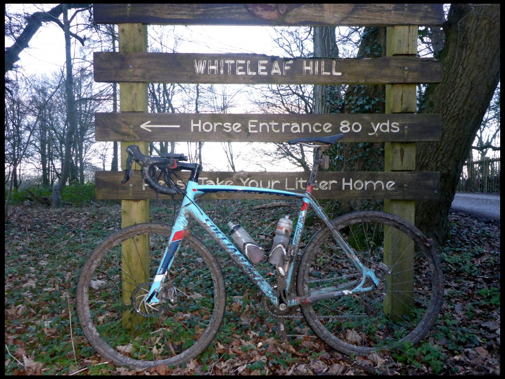
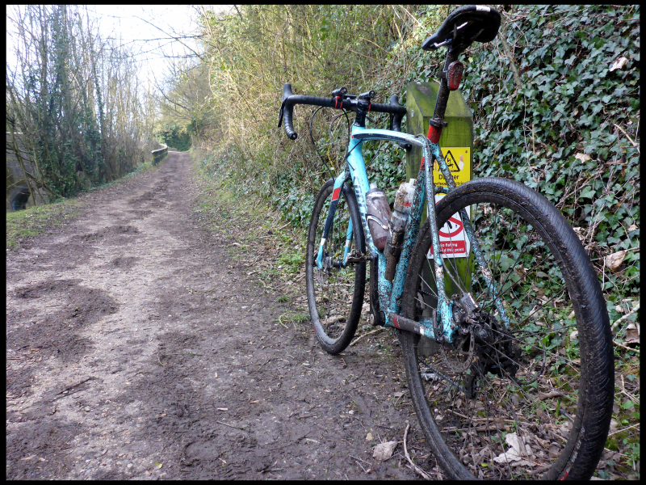
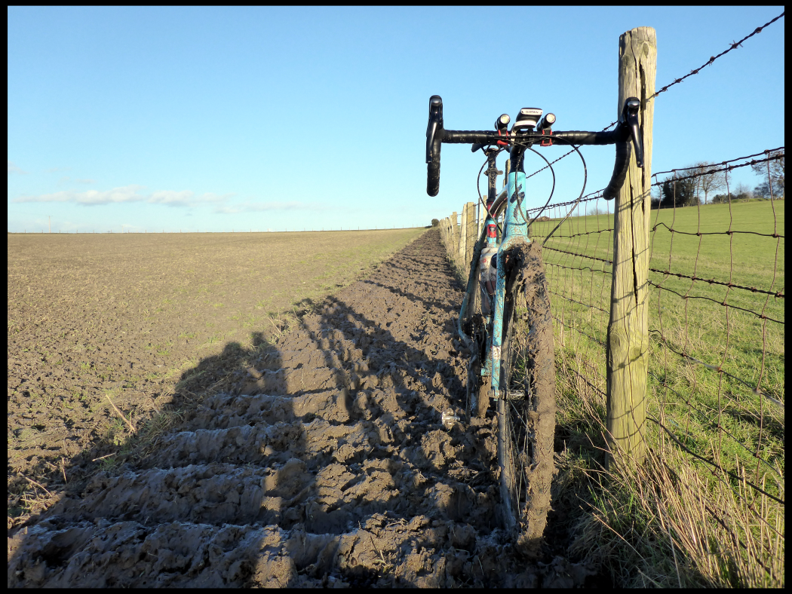

+++
title = "A month on the Crux Sport E5"
description = ""
date = "2016-02-09"
draft = false
tags = ["cycling"]
images = ["20160209-a-months-riding-on-the-Crux-E5.png", "20160209-crux-E5.png",
"20160209-Crux-E5-a-month-old-today.jpg", "20160209-muddy-crux-E5.png"]
+++

The new bike is a month old today. Very pleased with it. Lovely to ride. Smooth, nimble and a great fit. 1,019 miles done. It's been with me to the north, south, east and west. I've taken it through storms and muddy fields, along stony canal tow paths and bumpy tracks, into woods and on urban and country roads. Quite the versatile little number. Uncomplaining and ready to go where ever the fancy takes me.

Had a job near St Albans today. When I finished I went for a 58 mile ride. Took in #23 from 100 greatest climbs: Whiteleaf , Princes Risborough, Buckinghamshire. It's a bit of a slog but nothing too extreme. [Simon Warren](https://www.100climbs.co.uk) gives it a six out of ten. 1420m length with 127m height gain. Steepest bit is 1 in 7. Approx climb time of 6 mins. I did it in 7.52 mins. That was after riding 28 miles and through a lot of mud on the way. Not to shabby.

<iframe src="https://ridewithgps.com/embeds?type=trip&id=21152825&title=Whiteleaf&metricUnits=true&sampleGraph=true&distanceMarkers=true&showPhotos=true" style="width: 1px; min-width: 100%; height: 700px; border: none;" scrolling="no"></iframe>

It was a lot harder than it needed to have been. I was careless when plotting the route. I could easily have avoided the tow paths and muddy fields. Now I have a bike caked in crap that all needs cleaning off after work tomorrow. Another lesson learned.

Not decided on a name for it yet. It took me five years to name the Tricross. I called it Gezel. That's a Dutch word for companion or journeyman. It earned it. The Crux has bags of character but the spirit of it has yet to claim its name. All in good time.
