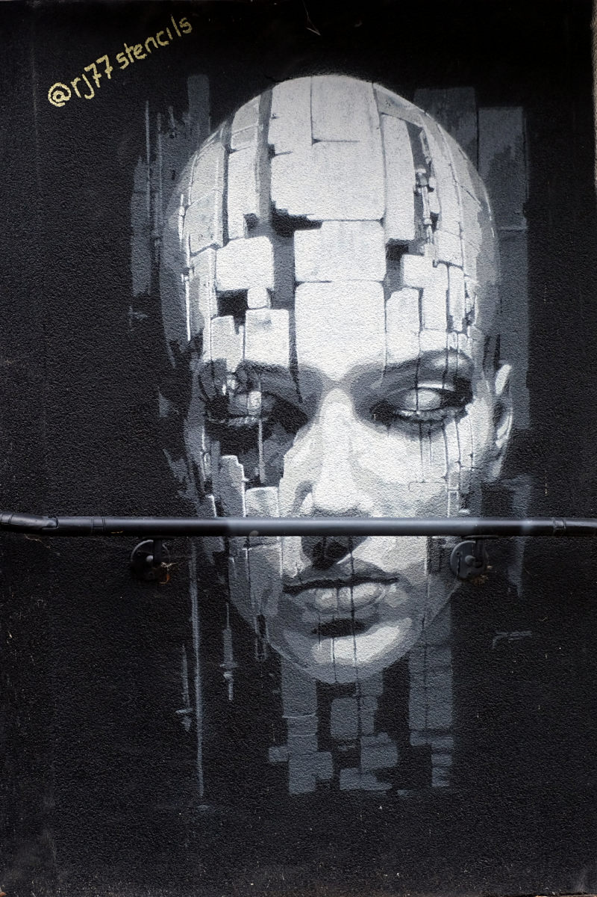
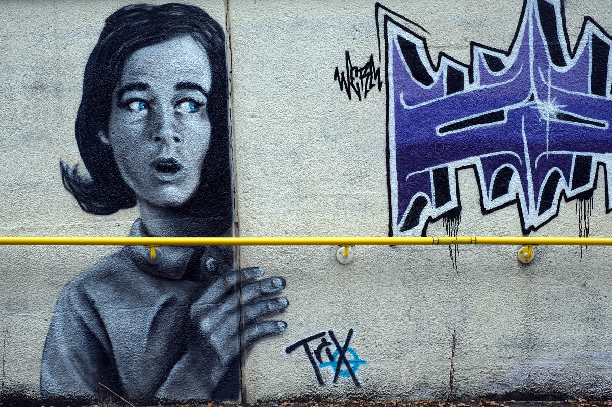
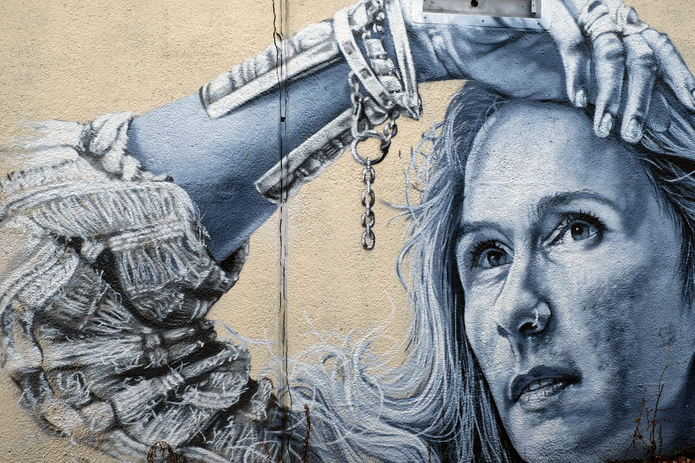
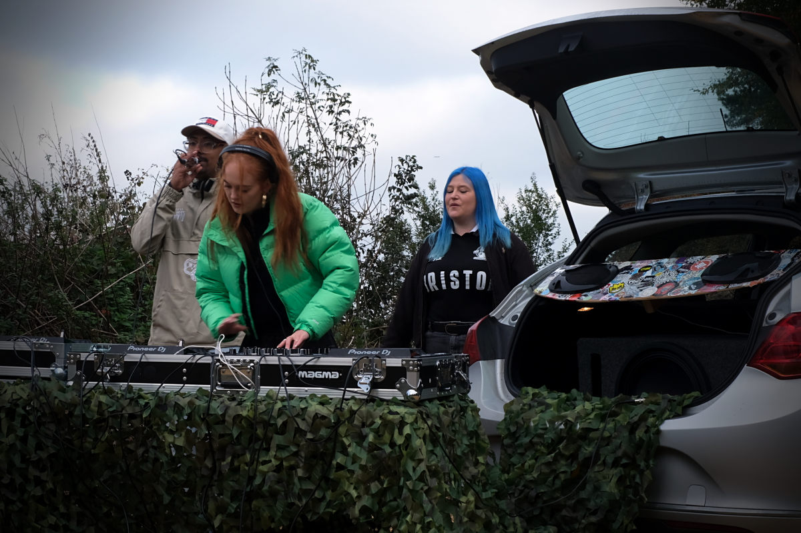

+++
title = "Bike ride in and around Gloucester"
description = ""
date = 2025-10-11T19:00:13+01:00
draft = false
author = "Alexander"
images = []
+++

I mapped a 50k route in the morning before leaving home and driving to Gloucester. 

It was good to have the opportunity to have a ride around an area outside of Kent. That's not to say there is anything wrong with cycling in Kent. Far from it. I love the countryside, the landscape, the hills, hedgerows, farm land and country lanes close to home. It's just good to see some new sites. To ride on unfamiliar roads. 

In that regard and on the way into Cheltenham I came across a few fine examples of street art stencilled on the walls of a subway going under the Gloucester Road....

And then as I approached the top of a pretty long climb up a country lane I heard some proper thumping drum and bass. Very out of place in otherwise peaceful surroundings. No complaints from me. I love all that. Intrigued I rode on and soon spotted the musics origin - 

Just the three of them there. I assumed they were testing things out and practising for greater things. They were happy for me to take a few snaps. I did not stop and chat or think to ask what they were up to. I regret not doing so now and using the opportunity to get more photos and hear their story. 

Not far beyond this the route took me down a gravel track. In my haste I omitted to tick the box to have the route follow paved surfaces only. Just past the 20k mark and I'm on the Cotswold Way. Trudging down a deeply rutted and furrowed stony path through some woods and back down a long hill I'd just climbed all the way up. 

I'd like to say lesson learned but this is not the first time I've done something like this. I think I am though making fewer of the same mistakes. 
