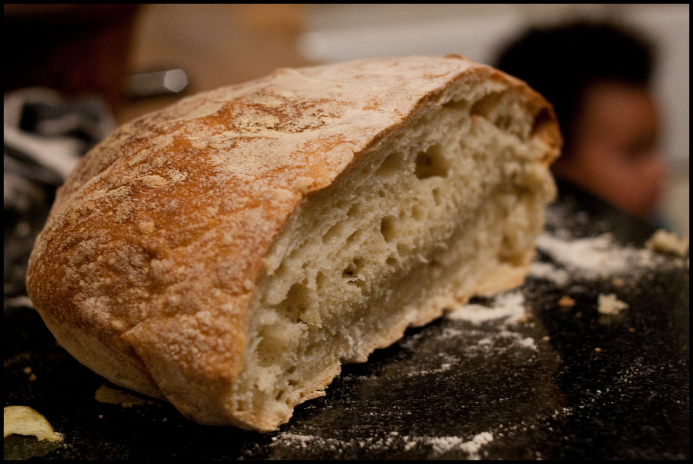

+++
title = "No Knead"
description = ""
date = 2011-04-08T19:51:13+01:00
draft = false
images = ["20110408_no_knead.jpg"]
tags = []
+++

Inspired by this [post](https://travellingtwo.com/7796) on one of my favourite blogs we've been baking bread at home. Very simple with no kneading involved. Very satisfying when it comes out the oven. Very tasty. Check out the method we followed if you want a go yourself...

