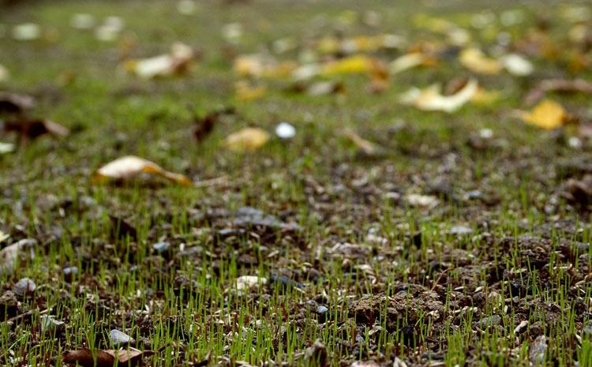

+++
title = "Seven days post seeding"
description = "The grass is growing beneath my feet"
date = 2007-10-07
draft = false
tags = ["Garden"]
+++

Seven days after putting down grass seeds to grow a lawn and here is how things are looking - 

You could be forgiven for thinking "so where is the grass", and if you saw it [last week](https://www.bongotwisty.blog/growing_grass/) it does not seem to have changed much.

Well I suppose from the picture above it does look that way and until yesterday I'd have agreed. This morning though I looked out at and hallelujah! The grass had begun to sprout all over. Here's a close up to prove the point -

I am delighted and relieved in equal measures. Seeding rather than laying turf was a bit of a leap of faith. It said on the packet that in favourable conditions grass would begin to show in about 7-10 days. I had my doubts. The weather conditions have been OK but I would not have put money on that or the results of my preparation to be so favourable. I certainly never expected the growth to be this punctual!

It also said on the packet that the seed was resistant to most birds. Something else I found a bit hard to believe. A friend of mine joked "How's that then? Are the seeds the size of gold balls". Still I went with it and true enough I only ever saw two pigeons on the mud in the last week.

All in all a good initial return on my first proper investment on the gardening front.
