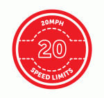

+++
title = "A Space for Cycling in Medway"
description = ""
date = 2014-05-12
tags = ["Cycling"]
+++

The UK cycling charity [CTC](http://www.ctc.org.uk/) is running an ongoing national campaign, [Space for Cycling](http://www.ctc.org.uk/campaign/space-for-cycling), which aims to create the conditions where anyone can cycle anywhere. There are six main themes:

| | | |
|---|---|---|
|  |  |  |
|  |  |  |

 I was minded to do something to get involved. I contacted my local councillor and asked what Medway Council was doing to make space for cycling in my area. I was encouraged by a prompt reply and then an impromptu visit by my ward councillor to speak with me about the issue. Typically when he called I was out riding at the time. A week or so later I got in touch again and fixed up a time to meet. As the wheel turns it was now my turn to be stood up and he failed to show! Regardless I continued with my contact and emailed him the following ideas to take forward and consider:

- **Planning and road improvements:** Cycle routes and paths should be included at the earliest stage. Move beyond the type of lip service now paid and invest in good practice as demonstrated in the Netherlands. These lanes should have priority over traffic turning out of side roads and at main junctions cyclists are given a few seconds head start with a separate signal
- **House building:** Require all new housing builds in Medway to include cycle storage space per bedroom.
- **Cycle routes / road marking:** Review all such routes and remove / improve those which end abruptly or otherwise compromise safety.
- **Medway Tunnel:** Introduce a safe passage for cyclist to use the tunnel thus promoting increased use of bike commuters from Gillingham / Rainham to Medway City Estate. Better yet build a footbridge / cycle bridge across the river from around that area.
- **Schools:** Enforce parking restrictions now in place outside all Medway Schools. Promote cycling clubs in schools / maintenance workshops. Deliver cycleability training in all schools from year three and up.
- **Town centres:** Bikes should be explicitly permitted and measures designed in so that they can share the space with pedestrians. Road closures with cycle gaps can also open up cycle routes on quiet streets, creating a time-advantage over driving as well as a safer and more pleasant journey.
- **Residential areas:** Introduce 20 mph to residential areas over the whole of Medway.
- **Public Transport:** Closer integration with public transport – particularly the railways – means longer distance trips can be made more easily by bike. Plan with SE Rail and Arriva for the increased transport of bikes.
- **Public bike share scheme:** Introduce and promote such a scheme in timing with other improvements and incentives rolled out.
- **Bike recycling:** To compliment the bike share introduce / facilitate a voluntary recycling scheme. Refurbish bikes to keep them from the scrap-heap and give them to those who need them. Hundreds of bikes could be recycled and masses of people gain maintenance and other skills.
- **Legislation:** Petition central government to simplify the cumbersome legal process for creating cycle tracks.

The reply I received was rather bland but with the promise that he would share these points with [Richard Hicks](http://democracy.medway.gov.uk/mgUserInfo.aspx?UID=200) at Medway Council who has the auspicious title of: Deputy Director, Customer Contact, Leisure, Culture, Democracy and Governance. Good stuff. I was not expecting great things or immediate changes to happen but I was hopeful of a considered reply. Here's what I got from one of his minions in planning via my ward councillor -

>In flat developments we do look for cycle parking provision but not as yet in housing and there is no policy backing for it. However, we are undergoing production of a new local plan which will look at sustainability and as part of that review housing standards, parking standards and cycling provision. The production of that plan will however take time._
> 
>I hope this helps 
> 
>Dave
> 
>There is a cycle day at one of the parks next Saturday. Details should be on the council website_

The cycle day referred to is Medway's Big Ride which I was thinking might have been affiliated to the CTC campaign but looking at the promotional blurb there's no mention of it. Not to worry though because in spite of Dave's reply the council has already produced a Provisional Cycling Action Plan for 2014 to 2017. Just a shame that my councillor and Dave in planning did not seem to be aware of it. Here's hoping though that the laudable schemes included in the plan get to see the light of day.

