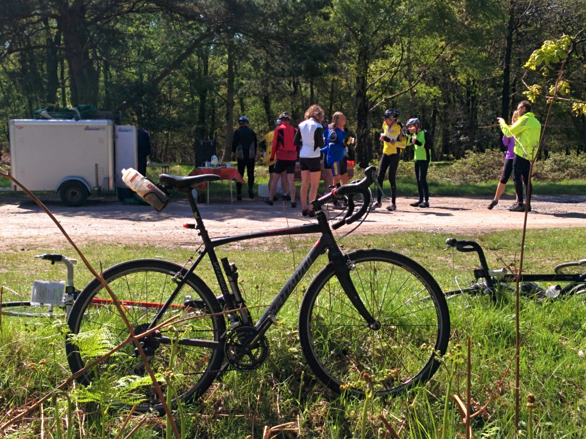
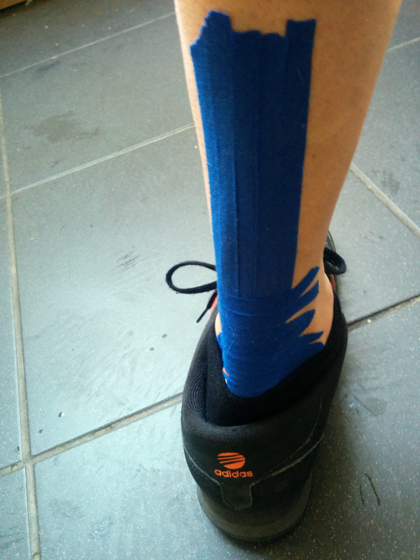

+++
title = "Cycling and Achilles Tendonitis"
description = ""
date = 2014-06-07T19:51:13+01:00
draft = false
images = ["20140505_bike_tent.jpg"]
tags = ["cycling"]
+++

I have been off my bike since May 3rd. That is the date when I rode the fifth and last audax I have completed so far this year. The Hell Forest 100. 

I took part knowing that I had developed Achilles tendonitis. It was a short ride. Not too hilly. Decent weather. The wife and I had planned a camping trip around it with the boys. I am going for a [Randonneur Round the Year](https://www.audax.uk/awards-pages/randonneur-round-the-year/) award in 2014. All sorts of reasons why I rode it in spite of knowing that it would aggravate the injury.

I completed the ride in good time without much discomfort. As I was riding the 12 or so miles back to the camp-site it began to feel pretty sore. It was fine when I got off the bike and walking. Just a little twinge. As soon as I got back on though the twinge became noticeably worse and quite painful. On inspection it was clear there was some swelling and redness.

I never rode again for the rest of the weekend. The bike went on the car and that is where it stayed until we got home.

So how did I manage to mess up my Achilles? The etiology tracks back a good few months.

At the tail end of January I rode the Hills and Mills 100. For the last 20-30 km I experienced pain in my left calf. I had never felt any aches or pains when riding for as long as I can remember. This was a sharp and deep pain. I ignored it in so much as I kept on riding but it did slow me down a bit.

Once off my bike the pain was gone. I remember going out on my daily circuits after this ride and feeling the pain again. On the first ride after the audax I turned round and went back home after half a mile or so because it was that bad. I had a couple of days off riding.

I was not really sure what caused it. I thought perhaps my saddle was a bit too high. I convinced myself that this was unlikely given I had not raised it and I'd never had such problems before. I got back on the bike and though the pain was still there it was not nearly as bad as it had been. I ignored it and rode that day and then after.

In February I rode the Gospel Pass 150km. Nothing that harsh except the climb going up to the Gospel Pass. The pain had come back. I nearly never made it without getting off to push. It may have been faster if I did since I was going that slow towards the top. It felt like it was worth it though as the views when I got there were splendid.

Home again and back to the daily circuits. The pain was on and off but mostly in the background. I think it was now that I put my saddle down a fraction of an inch. Whether it was this or just good fortune the problem seemed on the wane and I began to forget about it.

That was until one evening when the pain came back suddenly. By far the worse it had ever been. During a routine evening ride the left pedal gave out. I made it back but with a lot of calf pain and the pedal wobbling all over. A casual glance of it and nothing looked out of place. On closer examination I could see an inner section of the pedal had shorn of completely. The platform was pretty much unsupported and could be moved about 1/2 a cm or so in any direction. The time had come to get some new ones.

As is my way I had put off replacing parts on my bike until they finally gave out. Not a wise decision I guess especially when it comes to clipless pedals. I'd not really paid much attention to them. They were there and they seemed to work fine. My estimate puts between 25,000 to 30,000 miles on them before they gave up. Fair enough they looked a bit worse for wear and there was a reasonable amount of float but nothing that caused me to complain. I got myself a shiny new set of SPD's and was good to go. I thought my problems were behind me.

In the last week of March I finished the [Man of Kent 200km](https://www.bongotwisty.blog/audax-man-of-kent-200k-2014/). I was more than frustrated when once more towards the end the pain I thought I'd seen the last of came back. I pushed through to the finish. Slowly becoming resigned to it albeit with some consternation about the cause and disappointment that I was less than immune to the type of complaints I associated with other riders. This was not something that happened to me!

So I stuck with the regular rides close to home. Twenty or so miles every morning and evening. April began well. The second week I was [Pembrokeshire](https://www.bongotwisty.blog/hills_and_valleys/). The third week in [Gloucestershire](https://ridewithgps.com/trips/21153319), [Nottingham](https://ridewithgps.com/trips/21153321) and [Coventry](https://ridewithgps.com/trips/21153322).

Plenty of hills and mileage among that lot. None of my outings were over fifty odd miles though. I enjoyed the cycling and was free from the troubles I had experienced with my calf. I finished off the month with the [Oasts and Coasts 300km](https://www.bongotwisty.blog/audax-oasts-and-coasts-300k/). I suffered on that audax but not because of anything to do with the woes described in this post. It was no longer on my mind. If I thought of it at all it was thinking that I had the problem cracked by lowering my saddle and changing the pedals.

Once back home I carried on with the twice daily routine around the Medway Towns. It was when I was putting on my shoes getting ready for one of these rides that I first noticed my Achilles looked red and swollen. No pain or discomfort though. I'd read about how tendinopathy could go on for months and wondered whether what I was looking at was a symptom. I never really knew that much about it but the thought of not being able to ride my bike for that long worried me enough to put off the evenings ride.

As no discomfort accompanied the swelling I ignored it and was back on my bike the next evening. This was at the start of the last week of April. Not very sensible but I had the Hell Forest 100 scheduled for the first weekend in May. I did a bit of research and spoke with a friend about the swollen Achilles. It was a case of self / friends diagnosis. [Tendonitis](https://www.nhs.uk/conditions/tendonitis/) it was.

So I went ahead and completed the audax. It was a great ride. Good company, lovely scenery. Rest stops second to none with plenty of coffee, cakes and other assorted munchies laid on.

Average speed was a tad over fifteen miles an hour. It had been my intention to treat the event as a slow and sociable ride. That plan nose dived after I took a wrong turn on the way from the camp-site then having to pedal like crazy for six miles to reach the start line in time. I was the last to set out. I was the second rider back. I rode with others for much of the way but at the front of the field. It felt OK to me at that time although twinges of pain were there. If I'd have listened to my body and not ignored what it had told me since January I might not have been off my bike for so long.

And so it was at the end of that ride I came to take this prolonged break from cycling. To sum up here's what I think caused it:

1. Too much lateral movement on worn out pedals over a one to two thousand miles.
2. Saddle being a centimetre or so too high.
3. Changing the pedals and seat height. My body had to readjust and suffered!
4. Not recognising the early warning signs (calf pain) for what it was.
5. Ignoring the symptoms once I had recognised them.

The recovery and rehab plan started. I consoled myself by thinking I could replace my riding with swimming for the month. I was actually feeling good about the plan. I got a months pass for my local pool. Each morning and evening I was there. Each visit I would swim just over a mile. One weekend I swum two miles in a single session. True to form I was overdoing it.

I never realised that until after visiting the sports injury clinic at the centre. I booked an appointment. Told them my story and they gave me the once over. This was about two weeks into my recovery period. They told me it would be fine to get back on my bike so long as I took it very gently. Five or ten minutes riding at most and to stop if there was any pain at all.

Delighted with this advice the very next day I rode to the pool. Immediately I knew it was too early. The pain I had first felt at the end of the Hell Forest 100 was there in my Achilles no mistake. I swam the mile with sadness. I rode home feeling it in every rotation of the crank.

It was now with the encouragement and haranguing of my friends that I finally did what I should have done a long time before. Total rest from exercise. I bought myself some [KT tape](https://www.kttape.com/blogs/how-to-apply/achilles-tendonitis) and have worn it to support and strap my Achilles up since then.

Resting my ankle on a pack of frozen peas morning and evening and necking a couple of Ibuprofen every few days or so. That's been the way for the last three weeks now. Went out for a test ride a few days ago. The pain is all but gone. The swelling has almost disappeared. I'm not going to rush back. I have finally learned a lesson on this one. Missing out on a good few rides with friends. The most recent is this evenings London Night Ride.

For the next couple of weeks I shall be doing some stretching and strengthening exercises. Any tips or words of wisdom from anyone that has made a strong and successful comeback from Achilles tendonitis are welcome. I am confident I shall be back on the bike by the end of the month. I'm feeling cautiously optimistic the RRtY award is still within my reach.
