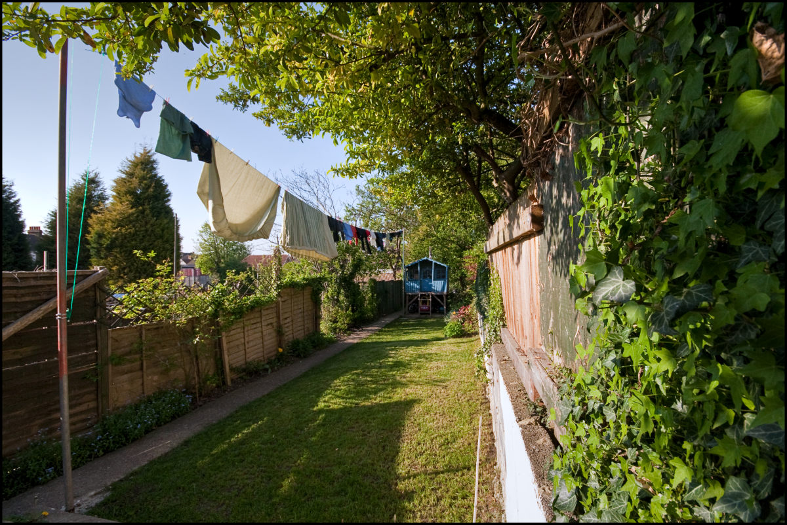

+++
title = "Washing Line"
description = ""
date = 2009-04-23T19:51:13+01:00
draft = false
images = ["washing_line.jpg"]
tags = []
+++

The washing line. An essential utility. It took us ages to get the scaffold poles - about a year or so. In the end we got these two for a tenner from a fella taking down some scaffold at the end of our road.

Dig a couple of three foot holes. 5 bags of concrete in each. A few bits of ironmongery and other bits and pieces. Bobs your uncle and fannies your Aunt.

Washing line in situ just like I remember as a kid.