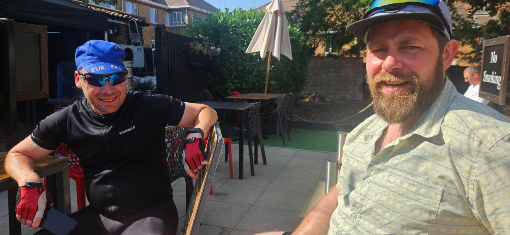
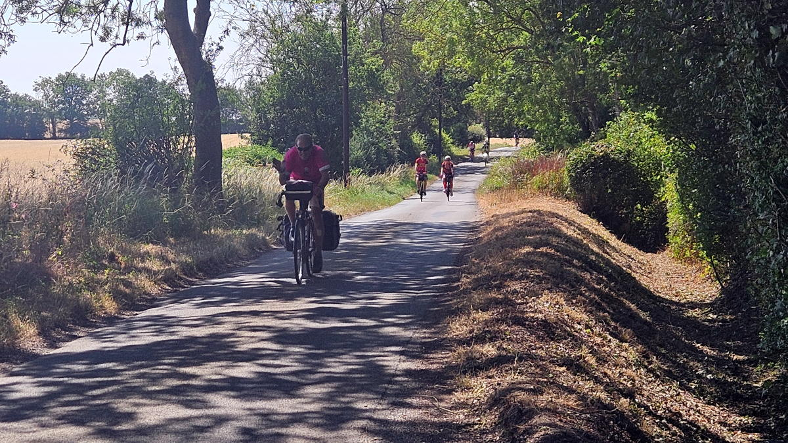
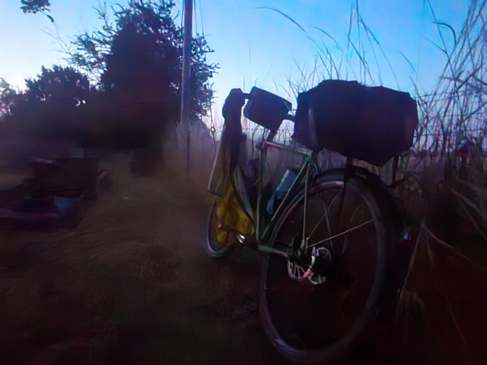
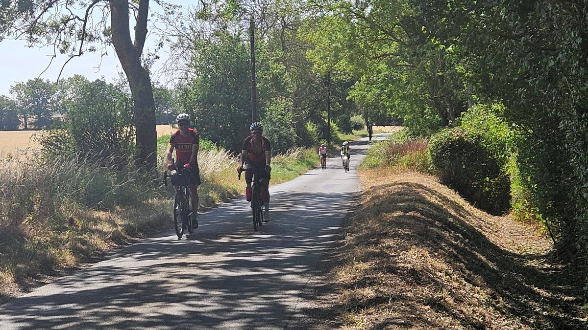
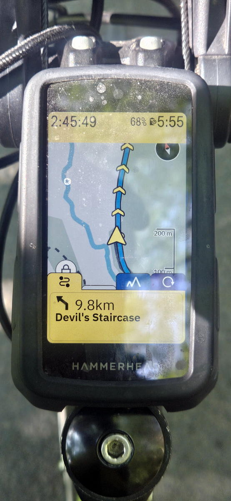
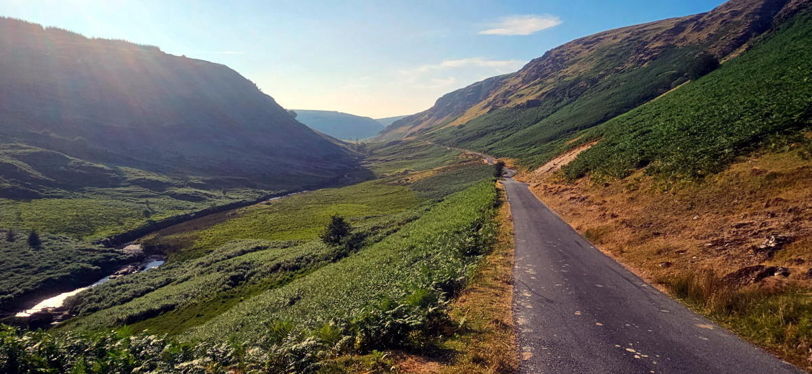
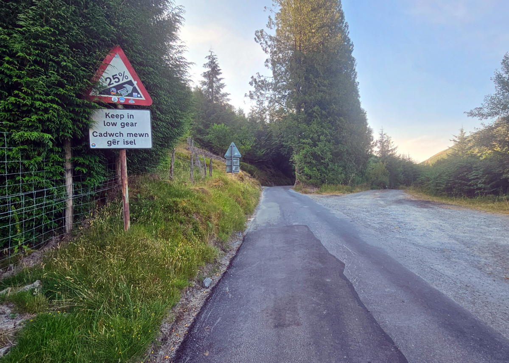

+++
title = 'audax: ACME Grand - West to the Sea 1000'
description = ""
date = 2026-07-21
draft = false
tags = ["cycling"]
+++

The 21st [Paris-Brest-Paris Randonneur](https://www.paris-brest-paris.org/en/) is taking place in 2027. When I completed [the 2019 event](https://www.bongotwisty.blog/audax-paris-brest-paris-1200k/), the support, encouragement and general goodwill of spectators along the route was what stuck with me the most. The challenge of riding the distance (1200km) in under 90hrs and all the rolling hills along the way became little more than a fading memory.

I quite fancy having another go at it next year. There's 8000 places but I'm pretty sure it will be oversubscribed. The earliest pre-registration opens on January 16th 2027 for those that have completed a 1000+km BRM ([Brevet des Randonneurs Mondiaux](https://www.audax.uk/about-audax/classifications/)) in 2026.

A 1000+km ride is a significant undertaking for me. One a year is quite enough. It's not only the distance but how much climbing there is along the way and the limited time to complete the ride. Put all these together and invariably I'm riding through at least one night and trying to manage the effects of sleep deprivation. All the same I was up for the challenge so entered the ACME Grand: West to the Sea 1000 to set my way towards PBP 2027.

### Départ
Since I live in Kent and the ride started in Witham near Chelmsford at 10.00 am on a Thursday I got the train up to Chelmsford the night before and stayed the night there. Rode the 17km over to the départ at Battesford Court in the morning. Arrived at around 9.40 am feeling fresh. Brevet card collected then nothing much else to do other than hang around chatting with a few of the others taking part.  

We rolled off without fanfare at 10.00 am. I resisted any inkling to match the pace of those who set off faster than me (most people). If there is one thing I have learned over the years that is to ride your own ride. As much as there is benefit in cycling with others that's negated at best if you need to push yourself to keep up. My bike is pretty heavy and optimised for comfort and durability rather than speed. There's no way I am going to keep up with those on lighter machines so no point in trying. On a long ride like this varying times off the bike and degrees of faffing are a good leveller in any case. Another important point is that audax events are non-competitive. The only goal is to complete the route within the time given — in this case 75 hours. 

Regardless I did catch up with a few people for at least a short time on the way to the first control in Haddenham. 

We were riding into the wind entire way towards Haddenham. It was not all bad though since it helped with not overheating on what became a pretty hot day. The following section towards Barton-le-Clay was mostly with the breeze behind us. It was slow going for me due to the heat and from this point on I was riding on my own for pretty much the rest of the route. I caught up with some people again at a couple more controls but on each occassion they mostly all left before me or quickly passed me later on the road. 

I reached the third control in Towcester at just gone 9.30 pm. Most people I had spoken to were aiming to reach the fourth at Strensham services where they had booked a room for a sleep / shower stop. I was taking a different approach. No rooms booked along the way. I was not too bothered about getting to Strensham before stopping. I left Towcester at 10.00 pm and decided to ride on for just a couple more hours.

### Sleeping Arrangements
I had my sleeping gear packed on the bike and looked out for suitable places to lay it out on the way round. Riding through the night is something I really do enjoy. The air often tends to be still. The roads are empty. Passing through sleeping towns and villages in the early hours of the morning gives me a feeling that I am doing something a bit special. At the same time though it messes with my body clock and has in the past had an adverse effect on my general constitution. For this reason I planned to stop riding while it was still dark and be back on the road just before dawn. Since the ride was in July it started to get light between four and five am.

Graveyards as you might expect are quiet and attract few if any visitors during the night. Ideal for setting down a sleeping mat and getting a few hours rest in. The first night was at the 250km mark in St Nicholas's Church graveyard in Tadmarton for around four hours from midnight. The second at around 500km in the graveyard of St Michael's Church at Felinfach near Lampeter. That time I slept for close to five and a half hours.

### Hereford and the Welsh Hills

The ride into Strensham on Friday morning went well. I arrived in time to quickly catch up with a number of those that had stayed there overnight. Made the most of the facilities before setting out again towards Hay-on-Wye. This was not a section I particularly enjoyed. The route followed the A438 and A4103 for close to 45km into, past, and then out of Hereford. Nasty roads. Poorly maintained chip and seal surface sending vibrations to the feet and hands. Busy and fast traffic. One of the drawbacks of calendar events is having to following the shortest distance between controls. Depending where those controls are avoiding roads like this is difficult. Not my thing at all. 

However, Hay-on-Wye is a lovely little town. I caught up with Steve Abraham there and enjoyed chatting with him while filling up on food and drink and packing supplies for the longest and hillest stretch of the ride into and across the Cambrian Mountains and onto Aberaeron by the west coast. 

After just an hour or so back on the bike I very suddenly got an overwhelming case of the dozzies. I carried on for a bit before deciding I had time enough for an unscheduled lie down. It was around 2.30 pm and hot. I spotted some shaded woodland just off the road. I laid out my sleeping mat, set my alarm for 90 minutes and got some shut eye. On the road again just after 4.00 pm. The temperature had now dropped and I was feeling much more with it. Spotted Spence and April at a garage a few miles up the road and thought to check in with them both. They'd also succumbed to the heat and had a hour's lie down to. April was suffering a bit with calf and knee pain.  Their plan was to ride through the night and get a couple of hours in a hotel they'd booked in Port Talbot. I wished them well and set off on my way.

The route slowly but surely made it's way to the Abergwesyn Valley nestled in the Cambrian Mountains. A beautiful place to ride a bike. This for me was the highlight of the ride. Surrounded by scenic views and riding along well maintained country lanes. That the Devils Staircase lay ahead and the subseqent ramps over the following 10 - 12 km took nothing away from the pleasure in being in this part of Wales. I rode them all and loved it. 

I left Hay-on-Wye at 1.15 pm. The control cutoff at Aberaeron was just past 10.00 pm. 9 hours to cover 102 km should be more than enough no matter the hills. What with my unscheduled sleep stop and slow pace on the climbs time was though getting on. Fortuantly as is the case with hills they balance out and my pace was enhanced by all the descents including for the last 12 km into Aberaeron. I got there close to 9.30 pm. Had a pizza by the sea front before setting out again with the intention to ride till midnight. 

I never quite made it for that long. After about half an hour's riding I spotted a churchyard in Felinfach near Lampeter and decided to get my head down for the night. It was around 10.45 pm. Set my alarm for 4.00 am and got some sleep.

Off again by 4.40 am. 95 km to Port Talbot. It was another hilly one. 1,314m in total. Nice enough roads until Port Talbot when it all became a bit grim. I stopped for five minutes to buy an energy drink for the control receipt at just before 10.00 am before heading off again towards Barry. More busy and poorly surfaced roads for much of the way.  

### Waking Up in Barry
It was when I got to Barry at just before 1.30pm on the Saturday that the consequence of my somnambulist indulgence hit me. I was now close to 5 hours behind schedule with near enough 440km to go. Woops! Could have planned that better. The only way I was going to finish in time now was to ride continuously through to the end.

It felt a daunting prospect but possible. I doggedly set to it with determined focus.

### South Wales and a Long Evening
The stretch from Barry to Chepstow was mostly horrible. Flat but into the wind for much of the way. Nasty A roads and via ugly industrial wastelands of South Wales. If I had more time I would have appreciated the desolate steel works I passed by. Since I did not, I was simply pushing hard to get past the busy and noisy dual carriageway I needed to follow for what seemed far too long.

The next stage up to Pershore was lovely. Very hilly but through some beautiful countryside and woods along well maintained minor A roads and country lanes. Towards the end, at Upton upon Severn the whole town was closed to motor traffic. There was a Blues Festival going on. Loads of people milling about in the street holding drinks and munching street food. It felt a bit surreal to be there navigating my way through an inebriated crowd at around 9.00pm, me on a mission having been cycling since 4.30am and with still a very long way to go. I was though totally locked in and got through quickly and without incident.

### Petrol Stations and Pizza
I arrived at a petrol station in Pershore at around a quarter to ten. The lights were on but the door was locked and no attendant to be seen. I was not in the mood for this and sorry to say got a bit impatient. Knocking on the door, calling out for the attendant was only the half of it. After what seemed much too long but probably only about ten minutes the young attendant appeared looking somewhat sheepish, unlocked the door and apologised for his absence. To make matters worse the coffee machine was not working. I left there still feeling a bit annoyed. This was not a bad thing since the annoyance was converted to cycling energy and in no time at all I was up to speed and making good progress once more.

Pizza was on my mind. I'd been craving another one since before Pershore. Riding through Banbury on the way to Towcester I saw a place I could get one. It was heaving with people, many of whom seemed drunk and were making a right din. Another odd interlude to my ride through the night. I got my order and sat down to eat it, oblivious to while being slightly amused by the commotion surrounding me.

Towcester control was a quick five minute break for a pint of milk and a receipt at an all night garage. Onward into daybreak and St Neots.

### The Final Push
I was now struggling to stay awake and was doing whatever I could to keep my eyes open. Counting telegraph poles, spelling out signs, singing and talking to myself. Anything to stave off drifting off to sleep. I dosed up with a large Americano plus a double espresso shot at St Neots before the penultimate stage towards Buntingford.

At each of the controls from Chepstow onwards I'd steadily been making back the time I'd spent sleeping on the first couple of nights. About an hour each time. But by the time I got to Buntingford at 09:44 on Sunday morning I was still 20 minutes outside the control's closing time. The last stretch back to Witham was just a tad under 62km. I had at most 3hrs 11m to cover the distance and make up that deficit. Under normal circumstances that would pretty much be a sure thing. However, at the end of a 1000km audax, and having been cycling for close to 32hrs without sleep over the last 400km and goodness knows how much elevation, it was by no means in the bag.

As these things go it was on this stage that my GPS headset decided to get confused. Twice it lost track and needed to reload the route. On the third occasion I decided to stop, turn it off and on again. Thankfully that resolved the issue.

Soon after that and for the first time since Barry two others passed me on their way back to Witham. Pete and John. I was so happy to see them. They were riding as though out on a Sunday club run in a similar way to when I last saw them back just after the first control. There was no way I could keep up and it was with a bit of a heavy heart I saw them race away ahead of me. All I could do now was push on as best I could. The natural anaesthetics that had got me through to this point seemed to have also reached their limit. My legs were fine but my feet and hands were now feeling every bump and vibration along the way. The headset's ETA was slowly getting closer and closer to the 1.00pm cutoff time. I finally entered Witham High Street just gone 12:45 and rolled into the arrivée at Battesford Court at 12:47. I'd made it.

### By the Numbers
In total I rode 1068km with 10,689m elevation in 74hrs 47m — 13.5kmph overall including stops. The last 553km was after the final sleep stop I had I had in Felinfach. Total moving time was 52hrs 23m at a moving average of 20.4kmph. Total sleep over the four days was about 10–11 hours. My first time ever to win the accolade of lanterne rouge. Being the last to finish and with just thirteen minutes before the cut off time felt pretty good to me. PBP next year seems manageable after that. 

### Stage-by-Stage Breakdown (Recorded GPS Data)

| Stage | Route | Dist (km) | Elev (m) | Time | Speed (kph) | Power (W) | Arrived |
|-------|-------|-----------|----------|------|-------------|-----------|---------|
| 1 | Witham → Haddenham | 90.2 | 769 | 3:47 | 23.8 | 175 | 14:09 Thu |
| 2 | Haddenham → Barton-le-Clay | 75.7 | 391 | 3:19 | 22.8 | 165 | 18:18 Thu |
| 3 | Barton → Towcester | 58.2 | 498 | 2:49 | 20.6 | 146 | 21:33 Thu |
| 4* | Towcester → Strensham | 97.3 | 976 | 4:28 | 21.8 | ~155 | 07:19 Fri |
| 5 | Strensham → Hay-on-Wye | 79.8 | 856 | 4:09 | 19.2 | 134 | 12:31 Fri |
| 6 | Hay → Aberaeron | 103.0 | 1,572 | 5:57 | 17.3 | 120 | 21:39 Fri |
| 7* | Aberaeron → Port Talbot | 106.2 | 1,314 | 5:30 | 19.3 | 135 | 09:56 Sat |
| 8 | Port Talbot → Barry | 51.0 | 535 | 2:43 | 18.7 | 131 | 13:19 Sat |
| 9 | Barry → Chepstow | 59.5 | 306 | 2:34 | 23.0 | 168 | 16:55 Sat |
| 10 | Chepstow → Pershore | 80.9 | 1,038 | 4:13 | 19.1 | 134 | 21:43 Sat |
| 11 | Pershore → Towcester | 92.2 | 976 | 4:43 | 19.5 | 136 | 03:27 Sun |
| 12 | Towcester → St Neots | 65.7 | 496 | 3:12 | 20.4 | 144 | 07:09 Sun |
| 13 | St Neots → Buntingford | 46.6 | 374 | 2:05 | 22.2 | 160 | 09:44 Sun |
| 14 | Buntingford → Witham | 61.8 | 588 | 2:54 | 21.3 | 152 | 12:47 Sun |
| | **Total** | **1,068.1** | **10,689** | **52:23** | **20.4** | **~147** | **74:47** |

*Stage 4 was split by the sleep stop at Tadmarton and stage 7 the sleep stop at Felinfach.*

### A Few Pictures from Along the Way

   
   
  
   
   
  
   
   
  
   
   
  
  
  
  

