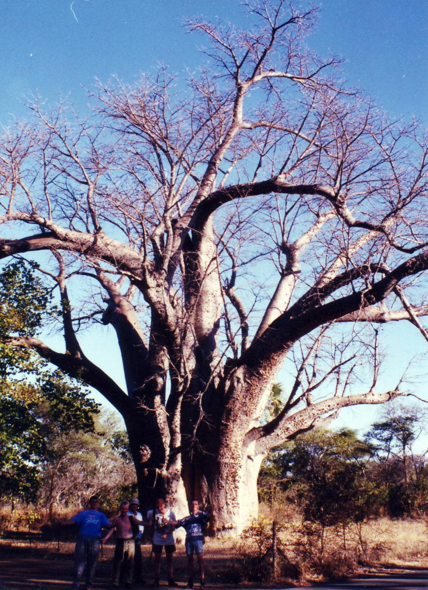
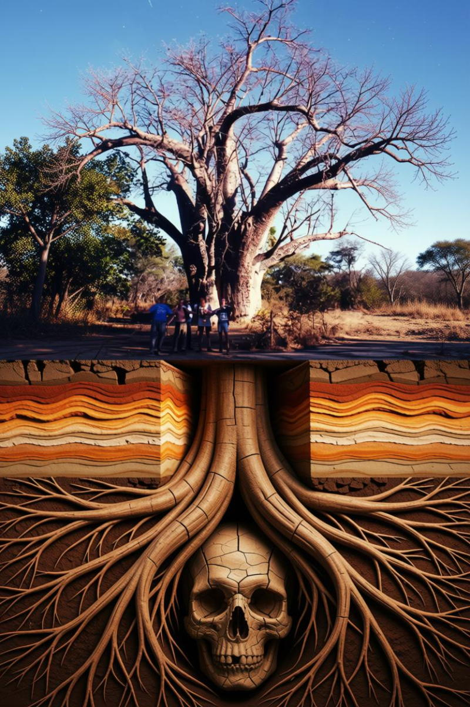
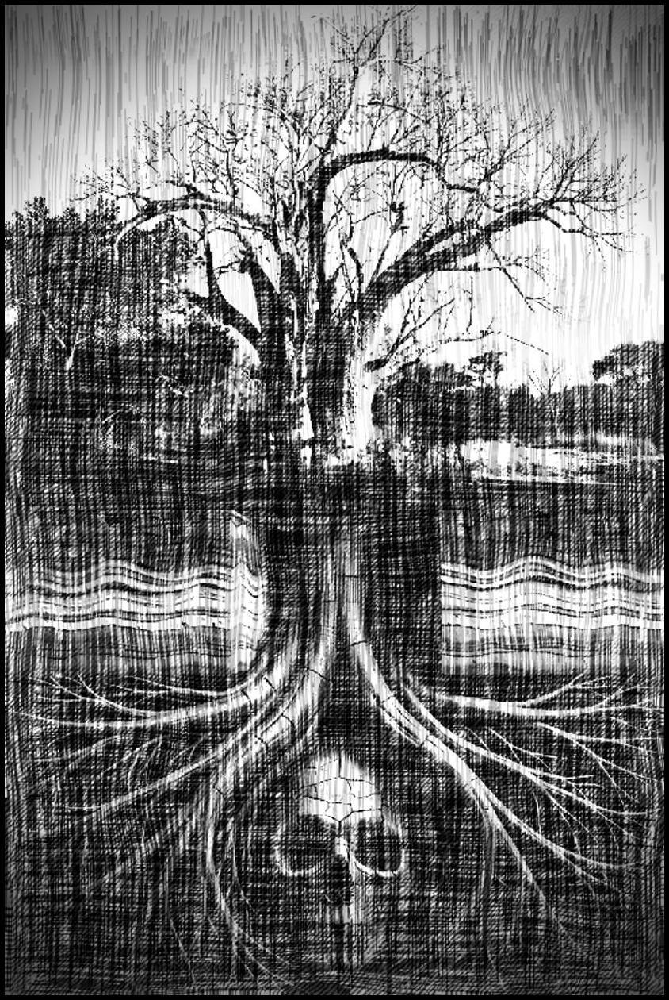

+++
title = "The creative devolution of a baobab tree"
description = ""
date = 2026-08-20
+++

>Don’t baobab trees look like they’re just the tip of something much bigger? Maybe it is some creature or alien sleeping deep down in the soil, with only part of its head sticking out.
>
>For today’s Daily Create, show us what is secretly hiding down there. [#tdc5333](https://daily.ds106.us/tdc5333/)

I used one of my own photos for the base image. 

Since I have no original ideas of my own I ran that through an LLM with just the Daily Create prompt to see what it came up with. 

Afterwards I tinkered with the LLM's ouput in DigiKam. I mostly used the threshold-etch filter in the G'MIC-Qt that comes bundled with image editor. 

In all I spent a bit more than twenty minutes before ending up with something I quite liked the look of. It was a distraction if nothing else.

