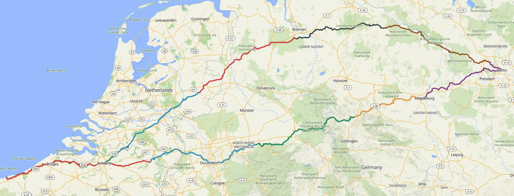

+++
caption = 'Dunkirk - Berlin - Dunkirk'
description = ""
date = 2026-06-02
draft = false
tags = ["cycling"]
+++

Dunkirk to Berlin via Belgium and the Netherlands.  Different route there and back. I remember big open fields of crops; long straight roads; avenues of trees; canal/riverside cycle paths; woodlands; small villages with an intro and outro of frame rattling, bone shaking cobble stones. Great provision pretty much most of the way for cyclists. That's the infrastructure and the way other road users notice and treat cyclists. It felt to me that cycling was welcomed and encouraged as a legitimate form of transport as opposed to being seen as a nuisance on the roads in England. 

Despite being loaded up with two panniers, camping gear, saddle bag and a handlebar box, this was not a tour. There was no planned sight seeing. It was an out and back, head down, get the miles in sort of ride. 2,112 km with 6,782 m of climbing on mainland Europe. Not too shabby for a ten day excursion. Adding in the distance cycled from home to Dover then home again, the total was around 2,232 km. 



| Day | Date | Ride | Location | Distance (km) | Elevation (m) | Time | Avg speed (kph) | Avg power (W) | Link |
|---|---|---|---|---:|---:|---:|---:|---:|---|
| 01 | 14/5/2026 | DBD Day 01 | Loon-Plage, Hauts-de-France | 214.2 | 376 | 10:27 | 20.5 | 144 | [Ride](https://ridewithgps.com/trips/383450924) |
| 02 | 15/5/2026 | DBD Day 02 | Sint-Job-in-'t-Goor, Vlaams Gewest | 210.4 | 413 | 9:25 | 22.3 | 161 | [Ride](https://ridewithgps.com/trips/383654265) |
| 03 | 16/5/2026 | DBD Day 03 | Diepenheim, Overijssel | 208.4 | 466 | 9:22 | 22.2 | 160 | [Ride](https://ridewithgps.com/trips/383831517) |
| 04 | 17/5/2026 | DBD Day 04 | Stuhr, Niedersachsen | 174.2 | 717 | 8:07 | 21.4 | 153 | [Ride](https://ridewithgps.com/trips/384194886) |
| 05 | 18/5/2026 | DBD Day 05 - Himbergen, Niedersachsen | Himbergen, Niedersachsen | 213.0 | 475 | 9:56 | 21.4 | 153 | [Ride](https://ridewithgps.com/trips/385765573) |
| 06 | 19/5/2026 | DBD Day 06 - Schönwalde-Glien, Brandenburg | Schönwalde-Glien, Brandenburg | 209.1 | 762 | 10:38 | 19.7 | 138 | [Ride](https://ridewithgps.com/trips/385768720) |
| 07 | 20/5/2026 | DBD Day 07 | Hohe Börde, Sachsen-Anhalt | 136.7 | 920 | 8:14 | 16.6 | 115 | [Ride](https://ridewithgps.com/trips/384660475) |
| 08 | 21/5/2026 | DBD Day 08 - Bad Gandersheim, Niedersachsen | Bad Gandersheim, Niedersachsen | 230.6 | 1,605 | 12:01 | 19.2 | 134 | [Ride](https://ridewithgps.com/trips/385762876) |
| 09 | 22/5/2026 | DBD Day 09 - Fröndenberg/Ruhr, Nordrhein-Westfalen | Fröndenberg/Ruhr, Nordrhein-Westfalen | 243.7 | 773 | 12:04 | 20.2 | 142 | [Ride](https://ridewithgps.com/trips/385761723) |
| 10 | 23/5/2026 | DBD Day 10 - Pelt, Vlaanderen | Neerpelt, Vlaams Gewest | 271.7 | 275 | 13:58 | 19.4 | 136 | [Ride](https://ridewithgps.com/trips/385769921) |
| **Total / Avg** | 14/5/2026–23/5/2026 | 10 rides | — | 2,112.0 | 6,782 | 106:12 | 19.9 | 143.6 | — |



I set off with my friend Dave. We rode together on the outward journey. How often do any of us spend so much time in close proximity with another person for five continuous days? Five days of prolonged physical effort and sleeping rough is a good test of any friendship. We got on well enough. Reciprocated compromise and accommodating each others ways helped a lot. I enjoyed the company. Dave decided to stop over with friends for a couple of nights when we got to Berlin. I chose to keep going. I think it was the right decision for both of us. Another five days together may have been too much.

Sleeping rough / wild camping - whatever you call it that's what we did. Overall this worked out very well with no problems at all. I had a small one man tent. Dave made do with a tarp and bivy. Most nights we pitched up within a few meters of the road/path we were were riding on. Arriving late and leaving early meant our presence was hardly ever noticed. The furthest pitch was probably no more than 200 meters or so from the route. I spent one night in a campsite on the way back. I never planned to do so. It was just there on a corner and I really needed a shower. That was the shortest days ride for me at 132 km. I arrived at around 6.30 pm. Reception was closed. I pitched my tent in a small field for late arrivals. This was right next to the wash block. Had a shower then washed and dried my clothes. Used the facilities to boil water. Had soup and noodles, a chat and a beer with someone staying over in a camper van before bedding down for the night. Set off again at 7.30 am which was before reception opened. I would have paid but in the event there was no one around I could pay for the nights stay. 

Kindness of strangers - a free beer in Germany and France. A free meal and drinks in Dunkirk. On my part I helped a stranded motorist and his wife get going again having run out of petrol and cash to fill up. It may have been a scam. I gave them the benefit of doubt. They gave me a 'gold' ring in return.

Two things I really enjoy about any long ride are road side food stops and giving myself over to the effort to the exclusion of all else. For me there is definitely something meditative about this. Focus and traction. It's a relaxing way to spend time. Nothing to do other than ride a bike and attend to basic physical needs for ten days straight. It's a good space for me to be in. A bit of a reset. 

I took some quick snaps but not many. I didn't notice any dramatic scenery or much else that seemed particularly interesting. That's not to say it was not there. I was simply not looking for or seeing it.  A matter of attention I guess which was mostly directed on the 30 meters in front of me.

The weather when we set off was just 4 degrees above freezing. For the first few days we were both layered up and wearing gloves. It got warmer as time passed by. The journey back I was down to short sleeves and applying sun cream. It rained a bit but nothing prolonged. 

Next time I may travel lighter. I carried a lot of stuff I did not use or could have done without. Next time I will take a bit more time exploring where I can ride that's a bit more interesting in terms of landscape and scenery. I don't mind hills, I like roads that curve and bend, variety is good. Berlin and more specifically Brandenburg Gate served well as a target but the journey there and back did not feel inspiring to me in the way my ride to Cape Wrath and the West Coast of Ireland did. Since I chose to simply ride through towns and cities on the way I never made anything of what interest these places offered. Not something to change but rather to be aware of.  

I was really pleased to have completed the ten stages in ten days. I never set out to do so but once I had the bit between my teeth it became something I aimed for. Eight of the ten days were in excess of 200 km. The longest day, which was also the last, was 271 km.  Happy to say that neither I nor my bike had any mechanical problems along the way. Pressure points were okay. My hands were the only thing that got a bit sore. Been back just over a week now. Took a few days lying around to recover but all good now. My weight did not change a bit. Guess I must have got a few things right this time round. 

     
  	
  	
  
	  	
  	
  
	  	
  	
  
	  	
  	
  
	   	
  	
  
	  	
  	
  
	   	
  	
  
	  	
  	
  
	  	
  	
  
	  	
  	
  
	  	
  	

