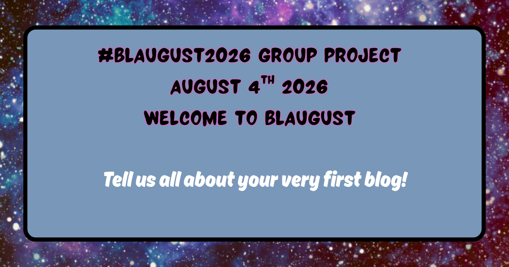

+++
title = "Blaugust 2026 Group Project - Tell Us About Your Very First Blog"
description = ""
date = 2026-08-04
draft = false
author = "Alexander"
images = ["cover.png"]
+++

For Blaugust2026 I have anchored to this [page](https://nerdgirlthoughts.game.blog/2026/07/23/blaugust-2026-calendar-weekly-prompts-group-projects/) published by Krikket on her blog [Nerd Girl Thoughts](https://nerdgirlthoughts.game.blog) for reminders and ideas on ways to participate. Very helpful when I am feeling inclined to dismiss every idea I have because (*insert any reason that comes to mind*).  





The first blog I created was in 2000 and on a site called Cosgrove Capers. The name was taken from the block of flats in Hackney that we lived in at the time - Cosgrove House. 

The aim was to keep a digital scrap book and share news with family and friends about the first year of our oldest sons life. I think it's fair to say any interest in what I posted back then was mostly mine. Nothing much has changed. 

There was weekly updates, snap shots and a few audio files. Without knowing it "Oscar's Page" was very much a weblog and the site I suppose what might now be called a digital garden. It was created and hosted on a service called [Homestead](https://www.homestead.com).

Over time I added stuff about getting married. I created a project called Drawstrings. We asked everyone we invited to our wedding to complete some 'amusing' profile questions. These were compiled into an album that was shared with everyone at a pre wedding party. The idea was to have our respective extended families be part of a shared project to help get to know one another a bit. I was thinking that a wedding and reception where people were not total strangers would be a good thing. It worked out pretty well.

{{< glightbox-figure 
   src="cosgrove.png" 
   title="Cosgrove Capers"
   alt="Screenshot of the homepage for Cosgrove Capers, a family website titled Alex, Monica & Oscar on the web. The page has a black background with orange and white text. There is a navigation menu on the left with buttons for Home Page, Oscars Page, Drawstrings, Wedding, and E mail us. The main content welcomes visitors, explaining the site documents family news and includes links to sections about Oscar, an archive, a wedding page, and a project called Drawstrings. Some images on the page display a placeholder message: Connect to the Internet if you can't see this image. Additional options include a guestbook and site search." 
>}}

I found some of the old html files a while back and retrieved some of what I wrote and saved them [here](https://www.bongotwisty.blog/oscars-first-year/) for posterity. I also still have the Drawstrings album and harboured the intention to scan and add the pages to whatever iteration of a site/blog I have had online for way too many years. One day I will get round to doing that. 