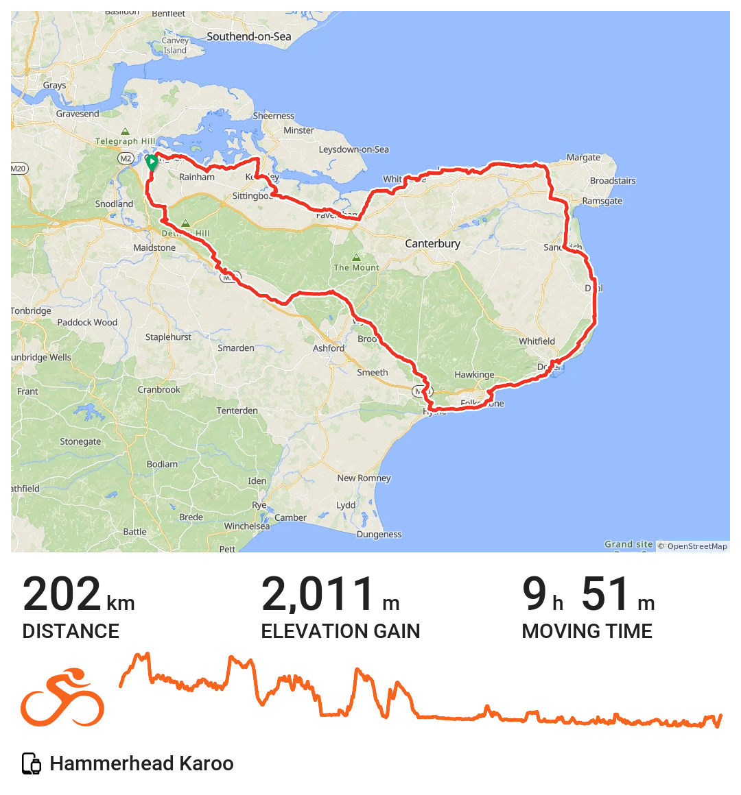

+++
title = "Coastal 200"
description = ""
date = 2026-04-06
draft = false
tags = ["Cycling"]
+++

Easter Sunday. Out for the first of this months RRtY 200k DiY brevets. My friend Dave planned the route. He was off out to ride it today. Birthday celebrations for two of our boys precluded me from joining him hence why I went the day before. 

The weather was decent. I sometimes choose the wrong clothes in spring. Either too hot or too cold. Got it right for this ride. Sunny most of the day. But windy. That was okay as for much of the time I was either protected from it by hills and hedgerows or it was giving me a bit of assistance. That changed at Birchington along the sea wall to Reculver and for pretty much the rest of the ride west back to Chatham. All good exercise. 

   
   
     
   
     
   
     

  