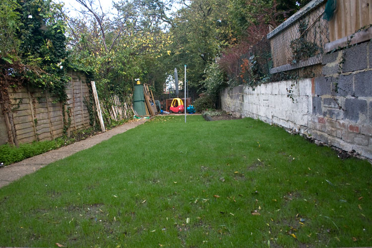

+++
title = "Fourteen days post seeding"
description = "The Lawn is Growing"
date = 2007-10-14
draft = false
tags = ["Garden"]
+++

Last week it was [seven days](https://bongo-twisty/seven_days_post_seeding/) after seeding the lawn and grass was just beginning to show.

This Sunday at fourteen days there is no doubt. We are growing lawn!

The amount it has grown in the last seven days is astounding. There are still a few patchy bits. This is possibly because the seed was raked in a bit deeper in some areas. Everyday though it looks likes it's grown more.

The next challenge is keeping the local cats from using it as their dumping ground. They have been using the garden as a toilet since before we got here.

I spotted one had taken a crap on the grass the other day. This morning I spotted a patch which looked like a cat had done its business and then tried to dig it in (and the new grass up).

I've been told sprinkling black pepper can help and I had a go at that today. Spouse has done some reading up and found a number of different suggested solutions. Seems all of them can be effective or ineffective depending on the cats particular vulnerability.

Its going to be a process of trial and error. If anyone wants to recommend something they have tried I'll be happy to give it a go and report back on how its worked for us.
