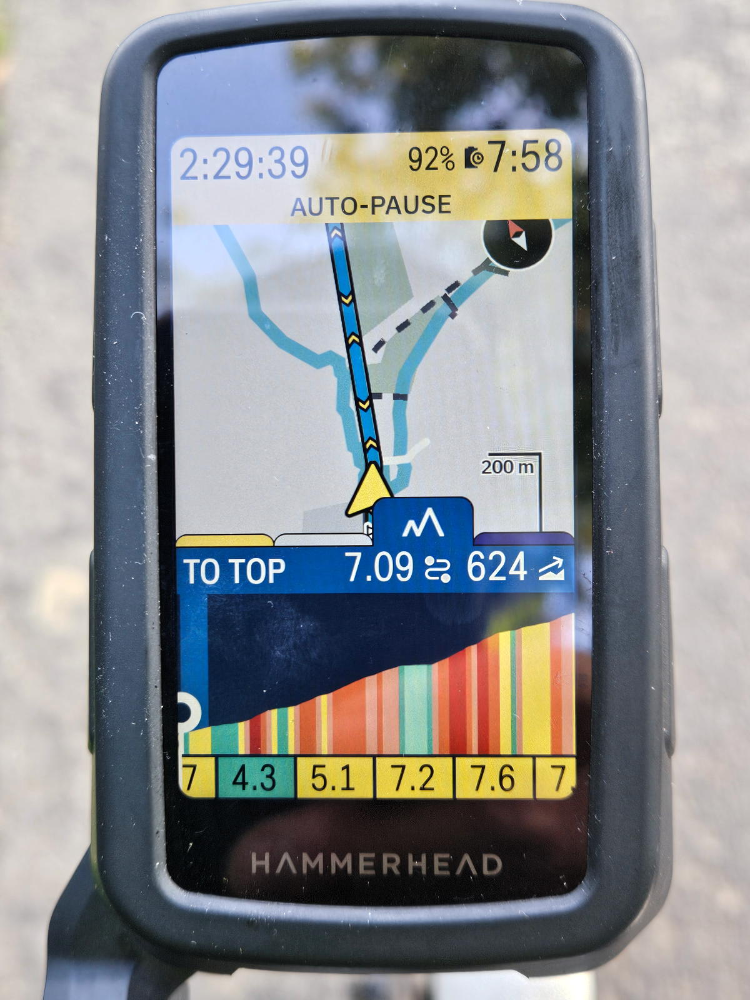
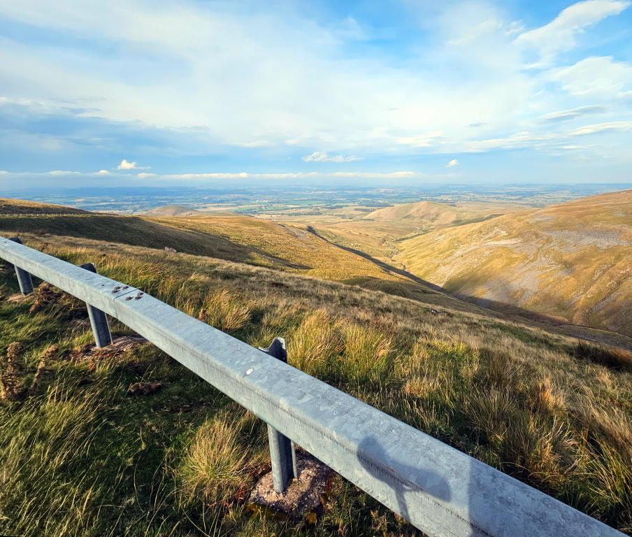
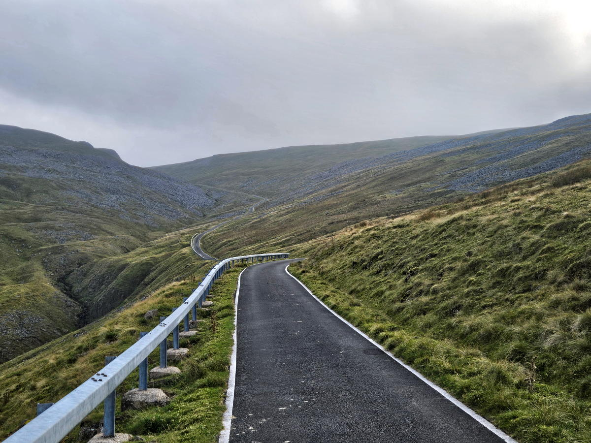
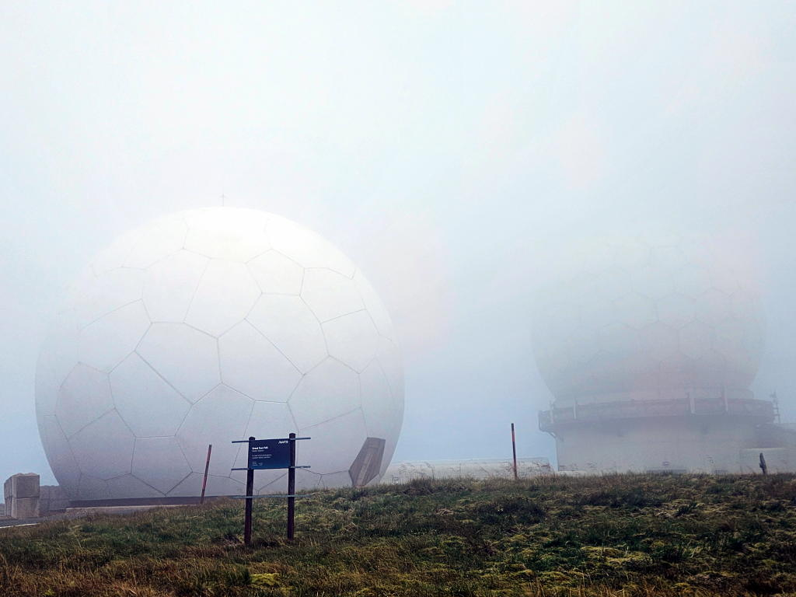
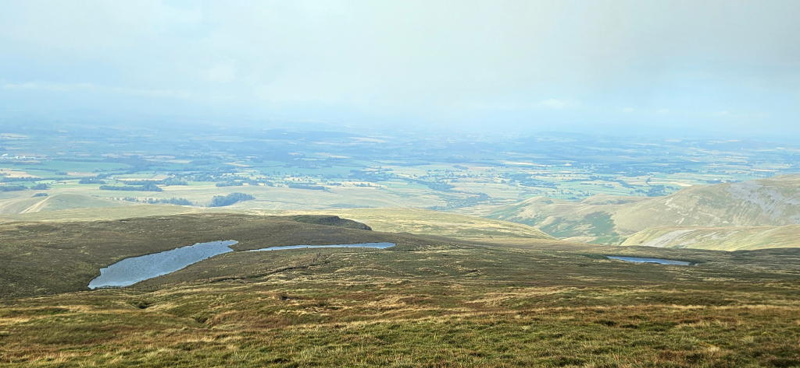
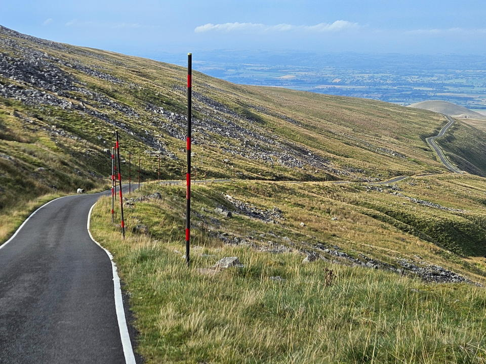
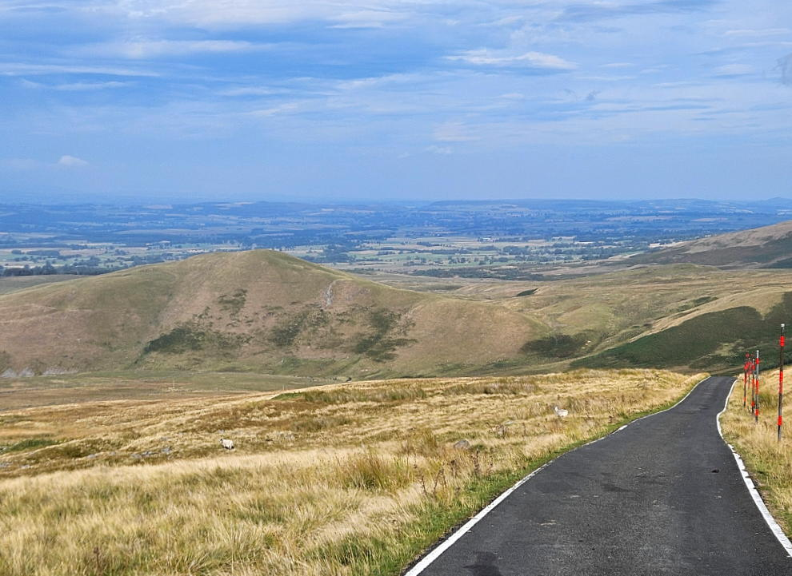
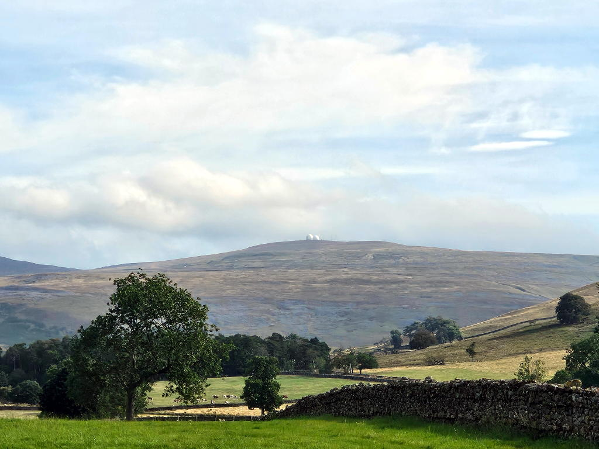

+++
title = "Cycling Up to the Radomes on Great Dunn Fell"
description = ""
date = 2026-08-26
images = ["cycling"]
+++

We're on holiday camping in the Lake District.  I'd set my mind on riding the Fred Whitton Challenge (FWC) route while we're here. I've not been feeling great this month though. A few early warning signs of over-training syndrome for two to three week. I heeded advice and postponed the FWC so as not to make things worse. I was not going home though without getting in at least one decent ride. A warden at the campsite suggested Great Dunn Fell. It's where the highest road in the UK leads up to the iconic "golf ball" radome on the summit at 835 m. This seemed like a reasonable alternative.

By the end of the third day I noticed was feeling more like normal. The fresh air and rest must be doing me good. In addition, I tend to sleep better at night on a camp bed in a tent than I do at home. No idea why but sure I can't be the only one. Had a good feed in the evening, got the necessary ready and went to bed with the intention to be up and out early for the ride. 

The plan and prep worked. Out at around 5.30 am with the dawn chorus.  I love an early morning outing on the bike. The ride towards Penrith was lovely. Empty roads. Colourful skies. Mist rising up from the fields. Still air. Undulating well paved roads. From Penrith things just got better - smooth lanes, great vistas and lovely countryside. It felt great to be riding. 

The climb to the radomes starts at a tiny hamlet called Knock. You could easily miss the turn into it. No signage whatsoever to signal the way to what some say is the greatest cycling climb in England if not the UK. The only giveaway being that the road was marked as a dead-end and a warning notice that vehicle access was restricted after a mile or so. All the same I knew where I was and in case I needed reassurance the elevation profile helpfully popped up on my GPS 

 

My approach was simple -  choose the lowest gear when needed and slowly make my way to the top. This was a recovery ride after all. The gradient varies and the average is around 9% and the maximum around 20%. The climb went in three stages for me. 

The first stage was up to just past the half way mark. It was a good warm up for what was to come. Looking to the left over an expansive gully in the hill side and out towards wide open views of the land stretching out as far as the eye can see. 

The elevation gained becoming abundantly clear as the dry stone walls and fields became smaller and smaller far below. There was no let up from the start - the climbing to this point was continuous. A few steep ramps but mostly just what made up the average grade. 

The road flattened out slightly for a maybe 50 meters or so. I stopped here for a few minutes to look down to where I'd came from and up towards where I was going. There was a bend ahead to the right before curving back to the left and then a long drag up between two ridges. 

This next stage was about 35 - 40% of the distance and was hard work. The wind was blowing in from ahead and one side all the way. Pretty sure the gradient towards the end of this section hit 20% over the last two slopes. There was a stopping place between them which I used to get my breath back and take a couple more pictures before pushing on to the final stage. 

The road curved round to the left up for a bit before sweeping round to the right again and up to the summit. The first part was fairly benign and in places wind assisted. The last part was two short but steep ramps to the top. The summit was partially obscured by clouds blown over from the opposite side to which I had come but I could still make out the larger of the two radomes and set my eye on that to get me there.

Not a great deal to do at that point other than take in what I'd just done, have a good look around and take a few pictures when the cloud cleared.

	
	
	

I set off back down again after about 10 - 15 minutes. I saw another cyclist making his way up on the toughest part of the climb. Acknowledgements were shared as we approached and quickly passed one another. My brakes were put to good use for much of the way down. 

After having the front rotor snap off on a ride down a hill in Ireland I'm cautious to modulate my braking thinking it might help keep the temperature of the disc in check. No idea whether it would or not but happy to say I got down to Knock without incident. There was a few sheep to avoid but no vehicles on the road the whole time I was on the hill. 

One last photo of the radomes before the ride back to the site. You can see them for miles on a clear day. 

#### Numbers
* Length: 7.24 km
* Vertical ascent: 632 m
* Average gradient: 9%
* Max gradient: 20%
* Height at top: 2,900 ft / 835 metres