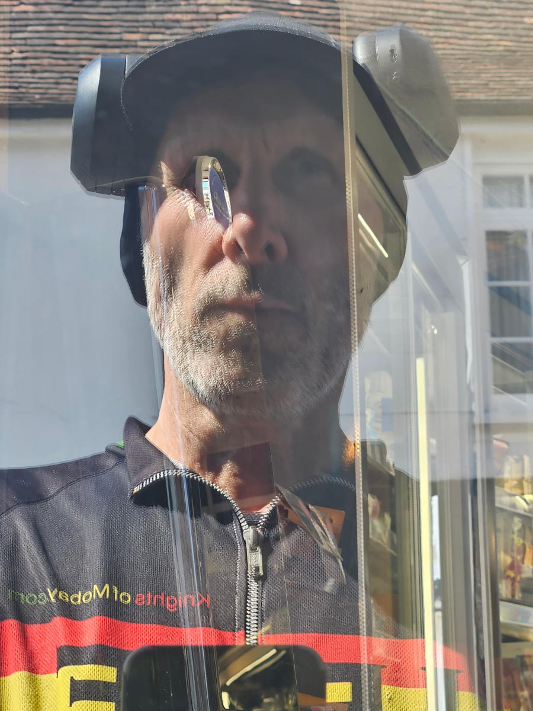
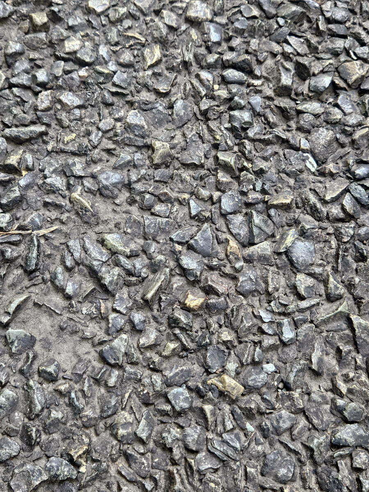
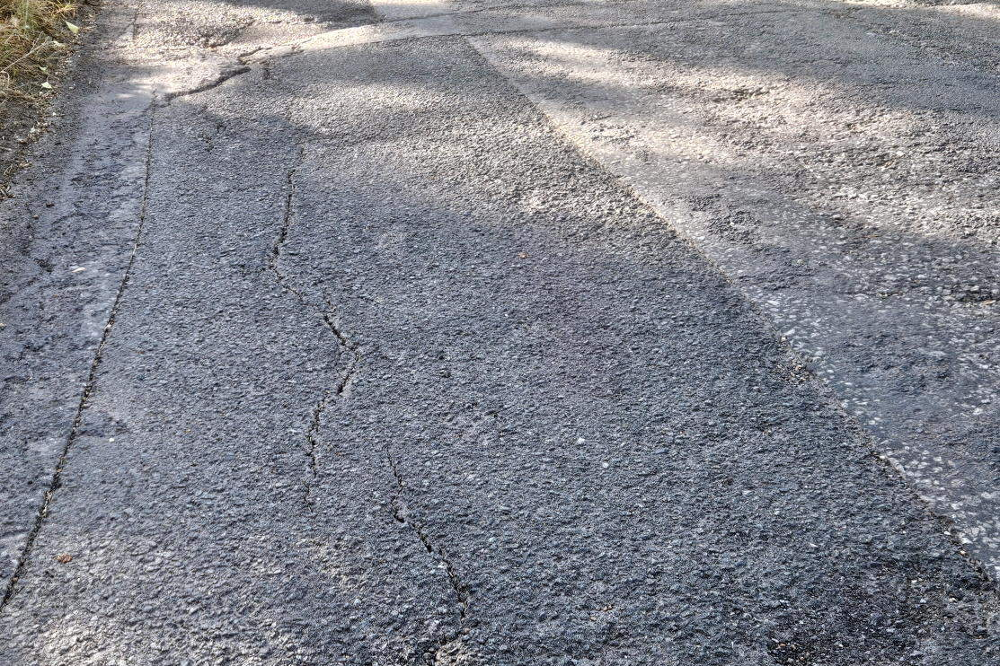
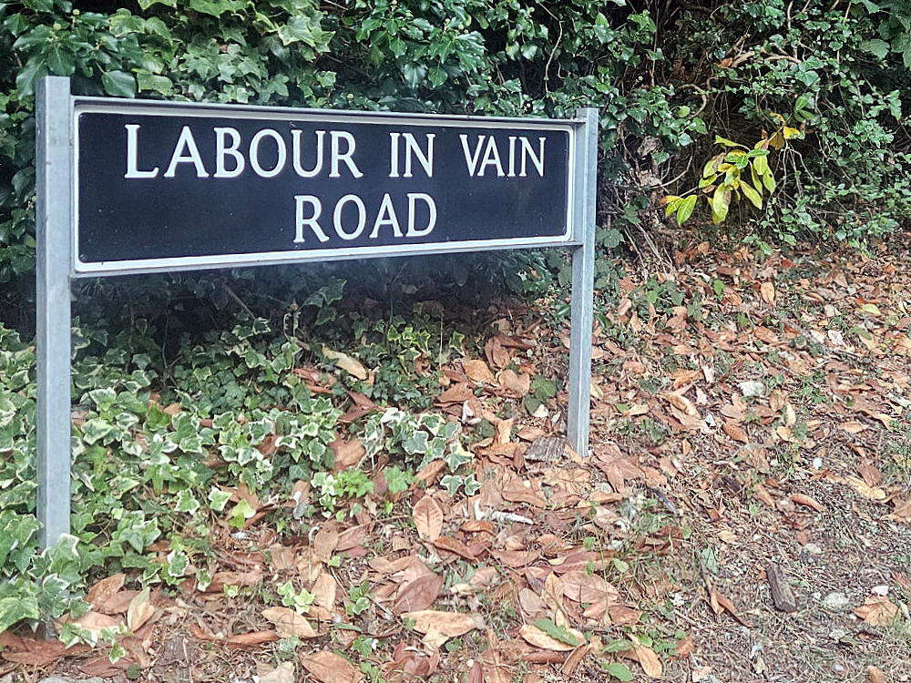

+++
title = "audax: Chipseal 200km DiY"
description = ""
date = 2026-08-10
draft = false
author = "Alexander"
images = []
tags = ["cycling"]
+++

<iframe src="https://ridewithgps.com/embeds?type=trip&id=404114921&title=audax%3A%20Chipseal%20200k%20DiY&metricUnits=true&sampleGraph=true&distanceMarkers=true&showPhotos=true&privacyCode=Gx2GgLRqW1rLKDUM8r7FEzb0SxLOr9W3" style="width: 1px; min-width: 100%; height: 700px; border: none;" scrolling="no"></iframe>

Oh my gosh. Out yesterday on my bike to complete a 200km. I have been doing a least one long ride each month for the past couple of years. Occasionally much longer. I did not enjoy yesterdays ride at all. That is quite unusual. 

Something felt different not even 50km into the ride. It was more of an effort than normal. At first I thought this was down to not having ridden any miles for ten days. Not so sure about that now. If anything I would have thought having fresh legs would help. 

It briefly crossed my mind when I selected the route that when I last rode it the going got tough in places. Kind of shrugged that off. I guess because it was a faded memory I minimised the potential of a repeat. Turns out that was a mistake.

While the first 50km felt more effort than usual it was the following 100k that was really problematic. I started to feel it between 90 - 100km. Not even half way. The ride had become a slog. An unscheduled stop at that point for water and an energy drink brought it home to me. 

The prospect of another 100km felt daunting. If there had of been an easy way out I probably would have taken it. Not felt like that on a ride for a very long time. 

Other than just not feeling particularly fit and strong there was two main factors that negatively impacted the experience. It was pretty hot. +30° at times and muggy. That would not have been so bad except I was dressed for milder weather. When I left home there'd been a smattering of rain and it felt pretty cool. I should have known better. I did not take my cap of until much later on. Stupid of me since it made an immediate difference when I eventually did. The other reason was out of my control. The road surface was appalling. 

Between about 60km to 160km it was truly horrible. It's a an issue I have often come across on [audax](https://www.audax.uk/about-audax/new-to-audax/) routes which I have adapted from a [calendar event](https://www.audax.uk/choose-a-ride/calendar-events/). When planning these routes organisers plan the control points then have to take the shortest practicable distance between them. In Kent that frequently means following A roads or busier B roads. 

There's a few things wrong with this. They are often not very scenic or interesting roads to ride on. You get the traffic which is not necessarily heavy but does tend to travel at the speed limit of the road or faster. Worst of all though is the surface. 

Chances are if you don't ride long distances on a bike or have some special interest in road surfaces [chipseal](https://en.wikipedia.org/wiki/Chipseal) may not mean much if anything at all to you. Maybe though you've sometimes noticed an increase in road noise while driving. It could be chipseal you're travelling on.  

Riding a bike on chipseal is not nice. It increases the rolling resistance. You go slower for the same or more effort than on smoother tarmac. It sends vibration up into the bike. I feel this mostly in my hands and feet. It wears them out and after a while gets proper uncomfortable. It becomes worse depending on the age and ultimately the condition of the road. 

   
   

Quite often utility supplies (water, gas, electric) run along these roads so consequently they get dug up a lot. This then creates frequent patch repairs of which there seems to be very little quality control of. 

So I had close to 100km of this. I was fed up. When I got a flat I welcomed the respite from riding. It was a tube failure rather than a puncture. At the time I would not have minded if the spare tube did not inflate as that would have given me a legitimate reason to bail on the ride and call spouse for a lift home. My mood deflated as the tube inflated. That's a rare thing to happen.

As it goes the worst of it was nearly over. After another 10km or so I was into the country lanes and the surface had markedly improved. I was still hot and tired. Most of the climbing was in the last 50km but at least I was no longer on chipseal. 

I've been thinking today more about calendar events. I had been planning on doing some next year to qualify for [PBP](https://www.audax.uk/about-audax/event-types/paris-brest-paris-pbp/). This would be instead of getting the SR award from my usual DiY rides. Not sure I want to do any in Kent and I am reluctent to drive anywhere just to go for a ride. I was also thinking do I really want to even do PBP in Autumn. It's bound to be boiling. I'd rather do that kind of distance in April, May, September or October. Just thinking things over for the time being. Give it time and it will all be just a memory. 

