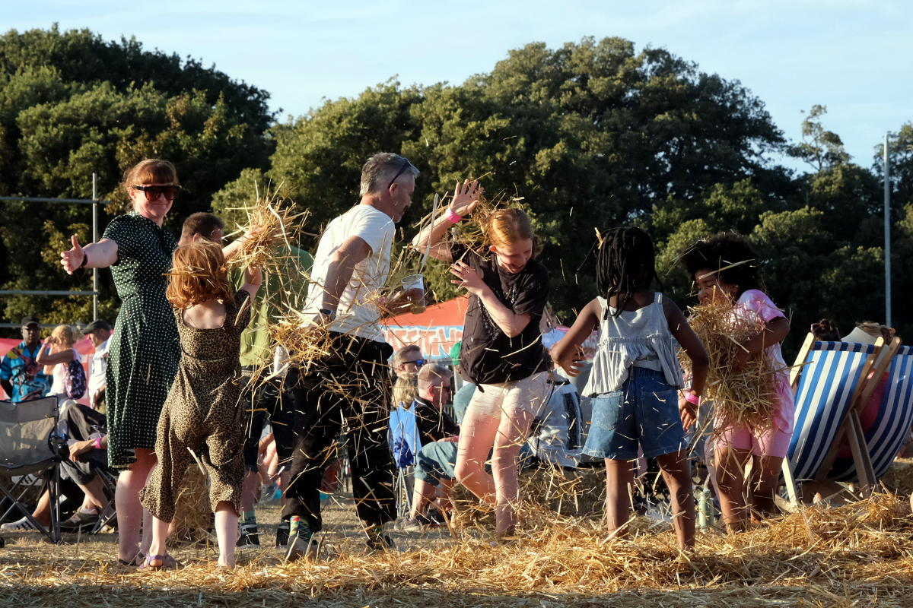

+++
title = "What Photography is For"
description = ""
date = 2026-08-08
draft = false
author = "Alexander"
images = []
+++

I have just been looking through some pictures I took yesterday. I came back with a good few from an afternoon session down in Hastings at the Hidden Beach Festival. 

We'd gone along to catch a few hours of Aba Shanti's set. I'd been hoping to come away with some decent photos of Aba behind the controls, of Aba looking out into the crowd, of people dancing, of people enjoying themselves and being together. None of the pictures I looked at this morning did that.  

They were mostly poorly composed snapshots. None of them conveyed any feeling. What was missing is any sense of connection. Not so much a physical or social connection between me and the subject but more so human. If anything at all the pictures convey emotional detachment. Images created by an impassive observer. 

What this implies and how I engaged with the experience feels a bit off. It gives me food for thought though. Having it come to my awareness it's now something I shall be mindful of in future and experiment with. Easier said than done but it's worth reflecting on and trying new things out. 

When Aba's session ended we bought some food and sat down to eat. There was some kids playing near by. This was my best photo of the day - 

[Teaching Photography #2: What Photography Is For](https://photoni.st/index.php/2026/03/29/teaching-photography-2-what-photography-is-for/)

> What they’re trying to do is communicate something. Make the viewer see or feel or understand something they wouldn’t otherwise. That’s what separates photography from pure documentation. Showing what was there is only the start; what it meant, how it felt, why it mattered; that’s the actual work.