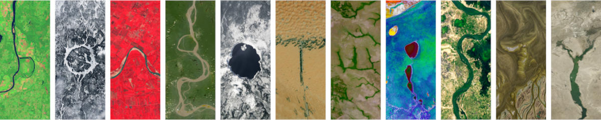

+++
title = "Your Name in Landsat"
description = ""
date = 2026-04-28
draft = false
+++

> The NASA/USGS Landsat program provides the longest continuous space-based record of Earth’s land in existence. Landsat data are essential for making informed decisions about our planet’s resources and environment.

Given the myriad of possibilities the project affords, after much thought and deliberation I put it to the best use I could think of - spelling out the name of this blog using the free [Your Name in Landsat](https://science.nasa.gov/mission/landsat/outreach/your-name-in-landsat/) tool. 

**B** - Holla Bend, Arkansas, 35°08'41.1 N 93°03'16.5 W

**O** - Manicouagan Reservoir, Canada, 51°22'42.4 N 68°40'27.2 W

**N** - Yapacani, Bolivia, 17°18'29.7 S 63°53'19.0 W

**G** - Fonte Boa, Amazonas, 2°26'30.8 S 66°16'43.7 W

**O** - Crater Lake, Oregon, 42°56'10.0 N 122°06'04.7 W

**T** - Liwa, United Arab Emirates, 23°10'30.0 N 53°47'52.8 E

**W** - La Primavera, Colombia, 5°26'57.9 N 69°47'57.0 W

**I** - Etosha National Park, Namibia, 18°29'15.2 S 16°10'14.6 E

**S** - N’Djamena, Chad, 12°00'27.7 N 15°03'46.2 E

**T** - Lena River Delta, 72°52'40.3 N 129°31'51.5 E

**Y** - Estuario de Virrila, Peru, 5°51'53.4 S 80°43'51.6 W

It got me thinking about route planning. If you joined the letters up in a straight line you'd have about 80,000 km to ride. Bit tricky in places. Maybe a too much to cycle on a whim but for future reference...

| From                     | To                                | Approx distance | Notes                                                                                 |
| ------------------------ | --------------------------------- | --------------- | ------------------------------------------------------------------------------------- |
| B – Holla Bend, Arkansas | O – Manicouagan Reservoir, Canada | 2,700 km        | About two to three weeks on long, straight roads. |
| O – Manicouagan          | N – Yapacani, Bolivia             | 7,600 km        | North America to the Amazon with a few garage stops on the way.                       |
| N – Yapacani             | G – Fonte Boa, Amazonas           | 1,700 km        | Bit rooty and damp through the jungle.              |
| G – Fonte Boa            | O – Crater Lake, Oregon           | 7,500 km        | Probably not all bike friendly.              |
| O – Crater Lake          | T – Liwa, UAE                     | 12,700 km       | A pedalo could be a valid option.  |
| T – Liwa                 | W – La Primavera, Colombia        | 13,000 km       | Perhaps the most challenging section.    
| W – La Primavera | I – Etosha National Park, Namibia | 9,800 km | Charged up on good coffee you should be good to go. |
| I – Etosha National Park | S – N’Djamena, Chad | 3,400 km | Mostly a cross‑to‑headwind from the east. Stay hydrated and lower your expectations. |
| S – N’Djamena | T – Lena River Delta | 9,500 km | From dust to marshes; time spent on choosing the right bike packing gear could pay off here. |
| T – Lena River Delta | Y – Estuario de Virrila, Peru | 12,300 km | Not the easiest route to end on but that’s just down to spelling. |                        |

I am happy to contribute to the advancement of cycle route planning in this way. You're welcome.   

*Hat tip to V H Belvadi for [signposting](https://vhbelvadi.com/your-name-in-landsat) the service*. 