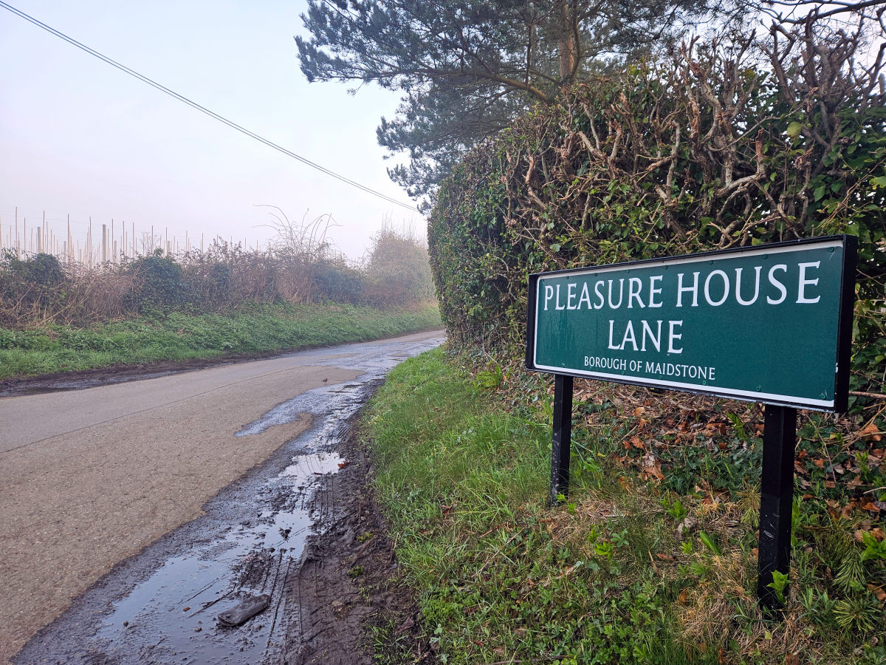

+++
title = "March RRtY Rides"
description = ""
date = 2026-03-23
images = [""]
draft = false
tags = ["Cycling"]
+++

Two more rides this month for the RRtY award. That's six months done of this round of the series. The first was a modified version of an Audax UK calendar event I completed back in May 2013, the Hop Garden 200. 

   
  	
	

Not sure why but the original ride is [logged](https://ridewithgps.com/trips/21153632) in my RWGPS account as having been completed in April 2012. That does not match my ride [history](https://www.audax.uk/results/results-search/) on the Audax UK website or my memory of it. 

Regardless, I changed the route a bit to start and end from home instead of Meopham along with some other minor changes along the way and the removal of the shortish section in the south east corner of the original route. 

It's only from writing this post have I realised the version I did in 2013 was the first Audax UK event I ever entered. The difference in ride stats are interesting to me - 

| Metric         | Ride 1 – May 2013 | Ride 2 – March 2026 |
| -------------- | ----------------- | ------------------- |
| Distance       | 206.4 km          | 204.6 km            |
| Elevation gain | 2,207 m           | 2,684 m             |
| Elevation loss | 2,206 m           | 2,683 m             |
| Max grade      | 10.1%             | 12.7%               |
| Avg grade      | 0.6%              | 1.0%                |
| Total duration | 11:11:00          | 11:14:01            |
| Moving time    | 08:53:42          | 09:47:57            |
| Stopped time   | 02:17:18          | 01:26:04            |
| Max speed      | 55.1 kph          | 54.3 kph            |
| Avg speed      | 23.2 kph          | 20.9 kph            |
| VAM            | 428 Vm/h          | 453 Vm/h            |
| Ascent time    | 05:10:30          | 05:56:06            |
| Descent time   | 03:43:12          | 03:51:51            |
| Pace (elapsed) | 00:03:15 / km     | 00:03:17 / km       |
| Moving pace    | 00:02:35 / km     | 00:02:52 / km       |
| Calories       | 4,670             | 6,313               |

At first glance I thought the ravages of age were catching up with me. Slower average speed and almost one hour more moving time. 

But on a closer look the 2026 ride had more climbing, steeper climbs, higher VAM (vertical ascent in meters) and I burned an extra 1600 calories going round. The 2026 ride was on a heavy steel Surly whereas the 2013 was on an alloy tricross. My memory of the first ride is that I found it a lot harder at times. 

Taking all that into account I did pretty well with just three minutes difference between the two rides. Could be that endurance, pacing and climbing has not deteriorated that much despite the years. Sounds good to me.



Although I had two weeks between this months DIY brevets they were separated by just two shorter rides of 50km each. For a time I was not sure if I would get the second long ride in. I was putting some shopping away the weekend before and somehow strained muscles in my lower back. It was either putting tins away in the larder or cramming the freezer. I was off the bike for a whole week. Very painful and not much sleep for a good few days. Thankfully it resolved itself on the day before the second ride. I think it may have got better quicker if I'd have done a few rides sooner. That's a thing with having a bad back. You don't want to move but when you stay still it gets no better. 

The ride went well. Followed a route I'd not done before. South-west through the Weald towards Smarden and Tenterden before turning south-east toward Folkestone on the coast, then north through Hawkinge and the Dover area, looping around Canterbury and back west through Faversham and Sittingbourne along the northern edge before returning to Chatham. A few sharp climbs in the middle and latter sections. My legs are still feeling it. The weather was good. I felt alright on the bike and enjoyed the day out. 

![A panoramic photograph taken from high on the chalk downs above Folkestone, Kent, looking north-west across the town. In the foreground, a wide green valley floor is flanked by steep chalk and scrub hillsides. A multi-span concrete road viaduct carrying the A20/M20 approach road cuts diagonally across the valley, supported on tall concrete pillars. To the left, light industrial and warehouse buildings sit alongside a straight road leading into the town center. Beyond, rows of red-brick suburban housing spread across the middle distance. In the background, further chalk hills and the wider Kent landscape fade into a pale winter haze. There are bare deciduous trees and dormant scrub vegetation typical in early spring.](20260322_folkstone.jpeg "Looking over the M20 and towards Castle Hill near Folkstone")

