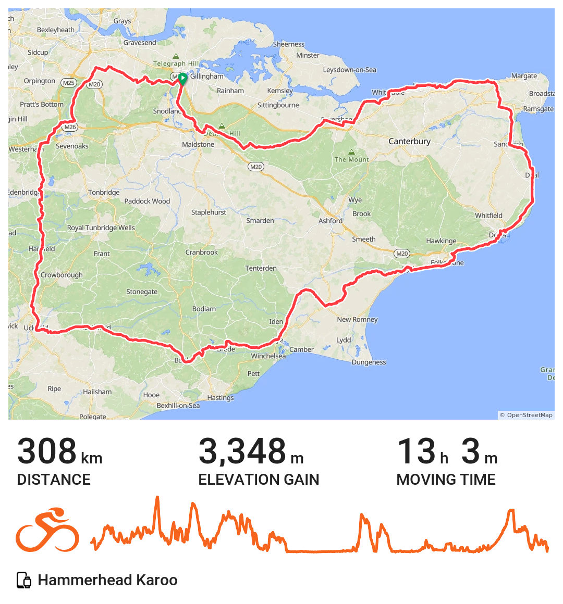
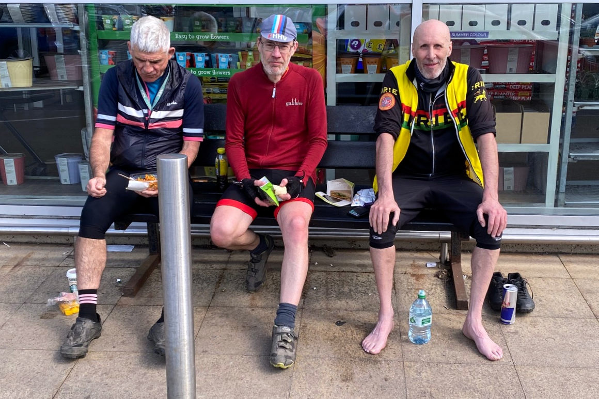
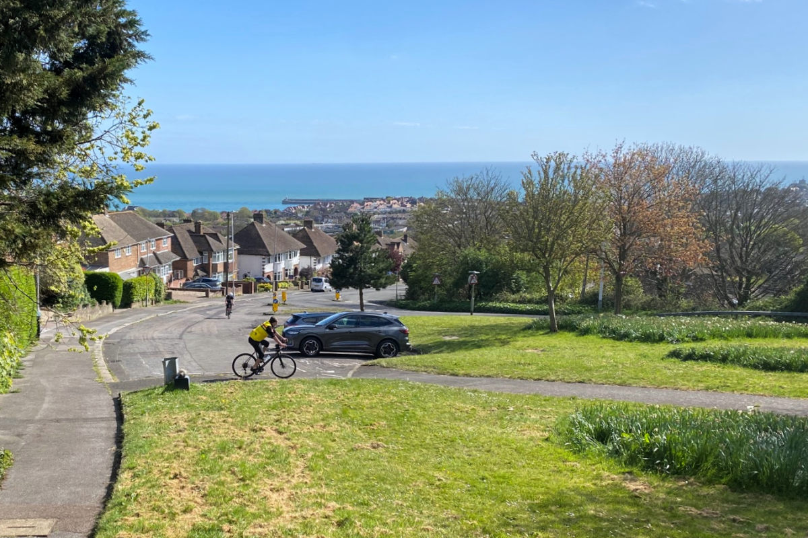
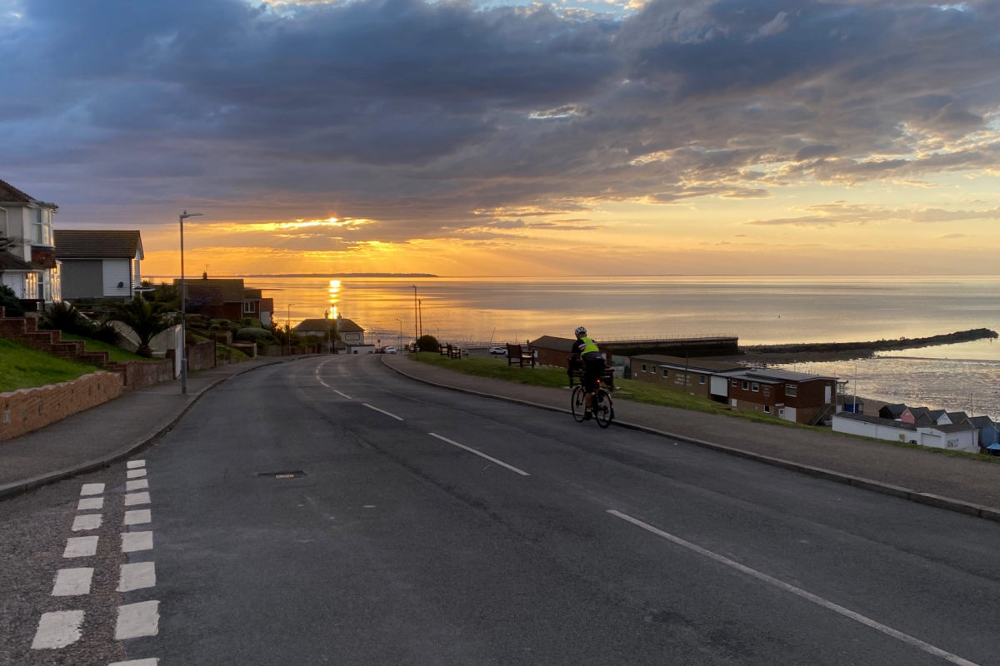

+++
title = "Oasts and Coasts 300"
description = ""
date = 2026-04-26
draft = false
tags = ["Cycling"]
+++

I volunteered to route check and help out at one of the controls on this years Oasts and Coasts 300km audax and so it came to be I completed the helpers ride last weekend.

There's about 3200m of climbing overall and close enough to 1900m of that is in the first 120km. Regardless it's the flatter sections of this event I always find more of a challenge. The 40 km from Rye to Hythe via Romney Marsh is for me always something to endure and get over with. Typically you're riding into the wind for all or at least much of the way. Last weekend it was not so bad. Nevertheless I still found it challenging and did start to drop behind a bit between Snargate and Breznet. Thankfully I caught up soon enough at a road junction and from that point into Hythe was able to hold it together to stay with Tom, Mike and Simon who I was riding with. 

 

I enjoyed their company. All are strong riders. I made way more of an effort riding with them than I do when I ride alone. Having others to chat with eases what "suffering" there sometimes is on long distance rides. It was all quite manageable and I took my turn at the front. 

Surprising to me I actually found myself some way ahead of them between Dover and St Margarets on Cliff. Not sure how it happened. I thought they were close behind. I got a call on my phone from Tom. Not sure where you are but we're at the top of the first hill out of Dover near the Castle. I was already on Upper Road that runs along the top of the cliffs. I said I'd meet them at St Margarets. All was good. 

I met another cyclist in St Margarets. He was taking a rest stop on a bench. I sat down and spoke with him while I waited for the others. He was quite a story teller. I'd guess he was in his late sixties or early seventies. Born and raised in Spain. Lifelong cyclist. Ambitions to do so professionally in his youth. Used to live in Hertfordshire. Amateur racing with a club there for a good while. Living alone now. Said he'd had a stroke around five years ago. Had to learn fine motor skills and how to walk again. Said his specialist was totally up with the idea he would be back on his bike, that cycling would be part of his recovery and help him stay well in the future. Turned out that was the case. He's now regularly riding back and forth between Deal and Folkstone. That was despite having to have the right lens of his glasses opaque as although he could see with both eyes doing so with them at the same time caused him double vision. I was inspired. 

Tom and the others rolled up after about ten minutes. We bid farewell to the Spanish man and was off again towards Deal. 

Tom has organised this event for years. Bit of legend. He's ridden PBP nine times and has his sights set on completing the tenth next year. By my reckoning that's at least 40 years of audaxing in his legs. Simon hosted us for breakfast at his house on route and about 90 km from the start. Mike helped with the original route planning of the Oasts and Coasts. We'd not ridden together before but as is often the way we found common interests to chat about for many of the miles. He and Simon were both very strong on all the hills. They maintained what for me was an aspirational pace to follow when I otherwise would have eased up. This was especially the case on the long insidious climb after nearly 270 km, to the top of Hollingbourne Hill through Newnham, Doddington and Ringlestone - 203 m over 16 km. I believe it may be the longest climb in Kent.  

I had my moments too. I led the way along the sea wall from Birchington to Reculver. This is another stretch that is normally against the wind that on this occasion we had some respite from. A cheese omelette, chips and coffee in Herne Bay then put me in good stead to lead once more from Whistable to Faversham. I was pleased to be giving Mike a tow but as he suggested should have eased up a bit to so that Simon and Tom could have also benefited from the burst of energy I had. 

Due to where I live my ride started on a part of the route that crosses the River Medway in Borstal. That's about 12 km from the départ and arrivée in Meopham. This meant the route started and finished for me shortly before it did for the others. We parted ways at this point at around 10.30 pm. 17 hrs 15 min in total. 13 hrs moving time. 4 hrs 15 mins off stopping time. I really enjoyed it. It was a good ride. 

It was this weekend the organised event took place. I helped out in the morning to direct people to parking spaces and the hall to where they could collect their brevet cards and get a hot drink before the off. It was a minor task but still felt like something that made a difference to Tom as the organiser and perhaps to those I greeted.



