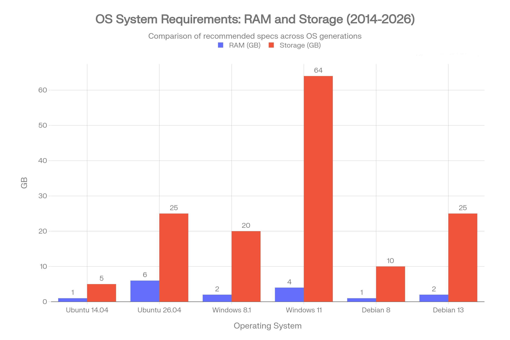

+++
title = "Migrating from Ubuntu to Debian"
description = ""
date = 2026-05-03
draft = false
tags = []
+++

On the 27th December 2015 I ditched Windows for Linux - Ubuntu 14.04 LTS ("Trusty Tahr"). I acted on impulse.  I wrote a short post at the time to mark the occasion - [Smashing Windows](https://www.bongotwisty.blog/smashing-windows/).

The release of each new LTS is a natural opportunity to take stock and consider whether Ubuntu is still for me. It's been a great introduction to Linux. I have learned a lot. Certainly not an expert, but my knowledge and understanding has grown over time. 

So the availability of Ubuntu 26.04 LTS (Resolute Raccoon) got me thinking. Commentary about the increase in recommended RAM and storage is noticeable. I was interested in seeing how Ubuntu's recommended specs stacked up over time compared with Windows and Debian - 

While it's obvious that Ubuntu takes the lead in the relative increase of RAM and storage it's not really an issue I worry about. I have plenty of both on the machines I use. I'm not bothered about snaps either. They're not new and it's my choice whether to use them. The planned integration of AI from 26.10 - I have no reason not to believe Jon Seager's words when he [writes](https://discourse.ubuntu.com/t/the-future-of-ai-in-ubuntu/81130) about treading carefully and, "*enabling access to frontier AI for Ubuntu users in a way that is deliberate, secure, and aligned with our open source values.*" 

On that basis job done I guess. Time for me to upgrade.

Or not. 

Ubuntu has served me well but all along I have been aware that Canonical and Microsoft have been getting closer and closer. In 2014 they partnered with Azure cloud optimisation. In 2016 the Windows Subsystem for Linux (WSL). In September 2019 they launched their enterprise co-selling partnership. More recently Ubuntu Pro and Microsoft Defender integration. It's what drives the development of Ubuntu and makes Cannonical profitable. 

The only value casual desktop users like me provide Canonical is adding to the global usage statistics, word of mouth recommendations, live testing, and the occasional bug report. Ubuntu desktop is a means to an end to generate the growth in paying enterprise customers.

It would be a bit much to criticise Canonical for doing what has always been the aim of the company. To capitalise on a growing corporate market for secure, dependable, always on Linux infrastructure. 

I am though privileged in that I can allow ethics, philosophy or perhaps just irrational feelings shape my decisions. There is nothing about Microsoft I like. The business model or the product. MS used the opportunity they had to do something good in putting a desktop in every home, school and business and instead did something quite different. Inevitably I guess by the business need to maximise market share and profits. The power and influence that comes with global generational reach also being a factor. You could argue it's what makes the world go round. 

That's true but there are other ways to turn the world. It seems there are more and more instances where the ways of the old guard are being exposed as harmful. Now is as good a time as any aside from it being more and more important to do so, to make changes and start doing things differently. 

Immediate gratification comes at a future cost. There is a price to comfort and convenience. Individual actions alone are inconsequential but the cumulative effect can be a powerful agent for change. Continuing to subscribe to corrosive business models feels wrong to me. I won't pretend to be perfect but I can also see value in making small changes to the heading I am on. 

And so it is, I have decided to migrate from Ubuntu to Debian. A trade-off being convenience vs. control. Moving to Debian means I no longer directly support Canonical's commercial agenda. In return, I accept older software packages, a less polished GUI, and sometimes I'll need to manage issues with hardware or permissions.

Healthy relationships involve a transparent two way give and take. What I get from Debian is clear. What do I pay for my lunch? Self-reliance with troubleshooting and resolving my own issues. Making meaningful bug reports. Opting in to provide package-usage statistics. Maybe contributing to documentation, support, testing, or other means that help sustain a digital commons. Becoming a participant in a cooperative project. Sounds good to me. 

