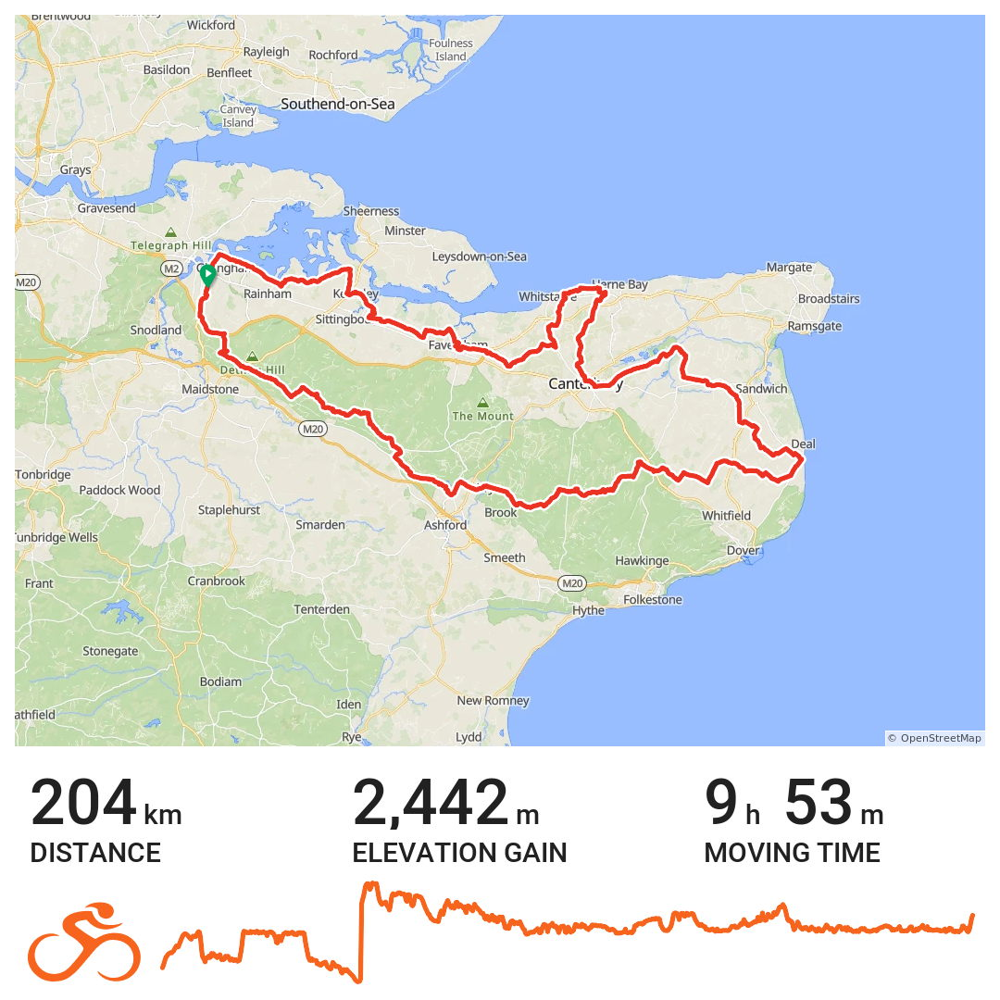
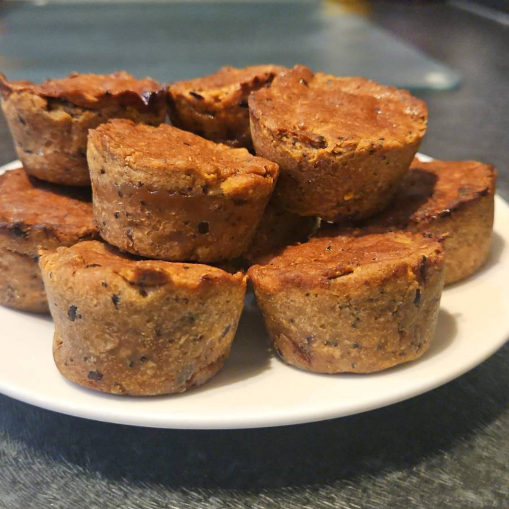
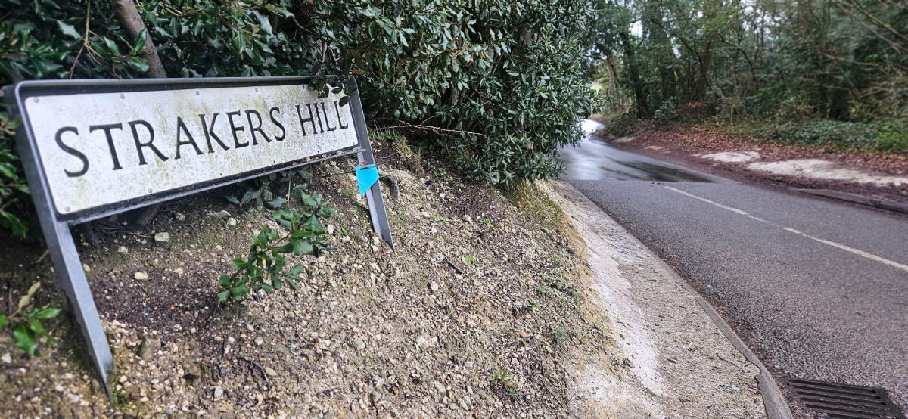
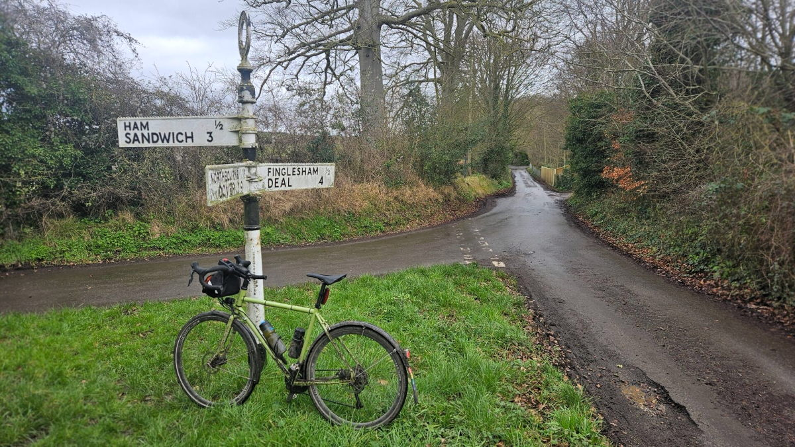

+++
title = "audax: Ham Sandwich 200k DIY"
description = "with added Pear Pies"
images = ["20260222_Kent_200.jpg"]
date = 2026-02-26
draft = false
tags = ["cycling"]
+++

Out on a 200k ride last weekend. The second for February to continue with the ongoing RRtY [^1] effort. I'm doing two simultaneously this time round — a double year. I started in October 2025 after completing the 2nd consecutive year of rides in September. I'm aiming for a chain of ten. 

I baked some tasty little pear pies to help fuel the ride. Had some gluten free dough left over from some pies I made last week to share with colleages at work. The dough was all the better for having been sitting in the fridge for a week. Gluten free dough makes the pies a bit softer when baked. The pies were sweet and moist but they held together okay in the bar bag for the duration of the ride. 

The idea was to have one every 60 - 90 minutes. That was not necessary as on the way round I stopped off at my sisters house in Deal and the parents house in Tankerton, and was supplied with coffee and cake at both. Nice. 

Pulled up at a flooded country lane just before the 70k mark (South Barham Road). At first glance it looked like I was going to get wet. I've ridden this route a good few times now so was not put off by the road closed signs I'd breezed past on the way down the road. There's an elevated path which runs along side that I knew would keep me away from the water. All the same it was the most flooded I've seen it in the last couple of years.





On the way to Deal the route takes in a road called Strakers Hill. Not sure why but the name really appeals to me. Often thought I should stop to take a picture. This time I did. For some odd reason that tune ["Gangsters Paradise"](https://www.nytimes.com/2022/09/29/arts/music/coolio-gangstas-paradise.html) always comes to mind when I see the sign. There is no connection; the tune and lyrics both grate on me. It was played on repeat at a nightclub (the Florida 2000) I went to in Narobi when I visted Kenya in 1997. I have no idea why the name reminds me of the tune. One day I'm sure it'll come to me why "Straker" means something to me.

A few miles out of Deal I pass by the most famous road sign I know of. I feel compelled to stop and take a photo every time. I have dozens of them. From here I headed over to Canterbury, then to Tankerton, from Tankerton to Faversham, and then back home to Medway. 

  



I enjoyed the ride. First one all week. I'd been feeling a bit run down and under the weather and thought it best to rest up. Started off feeling pretty good. Better than I expected. Finished off okay but pleased I had no further to go. 

The year so far has not been great in terms of getting regular rides in. I got a bit distracted by following a training "plan". That broke my routine and was in turn impacted by giving blood, which I would normally do and then just carry on riding regardless. What gains I've got from HR zone training have I think been diminished by a combination of these factors. Thinking to go back to what was my regular pattern of riding and maybe use a couple of those rides a week to get in a spot of HR zone training on the way round. We shall see.  

[^1]: See the foot notes in [this post](https://www.bongotwisty.blog/neighbourhood_200/) if you're interested in what RRtY means.  