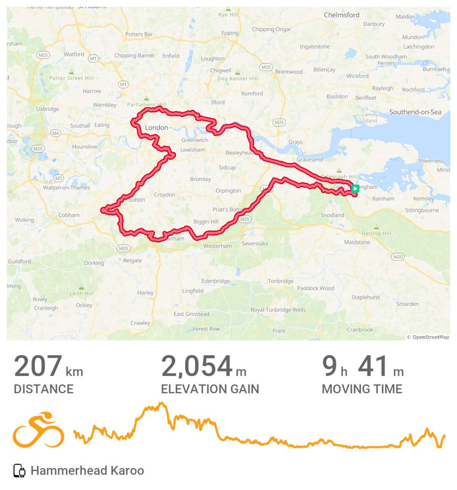
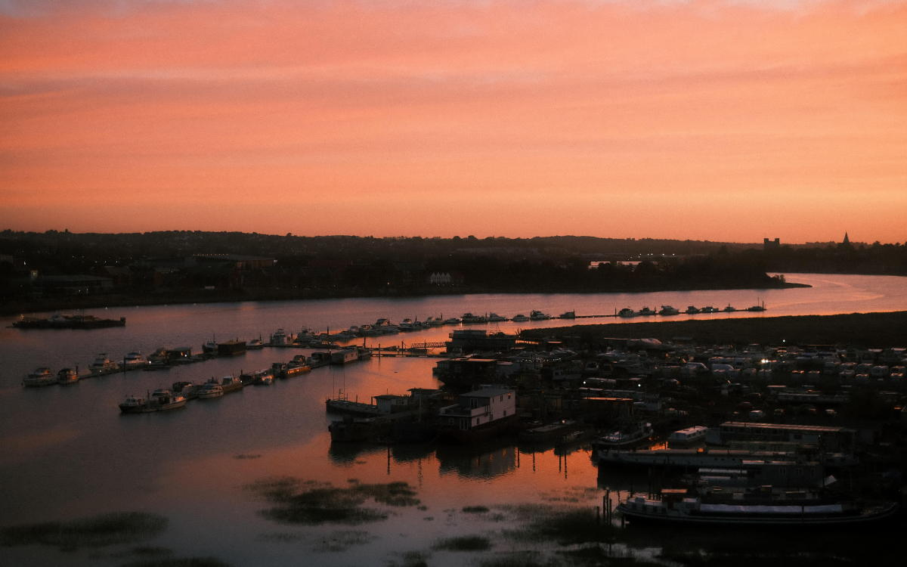
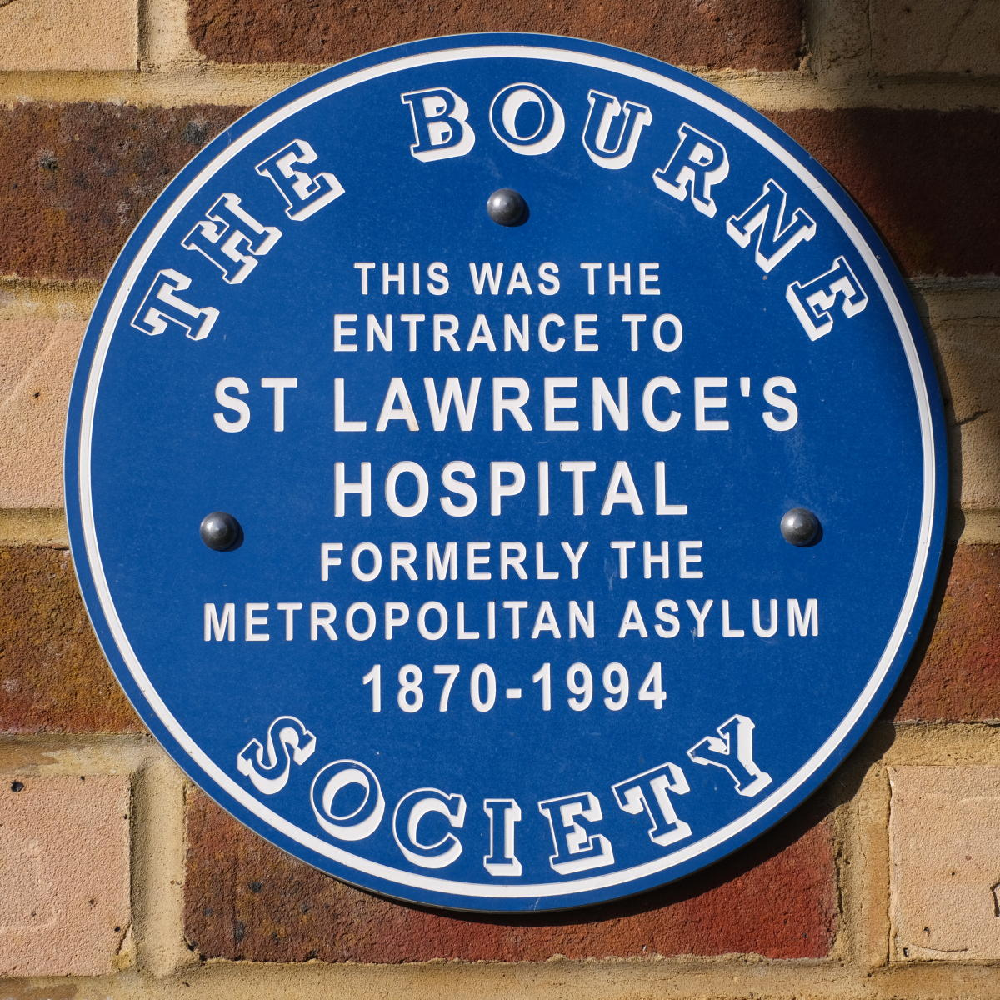
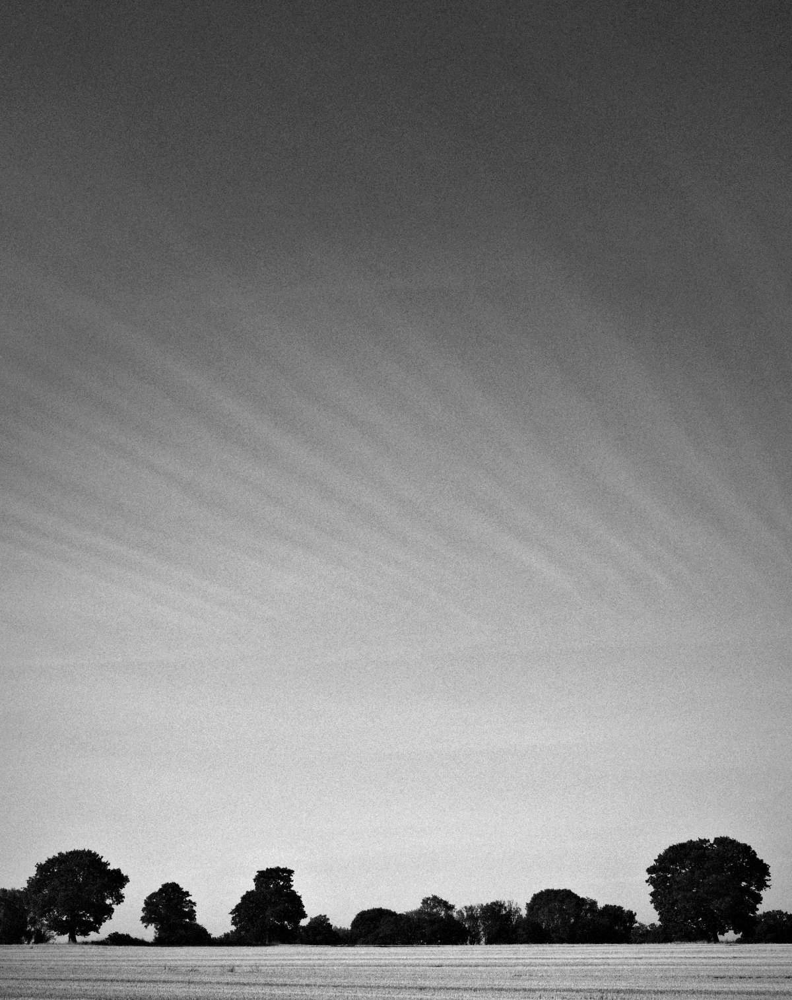
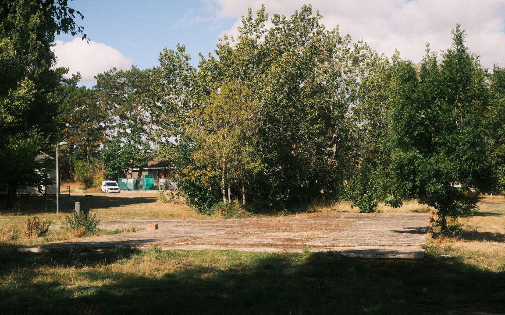
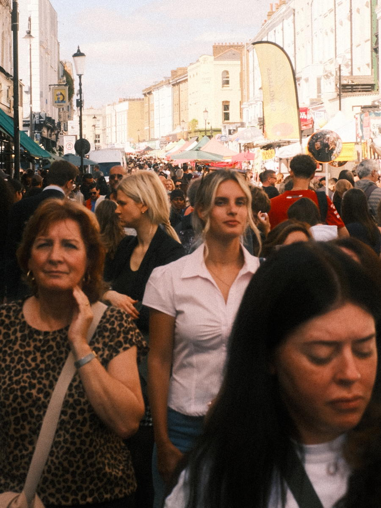
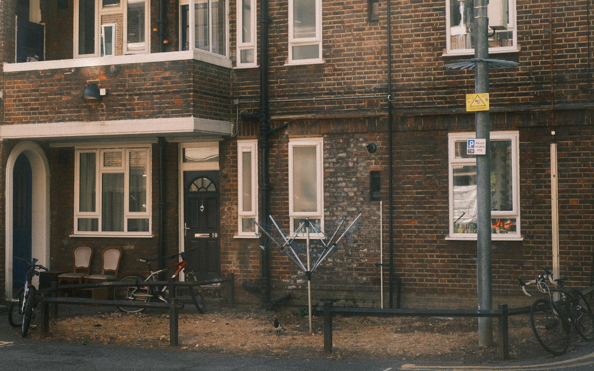

+++
title = "audax: Old Roads DiY"
description = ""
date = 2026-09-08
tags = ["cycling"]
+++

August was pretty dismal in terms of me getting out on my bike. Just seven rides all month. 

Pretty sure this was down to an imbalance between effort and recovery. I was taking things for granted. Not enough body maintenance. 

The time out was in some ways imposed on me by changes in my physiology and mental state. Muscle soreness. Generalised aches and pains. A big dip in performance. Poor sleep. Weight change. Lack of enthusiasm and motivation - not just for cycling but also at work and home. I was also feeling a bit down and moody.

Happy to have started September on a good footing. I've adapted my behaviour. I'm aiming to get out on the bike every day. Shorter, regular, low effort rides. That's about small wins and maintaining an identity that aligns with a future self I'd like to be. If you're familiar with people like Charles Dugigg and James Clear you'll know where that comes from.

Different routes. Different bikes. Different times of the day. I'm taking a camera out with me. It helps me to slow down and enjoy the ride rather than simply getting in the miles while lost in thought. Routine is important but when it's countered with variety a habit can stay feeling fresh rather than becoming a bit stale.  

I'll still do the couple of 200k rides each month for the ongoing RRtY[^1] award. Got the first one in over the weekend and really enjoyed it. Old Roads 200 DiY[^2] - revisiting places from my past. 

My first photo stop was soon after leaving home, on the motorway bridge over the River Medway. There's a cycle/foot path on the bridge. 

At 58 km I stopped again to get this snap.

 

Soon after riding on from here I remembered a video which suggested a few pictures tell a better story. Could have been a close up, an abstract and a landscape perhaps. Something to remember in the future. 

A few miles down the road to Netherne Village (formally Netherne Hospital) in Hooley nr Couldson. This is where I started working in mental health. First as a Community Service Volunteer then as an auxilary nurse. Just before I got there I noticed these odd looking lines in the sky. 

From Netherne I made my way over to Nobel Park (formally West Park Hospital) in Epsom where I completed my nurse training. Happy days. Lots of fun times here and at Netherne. 

From there it was into London where I dropped in to see an old friend now living in East Dulwich. I then cycled over to Notting Hill and walked my bike through Portabello Road Market. 

From west to east and over to Hackney. This is where spouse and I bought our first home in 1997.

The flat was adjacent to the Regents Canal just past Pickets Lock and Broadway Market. When we lived there it was still relativly unknown. Nowadays its quite different and seems like a very popular place to be. 

From Whiston Rd it's just a short ride down the canal tow path and into Victoria Park. I then followed the Greenway over to West Ham and onto Beckton where son 3 is at uni. 

The lift at the North Woolwich Tunnel was out of order. It was as well the last time I used it. That was in July 2025. I did wonder if it had ever been fixed. 

Once up and out on the south side it was along the Thames Path to Erith, onto Dartford and finally back home in Medway. 

It was a really good ride. I very much enjoyed it. Just one more 200 to do later this month and that will be four consecutive RRtY series done. Things are looking good. 

[^1]: Randonneur Round the Year, awarded to those riding a Randonneur event (=> 200k) in each of any consecutive 12 months.

[^2]: DIY events allow riders to plan and schedule their own events and still have them validated by Audax UK. *[New to Audax?](https://www.audax.uk/about-audax/new-to-audax/)*

