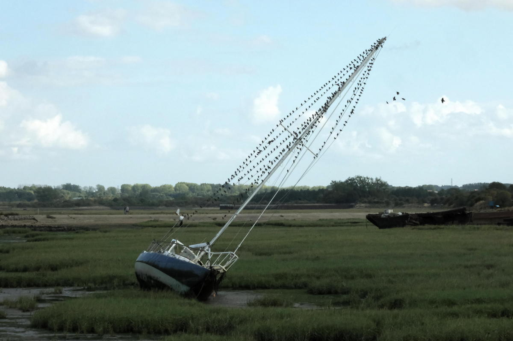
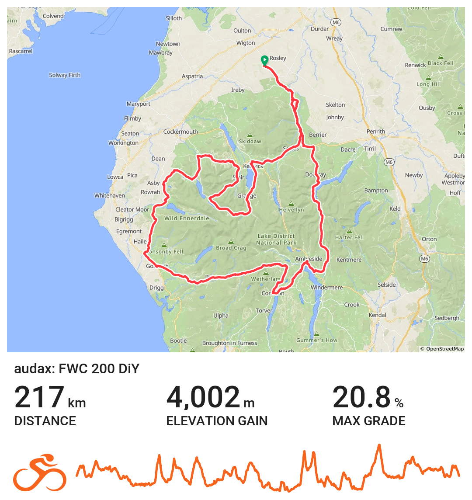

+++
title = "When the balance tips."
description = "Overtraining in Cycling"
date = 2026-08-22
images = []
tags = ["cycling"]
+++

I rode a few more miles over the last three months than I normally over do the same time span. 2400k in ten days during May. A 1000k ride over three days in July. Still getting in the regular rides and a couple of 200s each month on top of those. 

The last two to three weeks I've not been feeling my usual self. No get up and go. No enthusiasm for being out on the bike. Most rides I've done have turned out to be a bit of a slog. Riding anywhere has been with way more effort and little enjoyment. The hot weather has not helped. I've not been sleeping well either and have been feeling fed up in general. More aches and pains than usual. The skin around my torso has been sore and sensitive. Very little motivation for getting things done at work. Appetite for food has been on and off. 

Reason for all this probably seems obvious. You've been overdoing it! Indeed. All of those things could be early warning signs of "[overtraining syndrome](https://www.dream-cycle.com/overtraining-in-cycling-signs-and-recovery/)". Since I don't regard what I do as training it did not really occur to me that how I have been feeling could be down to doing to much with no "recovery plan". Yeah I know. Duhhh! I think I just need to rest up properly for a while. I kind of have been Monday - Friday since I've not felt like doing much at all anyway. However, on the last two weekends I've done a 200k ride. I think both of them likely set back whatever recovery my body was making during the week. 

Feeling better about things now  that I've finally twigged on to the probable cause of my decline. Only a couple of rides during this week and a gentle one today. Felt okay on the way round. 

We're off to the Lake District next week. I'm bringing my light bike with me and was planning on doing one long ride while we're up there - a slightly extended version of the Fred Whitton Challenge. 

I know it would be sensible to give it a miss but I really do not want to miss the opportunity. Last time I rode it was in [November 2014](https://ridewithgps.com/trips/21153568). I'll see how I feel towards the end of the week. 

