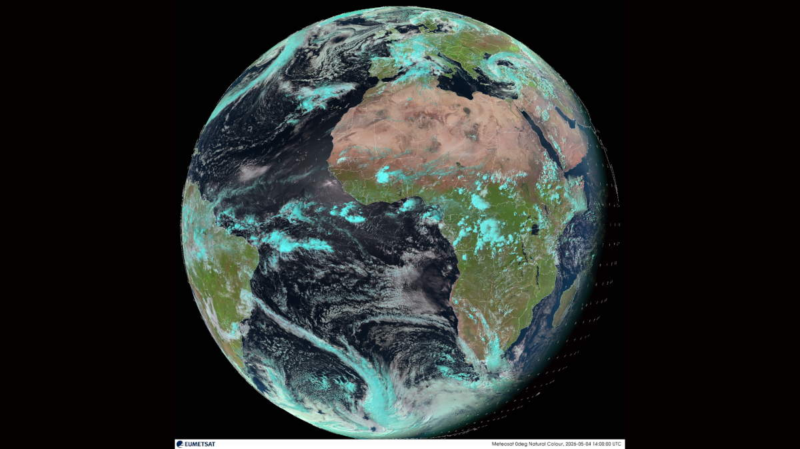
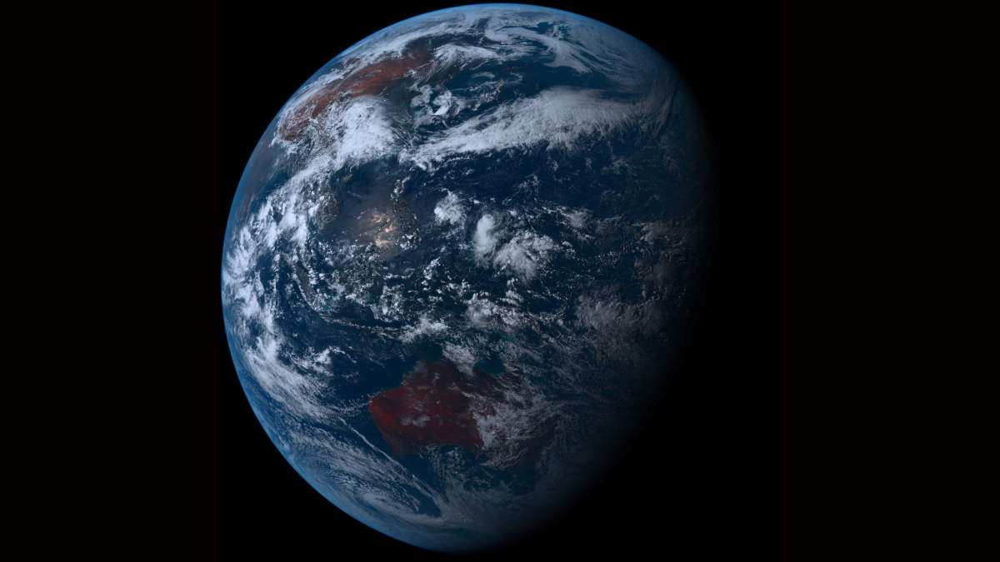

+++
title = "Views of Earth"
description = "Near Real-Time Satellite Wallpapers on Debian 13 with KDE Plasma 6"
date = 2026-05-12
draft = false
tags = []
+++

Every fifteen minutes or so, I have my desktop wallpaper changing to a fresh satellite image of Earth. Sometimes it shows Africa and Europe from the [Meteosat](https://www.eumetsat.int/our-satellites/meteosat-series) satellite. Sometimes it shifts to the Pacific and Australasia, seen from Japan's [Himawari-9](https://www.data.jma.go.jp/mscweb/data/himawari/). Both are near real-time images from geostationary satellites orbiting above the equator.

Here is how to cook it up on Debian 13 (Trixie) with KDE Plasma 6 on Wayland.


### Ingrediants

- Debian 13 (Trixie) with KDE Plasma 6, running a Wayland session

- [Himawaripy](https://github.com/boramalper/himawaripy): a Python tool that downloads the latest image from Japan's Himawari-9 weather satellite, centred over the Pacific. It saves a timestamped PNG to a local folder.\
The project is no longer maintained but continues to work just fine. I installed it via `pipx` rather than `apt` because it is not packaged in Debian, and requires `setuptools` to be manually injected as a dependency after installation.

- A custom shell script to download the latest natural colour image from EUMETSAT's Meteosat satellite, centred over Africa and Europe. No account or API key required.

- [Variety](https://github.com/varietywalls/variety): a wallpaper manager that rotates through images in a local folder on a schedule, calling a custom script to apply each one.

- plasma-apply-wallpaperimage: the tool I use for changing wallpapers on KDE Plasma 6 with Wayland. The older `qdbus`/`dbus-send` approach used in other guides does not work on Wayland.


### Method

### Step 1: Install pipx and Himawaripy

```bash
sudo apt install pipx
pipx ensurepath
```

and then:

```bash
pipx install himawaripy
pipx inject himawaripy setuptools
```
*Himawaripy was written to download imagery from the Himawari-8 satellite. Himawari-9 replaced Himawari-8 as the operational satellite but uses an identical data format and feed structure, so Himawaripy continues to work without modification.*

### Step 2: Create the Image Folders

```bash
mkdir -p ~/.himawari ~/.eumetsat ~/.satellite-wallpapers
ln -s ~/.himawari ~/.satellite-wallpapers/himawari
ln -s ~/.eumetsat ~/.satellite-wallpapers/eumetsat
```


### Step 3: Create the EUMETSAT Download Script

```bash
cat > ~/.local/bin/eumetsat-download << 'EOF'
#!/bin/bash
OUTDIR="$HOME/.eumetsat"
TIMESTAMP=$(date -u +"%Y%m%dT%H%M00")
OUTFILE="$OUTDIR/meteosat-${TIMESTAMP}.jpg"
if [ ! -f "$OUTFILE" ]; then
    curl -sf "https://eumetview.eumetsat.int/static-images/latestImages/EUMETSAT_MSG_RGBNatColour_FullResolution.jpg" \
        -o "$OUTFILE" && echo "Downloaded: $OUTFILE"
    ls -t "$OUTDIR"/meteosat-*.jpg | tail -n +7 | xargs -r rm
fi
EOF
chmod +x ~/.local/bin/eumetsat-download
```

The script adds a UTC timestamp to each filename so Variety and `plasma-apply-wallpaperimage` always recognise it as a new image. It also keeps only the six most recent images to save disk space.


### Step 4: Test Both Sources

```bash
himawaripy --auto-offset -l 4 --dont-change --output-dir ~/.himawari
eumetsat-download
ls ~/.himawari ~/.eumetsat
```

Each folder should now contain one timestamped image.


### Step 5: Set Up Cron Jobs

```bash
crontab -e
```

Add both lines:

```cron
*/10 * * * * /home/YOUR_USERNAME/.local/bin/himawaripy --auto-offset -l 4 --dont-change --output-dir /home/YOUR_USERNAME/.himawari
*/15 * * * * /home/YOUR_USERNAME/.local/bin/eumetsat-download
```

The `--auto-offset` flag automatically calculates the correct time offset for the satellite feed, and `-l 4` sets the resolution level with level 4 being the highest available.\
The `--dont-change` flag tells Himawaripy to download the image without trying to change the wallpaper itself, leaving that to Variety and the shell script.

Himawari-9 updates every 10 minutes; Meteosat updates every 15 minutes. 


### Step 6: Install Variety and Create the Wallpaper Script

```bash
sudo apt install variety
mkdir -p ~/.config/variety/scripts
cat > ~/.config/variety/scripts/set_wallpaper << 'EOF'
#!/bin/bash
echo "$(date) set_wallpaper called with: $1" >> /tmp/variety_wallpaper.log
plasma-apply-wallpaperimage --fill-mode preserveAspectFit "$1" >> /tmp/variety_wallpaper.log 2>&1
EOF
chmod +x ~/.config/variety/scripts/set_wallpaper
```

The `--fill-mode preserveAspectFit` flag ensures the full Earth image is always visible against the black of space, rather than being cropped to fill the screen.


### Step 7: Configure Variety

Open Variety preferences from the system tray:

- **Sources** tab: Add `~/.satellite-wallpapers` as a Local Folder, remove all other sources
- **General** tab: Set the change interval to **16 minutes**


### Step 8: Set the KDE Fill Mode

Right-click the desktop → **Configure Desktop and Wallpaper** → set **Positioning** to **Scaled, Keep Proportions** → **Apply**.


### Step 9: Test

```bash
variety --next
cat /tmp/variety_wallpaper.log
```

You should see a line ending in `Successfully set the wallpaper for all desktops`.


### How It Looks

Both images update throughout the day and the wallpaper should alternate between two perspectives of Earth. Meteosat shows Europe, Africa, and the Atlantic. 



Himawari-9 shows the Pacific, Japan, Australia, and Southeast Asia.




